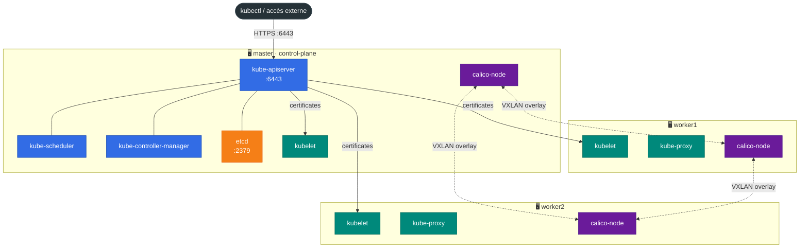
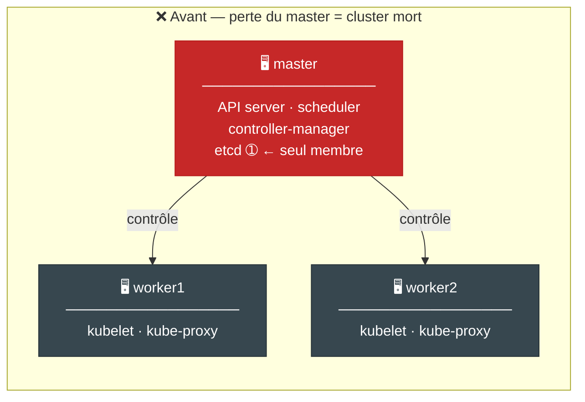
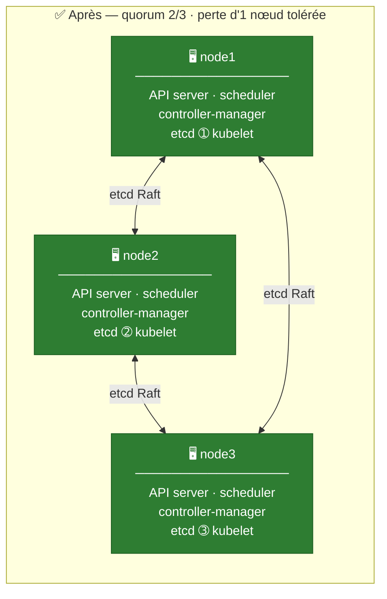
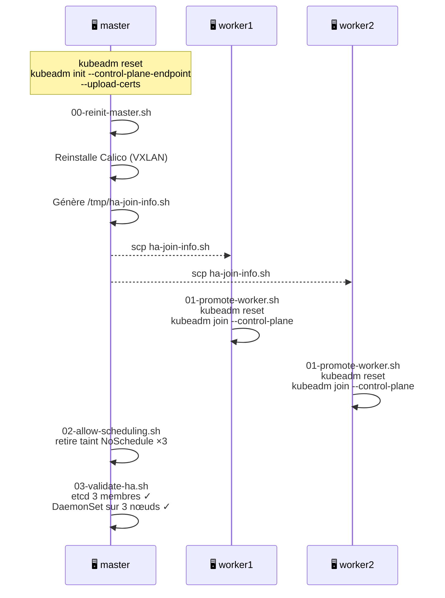

<div align="center">

# 🚢 Kubernetes — My Hard Way

**TP pratique kubeadm de A à Z** — CentOS Stream 10 — 12 parties + Bonus HA

[](https://kubernetes.io)
[](https://centos.org)
[](https://docs.tigera.io)
[](https://containerd.io)
[](https://gvisor.dev)

</div>

---

Ce TD pratique couvre **tout le cycle de vie d'un cluster Kubernetes** monté à la main avec `kubeadm` — de l'installation à la mise en place d'un control plane HA en passant par la migration CNI, l'upgrade, l'isolation sandbox et l'observabilité.

| | |
|---|---|
| **Durée totale** | ~5h (parties 2–12 + Bonus) |
| **Niveau** | Avancé |
| **OS cible** | CentOS Stream 10 |
| **Infrastructure** | 3 VMs — DigitalOcean ou Exoscale |
| **Kubernetes** | 1.34.x → upgrade 1.35.x |
| **Slides instructeur** | 340+ slides Marp |

---

## Parcours du TD

```mermaid
flowchart TD
    START(["🚀 3 VMs CentOS Stream 10"]):::start --> P2

    subgraph G1["🔧 Construction du cluster"]
        P2["**Partie 2** — Installation\ncontainerd · kubeadm · Flannel\n⏱ 35 min"]:::blue
        P3["**Partie 3** — Kubelet & Static Pods\nconfiguration · boucle de réconciliation\n⏱ 30 min"]:::blue
        P2 --> P3
    end

    subgraph G2["📐 Scheduling"]
        P4["**Partie 4** — Taints & Tolerations\nNoSchedule · PreferNoSchedule · NoExecute\n⏱ 30 min"]:::teal
    end

    subgraph G3["🌐 Réseau"]
        P5["**Partie 5** — Migration CNI\nFlannel → Calico · VXLAN\n⏱ 25 min"]:::orange
    end

    subgraph G4["⚙️ Opérations cluster"]
        P6["**Partie 6** — Drain & Maintenance\nPDB · DaemonSets · simulation panne\n⏱ 20 min"]:::purple
        P7["**Partie 7** — Upgrade cluster\n1.34 → 1.35 · ordre impératif\n⏱ 25 min"]:::purple
        P6 --> P7
    end

    subgraph G5["🛡 Isolation & Infrastructure"]
        P8["**Partie 8** — RuntimeClass & gVisor\nisolation sandbox · KVM\n⏱ 25 min"]:::red
        P9["**Partie 9** — cgroups\nv2 · QoS classes · mémoire\n⏱ 20 min"]:::red
        P10["**Partie 10** — Réseau public/privé\narchitecture · LB DIY · Exoscale\n⏱ 10 min"]:::red
        P11["**Partie 11** — SKS Exoscale\nKubernetes managé vs kubeadm\n⏱ 15 min"]:::red
        P12["**Partie 12** — kube-prometheus-stack\nGrafana · Prometheus · alertes\n⏱ 30 min"]:::red
        P8 --> P9 --> P10 --> P11 --> P12
    end

    subgraph G6["🏆 Bonus final"]
        PB["**Bonus HA** — 3 Control Planes\nreinit · promote workers · etcd quorum\n⏱ 30 min"]:::gold
    end

    P3 --> P4 --> P5 --> P6
    P7 --> P8
    P12 --> PB
    PB --> END(["💥 Suppression du cluster"]):::start

    classDef start fill:#1a1a2e,color:#fff,stroke:#326CE5
    classDef blue fill:#326CE5,color:#fff,stroke:#1a4db5
    classDef teal fill:#00897B,color:#fff,stroke:#00695C
    classDef orange fill:#E65100,color:#fff,stroke:#BF360C
    classDef purple fill:#6A1B9A,color:#fff,stroke:#4A148C
    classDef red fill:#C62828,color:#fff,stroke:#B71C1C
    classDef gold fill:#F57F17,color:#fff,stroke:#E65100
```



---

## Architecture du cluster

### État stable après la Partie 5



---

## Partie Bonus — HA Control Plane

> **Dernière manipulation avant suppression du cluster** — transformer 1 master + 2 workers en **3 nœuds cumulant tous les rôles** (control-plane + worker + membre etcd).

### Avant — single point of failure



### Après — quorum etcd · tolérance à la perte d'un nœud



### Séquence d'exécution



> **Contrainte clé :** `--control-plane-endpoint` doit être passé au `kubeadm init` initial. Sans lui, le certificat API server ne couvre que l'IP du master d'origine — impossible d'ajouter d'autres control planes sans tout réinitialiser.

---

## Table des matières

| Partie | Thème | Durée | Répertoire scripts |
|--------|-------|-------|--------------------|
| **2** — Installation cluster | containerd · kubeadm · Flannel | 35 min | `partie1-installation/` |
| **3** — Kubelet & Static Pods | config · réconciliation · CRI | 30 min | `partie2-kubelet-static-pods/` |
| **4** — Taints & Tolerations | scheduling avancé · 3 effects | 30 min | `partie3-taints-tolerations/` |
| **5** — Migration CNI | Flannel → Calico · VXLAN | 25 min | `partie4-migration-cni/` |
| **6** — Drain & Maintenance | PDB · DaemonSets · panne nœud | 20 min | `partie5-drain-maintenance/` |
| **7** — Upgrade cluster | 1.34 → 1.35 · ordre impératif | 25 min | `partie6-upgrade/` |
| **8** — RuntimeClass & gVisor | sandbox isolation · KVM | 25 min | `partie7-runtimeclass/` |
| **9** — cgroups | v2 · QoS classes · mémoire kernel | 20 min | `partie9-cgroups/` |
| **10** — Réseau public/privé | architecture · LB DIY | 10 min | — |
| **11** — SKS Exoscale | Kubernetes managé vs kubeadm | 15 min | — |
| **12** — kube-prometheus-stack | Grafana · Prometheus · alertes | 30 min | `partie12-prometheus/` |
| **Bonus** — HA Control Plane | 3 masters · etcd quorum | 30 min | `partie-bonus-ha/` |

---

## Démarrage rapide

### 1 — Provisionner les VMs

```bash
# DigitalOcean (3 VMs CentOS Stream 10, fra1)
./infra-do/manage_vm.sh --tags "k8s-tp" --count 3

# Exoscale (même interface)
./infra-exo/manage_vm.sh --tags "k8s-tp" --count 3
```

### 2 — Prérequis (sur chaque nœud)

```bash
git clone https://github.com/k8s-training-demo/kube-my-hard-way
cd kube-my-hard-way/tp101/td-kubernetes-kubeadm/scripts

# Sur tous les nœuds
./partie1-installation/01-prereqs.sh
```

### 3 — Initialiser le cluster (sur le master)

```bash
./partie1-installation/02-init-control-plane.sh
./partie1-installation/03-join-workers.sh        # commande kubeadm join
./partie1-installation/04-install-flannel.sh
./partie1-installation/05-verify-cluster.sh
```

---

## Structure du dépôt

```
kube-my-hard-way/
├── infra-do/                          ← Provisioning DigitalOcean (doctl)
├── infra-exo/                         ← Provisioning Exoscale (exo CLI)
└── tp101/td-kubernetes-kubeadm/
    ├── scripts/
    │   ├── partie1-installation/
    │   ├── partie2-kubelet-static-pods/
    │   ├── partie3-taints-tolerations/
    │   ├── partie4-migration-cni/
    │   ├── partie5-drain-maintenance/
    │   ├── partie6-upgrade/
    │   ├── partie7-runtimeclass/
    │   ├── partie9-cgroups/
    │   ├── partie12-prometheus/
    │   └── partie-bonus-ha/           ← HA Control Plane (3 masters)
    ├── configs/                        ← Manifests et configs de référence
    ├── validation/                     ← Scripts de validation par partie
    └── docs/
        ├── exercices-etudiants.md
        └── slides-instructeur.md      ← Marp · 340+ slides
```

---

## Ressources

- 📄 [Guide étudiant](tp101/td-kubernetes-kubeadm/docs/exercices-etudiants.md)
- 🎓 [Slides instructeur](tp101/td-kubernetes-kubeadm/docs/slides-instructeur.md)
- 🐛 [Issues](https://github.com/k8s-training-demo/kube-my-hard-way/issues)

---

<div align="center">
  <sub>Matériel pédagogique — Cours Kubernetes avancé · Montpellier</sub>
</div>
