<!-- _class: lead -->

# TD Kubernetes avec kubeadm
## Guide de formation pour instructeurs

**Durée:** 2h45 (compressible à 2h30)
**Niveau:** Avancé
**Prérequis:** Docker, concepts Kubernetes de base

---

## Vue d'ensemble du TD

### Objectifs pédagogiques

1. **Compréhension de l'architecture** Kubernetes
2. **Maîtrise de kubeadm** pour l'administration
3. **Configuration système** (kubelet, static pods)
4. **Mécanismes de scheduling** (taints, tolerations)
5. **Opérations réseau** (CNI, migration)
6. **Maintenance en production** (drain, upgrade)

---

## Points forts du TD

✅ Scripts automatisés mais commentés
✅ Validation à chaque étape
✅ Situations réalistes (migration CNI, panne de nœud)
✅ Balance entre théorie et pratique
✅ Proche des situations de production

---

## Infrastructure requise

### Option 1: VMs locales (VirtualBox, VMware)
```
Master:  2 CPU, 4 GB RAM, 20 GB disque
Worker1: 2 CPU, 2 GB RAM, 20 GB disque  — OS: CentOS Stream 10
Worker2: 2 CPU, 2 GB RAM, 20 GB disque
```

### Option 2: Cloud — VMs Exoscale (kubeadm manuel)
```
Zone: de-fra-1  |  Type: standard.large (2 vCPU / 8 GB)
Template: Linux CentOS Stream 10 64-bit
Réseau: public seul  OU  public + réseau privé Exoscale
```

### Option 3: SKS Exoscale (Kubernetes managé)
```
exo compute sks create tp-k8s --zone de-fra-1 \
  --version 1.30 --node-pools workers,2
```
→ Control plane géré par Exoscale, nœuds uniquement à configurer

---

## Préparation - Checklist avant le TD

- Infrastructure prête et testée
- Tous les scripts fonctionnent
- Versions des paquets disponibles
- Backup de l'environnement de démo
- Support visuel préparé
- Connexion Internet vérifiée
- Accès SSH pour tous les étudiants

---

## Timeline du TD - Vue globale

| Partie | Contenu | Durée |
|--------|---------|-------|
| 0 | Introduction | 5 min |
| 1 | **Nouveautés K8s 1.30-1.34** | 45 min |
| 2 | Installation cluster | 35 min |
| 3 | Kubelet & Static Pods | 30 min |
| 4 | Taints & Tolerations | 20 min |
| 5 | Migration CNI | 25 min |
| 6 | Drain & Maintenance | 20 min |
| 7 | Upgrade cluster | 25 min |
| 8 | RuntimeClass & gVisor | 25 min |
| 9 | Réseau privé & SKS Exoscale | 20 min |

**Total:** ~3h55 (modulable selon niveau du groupe)

---

<!-- _class: toc -->

## Navigation rapide

| Partie | Contenu | Slide |
|--------|---------|-------|
| [Partie 0](#69) | Introduction & Objectifs | [→ Aller](#69) |
| Partie 1 | **Nouveautés K8s 1.30-1.35** (en fin de présentation) | — |
| [Partie 2](#71) | Installation cluster kubeadm | [→ Aller](#71) |
| [Partie 3](#80) | Kubelet & Static Pods | [→ Aller](#80) |
| [Partie 4](#89) | Taints & Tolerations | [→ Aller](#89) |
| [Partie 5](#105) | Migration CNI | [→ Aller](#105) |
| [Partie 6](#113) | Drain & Maintenance | [→ Aller](#113) |
| [Partie 7](#125) | Upgrade cluster | [→ Aller](#125) |
| [Partie 8](#140) | RuntimeClass & gVisor | [→ Aller](#140) |
| [Partie 9](#155) | Réseau public vs privé | [→ Aller](#155) |
| [Partie 10](#160) | SKS Exoscale — Kubernetes managé | [→ Aller](#160) |

---

# Partie 0
## Introduction (5 min)

---

## Points à souligner

- Kubernetes est un **système distribué complexe**
- L'**ordre des opérations est crucial**
- La **sauvegarde est primordiale** en production
- Les **erreurs sont des opportunités** d'apprentissage
- Valider à chaque étape avant de continuer

### Architecture finale

```
┌─────────────┐
│   Master    │ ← Control Plane
└─────────────┘
      │
  ┌───┴───┐
┌─▼─┐   ┌─▼─┐
│W1 │   │W2 │ ← Workers
└───┘   └───┘
```

---

<!-- _class: lead -->

# Partie 2
## Installation du cluster (35 min)

---

## Partie 1 - Timeline suggérée

- Installation prérequis: **15 min**
- Init control plane: **5 min**
- Join workers: **5 min**
- Install CNI: **5 min**
- Vérification: **5 min**

---

## 1.1 - Prérequis système

### 📝 EXERCICE ÉLÈVE
**Script à exécuter sur TOUS les nœuds:**
```bash
cd scripts/partie1-installation
./01-prereqs.sh
```

**Questions à poser:**
1. Pourquoi désactiver le swap ?
2. Rôle de containerd ?
3. Différence kubeadm/kubelet/kubectl ?

---

## 1.1 - Prérequis système (suite)

### Problèmes fréquents

**Swap non désactivé**
```bash
free -h  # Vérification
# Si swap actif, kubeadm refusera de démarrer
```

**Modules kernel non chargés**
```bash
lsmod | grep overlay
lsmod | grep br_netfilter
```

---

## 1.1b - Prérequis CentOS 10 détaillés

### Installation containerd sur CentOS 10

```bash
# 1. Ajouter le repo Docker (contient containerd)
sudo dnf config-manager --add-repo \
  https://download.docker.com/linux/centos/docker-ce.repo

# 2. Installer containerd
sudo dnf install -y containerd.io

# 3. Générer la configuration par défaut
sudo mkdir -p /etc/containerd
containerd config default | sudo tee /etc/containerd/config.toml
```

---

## `containerd config default` — pas portable entre distros

### La commande inspecte l'environnement au moment de l'exécution

```bash
# Sur CentOS 10 (systemd, cgroup v2)
containerd config default | grep -E "SystemdCgroup|snapshotter"
#   SystemdCgroup = false       ← cgroupfs par défaut même sur systemd !
#   snapshotter = "overlayfs"

# Sur Alpine (OpenRC, cgroup v1 possible)
containerd config default | grep -E "SystemdCgroup|snapshotter"
#   SystemdCgroup = false       ← identique
#   snapshotter = "overlayfs"
```

### Ce qui change réellement selon la distro

| Paramètre | CentOS 10 | Alpine | Ubuntu 24.04 |
|-----------|-----------|--------|--------------|
| `SystemdCgroup` (défaut) | false | false | false |
| cgroup version hôte | **v2** | v1 ou v2 | **v2** |
| Init system | systemd | OpenRC | systemd |
| Ajustement requis | `true` | non | `true` |

> `config default` donne **les mêmes valeurs partout** — c'est la config universelle minimale, pas la config optimale pour ton OS

---

## Règle : toujours générer sur la cible finale

### Ne jamais copier une config.toml d'une autre machine

```
❌ À ne pas faire
──────────────────────────────────────────────────────
Copier config.toml depuis un tuto, une VM de test,
ou un autre OS → valeurs inadaptées, bugs silencieux

✅ Procédure correcte
──────────────────────────────────────────────────────
1. Installer containerd sur la machine CIBLE
2. containerd config default > /etc/containerd/config.toml
3. Ajuster SystemdCgroup selon l'init system de CETTE machine
4. Redémarrer containerd sur CETTE machine
```

### Pourquoi les bugs sont silencieux

- containerd démarre sans erreur avec une config incorrecte
- Les pods démarrent… jusqu'à la pression mémoire
- L'OOM killer se comporte différemment → crash imprévisibles
- `kubeadm init` peut passer → problèmes appraissent en production

> La config containerd est **locale** : générée sur place, ajustée sur place

---

## Configuration containerd - SystemdCgroup

### ⚠️ IMPORTANT: Activer SystemdCgroup

```bash
# Activer systemd cgroup driver (OBLIGATOIRE pour kubeadm)
sudo sed -i 's/SystemdCgroup = false/SystemdCgroup = true/' \
  /etc/containerd/config.toml

# Redémarrer containerd
sudo systemctl restart containerd
```

### Pourquoi SystemdCgroup = true ?

| Aspect | Explication |
|--------|-------------|
| **Cohérence** | CentOS 10 utilise systemd comme init. Le cgroup driver doit correspondre |
| **kubelet** | Par défaut, kubelet utilise systemd cgroup driver depuis K8s 1.22+ |
| **Stabilité** | Si containerd et kubelet utilisent des drivers différents → instabilité |
| **OOM Killer** | systemd gère mieux les limites mémoire et l'OOM killer |

---

## Configuration containerd - Explication détaillée

### Pourquoi cette configuration est critique ?

```
┌──────────────────────────────────────────────────────────┐
│                      SYSTEMD (PID 1)                      │
│                         ↓                                 │
│              Gestion des cgroups v2                       │
│                    ↓           ↓                          │
│            ┌───────┴───┐ ┌────┴────┐                     │
│            │  kubelet  │ │containerd│                     │
│            │ (systemd) │ │(systemd) │ ← Doivent utiliser  │
│            └───────────┘ └──────────┘   le même driver!   │
└──────────────────────────────────────────────────────────┘
```

**Si drivers différents:**
- Conflits de gestion mémoire
- Pods qui ne démarrent pas
- Métriques incorrectes
- Comportement OOM imprévisible

---

## Pourquoi cgroupfs par défaut ?

### containerd est agnostique de l'init system

```
┌─────────────────────────────────────────────────────────────────┐
│              Environnements cibles de containerd                │
├─────────────────────────────────────────────────────────────────┤
│   • Linux avec systemd (RHEL, Ubuntu, Debian modernes)          │
│   • Linux avec OpenRC (Alpine, Gentoo)                          │
│   • Linux avec runit (Void Linux)                               │
│   • Linux minimal sans init (Docker-in-Docker)                  │
│   • WSL2 (pas de vrai init)                                     │
│   • Embedded Linux                                              │
└─────────────────────────────────────────────────────────────────┘
```

**Dénominateur commun:** `/sys/fs/cgroup` (kernel Linux)

→ **cgroupfs** = choix par défaut le plus portable

---

## Distributions et configurations cgroup

| Distribution | Init system | containerd défaut | Recommandé K8s |
|-------------|-------------|-------------------|----------------|
| RHEL/CentOS 8+ | systemd | cgroupfs | **systemd** |
| Ubuntu 20.04+ | systemd | cgroupfs | **systemd** |
| Debian 11+ | systemd | cgroupfs | **systemd** |
| Fedora | systemd | cgroupfs | **systemd** |
| Alpine | OpenRC | cgroupfs | cgroupfs ✓ |
| Flatcar | systemd | systemd | systemd ✓ |
| Talos | custom | systemd | systemd ✓ |
| k3s/RKE2 | systemd | systemd | systemd ✓ |

Les distros K8s spécialisées préconfigure `SystemdCgroup = true`

---

## Le cas Alpine (sans systemd)

### Alpine utilise OpenRC, pas systemd

```bash
# Sur Alpine, cgroupfs est le bon choix !
# /etc/containerd/config.toml
[plugins."io.containerd.grpc.v1.cri".containerd.runtimes.runc.options]
  SystemdCgroup = false  # Correct pour Alpine
```

**Si `SystemdCgroup = true` sur Alpine:**
- containerd cherche systemd via D-Bus
- D-Bus n'existe pas → **crash**

---

## Philosophie containerd

### Pourquoi pas de détection automatique ?

```
Philosophie containerd:
───────────────────────
"Je suis un runtime bas niveau. Je ne fais pas de magie.
 L'administrateur sait mieux que moi dans quel environnement
 je tourne. Configuration explicite > détection implicite."
```

**Raisons techniques:**
- **Prévisibilité** — Comportement identique partout
- **Containers imbriqués** — systemd présent mais non fonctionnel
- **Transition cgroups v1 → v2** — Détection aurait été instable

---

## kubeadm vérifie la cohérence

### L'installateur Kubernetes force la bonne config

```bash
kubeadm init
# [preflight] Running pre-flight checks
# [preflight] Detected cgroup driver: systemd
# [preflight] Checking container runtime cgroup driver...
# ERROR: container runtime cgroup driver "cgroupfs"
#        != kubelet cgroup driver "systemd"
```

**kubeadm échoue** si configuration incohérente → force l'admin à corriger

---

## Résumé pratique - Cgroup driver

### Quelle configuration selon ton environnement ?

```
Distro avec systemd (CentOS, Ubuntu, Debian, RHEL) ?
────────────────────────────────────────────────────
  → SystemdCgroup = true  (OBLIGATOIRE)

k3s, RKE2, Talos, Flatcar ?
───────────────────────────
  → Déjà configuré, rien à faire

Alpine ou système sans systemd ?
────────────────────────────────
  → SystemdCgroup = false (le défaut est correct)
```

containerd choisit le mode universel → **l'intégrateur fait le dernier pas**

---

## cgroup v1 → v2 : chronologie du support containerd

### Les bornes à retenir

| Jalon | Version | Date |
|-------|---------|------|
| containerd supporte cgroup v1 | toutes (dès l'origine) | — |
| containerd supporte cgroup v2 | **1.4+** | août 2020 |
| Avant 1.4 sur Fedora 31+ | kernel cmdline `systemd.unified_cgroup_hierarchy=0` requis | — |
| Dernière version supportant v1 | **1.7.x** | — |
| containerd 2.0+ | **cgroup v2 uniquement** | 2024 |

### Conséquence pour Kubernetes

- K8s **1.35** = dernier K8s acceptant cgroup v1 (avec containerd 1.7)
- K8s **1.36+** exige containerd 2.0 → cgroup v2 obligatoire
- CentOS Stream 10 : cgroup v2 par défaut ✓ → on est alignés

---

## Matrice containerd × Kubernetes × cgroup

| Kubernetes | containerd min | containerd max | cgroup v1 | cgroup v2 |
|-----------|---------------|---------------|-----------|-----------|
| 1.24–1.25 | 1.5 | 1.6.x | ✓ | ✓ (depuis 1.4) |
| 1.26–1.27 | 1.6 | 1.7.x | ✓ | ✓ |
| 1.28–1.33 | 1.6 | 1.7.x / 2.0 | ✓ (1.6/1.7) | ✓ |
| 1.34 | 1.7 ⚠️ déprécié | 2.x | ✓ (1.7 seul) | ✓ |
| **1.35** | 1.7 (dernier) | 2.x | ✓ **(dernier K8s)** | ✓ |
| **1.36+** | **2.0 minimum** | 2.x | ✗ supprimé | ✓ uniquement |

> **Ce TD** : K8s 1.34/1.35 + containerd 2.x → cgroup v2 uniquement, on est dans la trajectoire moderne

---

## Prérequis réseau CentOS 10 - Modules kernel

```bash
# Charger les modules nécessaires
cat <<EOF | sudo tee /etc/modules-load.d/k8s.conf
overlay
br_netfilter
EOF

sudo modprobe overlay
sudo modprobe br_netfilter
```

### Pourquoi ces modules ?

- **overlay**: Système de fichiers pour les layers des containers
- **br_netfilter**: Permet à iptables de voir le trafic bridgé

---

## Prérequis réseau CentOS 10 - Sysctl

```bash
# Paramètres sysctl pour le routage
cat <<EOF | sudo tee /etc/sysctl.d/k8s.conf
net.bridge.bridge-nf-call-iptables  = 1
net.bridge.bridge-nf-call-ip6tables = 1
net.ipv4.ip_forward                 = 1
EOF

sudo sysctl --system
```

### Pourquoi ip_forward ?

Routage des paquets entre interfaces réseau (requis par CNI)

---

## Désactivation du swap sur CentOS 10

```bash
# Désactiver le swap immédiatement
sudo swapoff -a

# Désactiver le swap au boot (commenter la ligne swap dans fstab)
sudo sed -i '/ swap / s/^/#/' /etc/fstab
```

### Pourquoi désactiver le swap ?

| Raison | Explication |
|--------|-------------|
| **Scheduling** | Kubernetes doit connaître la RAM réelle disponible |
| **Performance** | Le swap introduit des latences imprévisibles |
| **Limites** | Les limits de mémoire des pods deviennent imprécises |
| **OOM** | Le comportement OOM devient non-déterministe |

**Note:** Depuis K8s 1.28+, le swap peut être activé avec configuration spécifique (voir section swap)

---

## Firewall CentOS 10 - Master

### Ports requis sur le Control Plane

```bash
sudo firewall-cmd --permanent --add-port=6443/tcp   # API Server
sudo firewall-cmd --permanent --add-port=2379-2380/tcp # etcd
sudo firewall-cmd --permanent --add-port=10250/tcp  # kubelet API
sudo firewall-cmd --permanent --add-port=10259/tcp  # kube-scheduler
sudo firewall-cmd --permanent --add-port=10257/tcp  # kube-controller-manager
sudo firewall-cmd --reload
```

---

## Firewall CentOS 10 - Workers

### Ports requis sur les Workers

```bash
sudo firewall-cmd --permanent --add-port=10250/tcp  # kubelet API
sudo firewall-cmd --permanent --add-port=10256/tcp  # kube-proxy
sudo firewall-cmd --permanent --add-port=30000-32767/tcp # NodePort
sudo firewall-cmd --reload
```

---

## SELinux sur CentOS 10 - Mode Permissive

### Recommandé pour ce TD

```bash
# Temporaire (jusqu'au reboot)
sudo setenforce 0

# Permanent
sudo sed -i 's/^SELINUX=enforcing$/SELINUX=permissive/' \
  /etc/selinux/config
```

### Pourquoi mode permissive pour le TD ?

- Simplifie le troubleshooting
- Évite les problèmes de permissions complexes

---

## SELinux sur CentOS 10 - Production

### SELinux activé (recommandé en production)

```bash
# Installer les policies container-selinux
sudo dnf install -y container-selinux

# Kubernetes supporte SELinux enforcing depuis 1.25+
```

**En production:** SELinux en enforcing avec policies appropriées

---

## Installation kubeadm - Repo Kubernetes

### Configuration du repo sur CentOS 10

```bash
# Ajouter le repo officiel Kubernetes
cat <<EOF | sudo tee /etc/yum.repos.d/kubernetes.repo
[kubernetes]
name=Kubernetes
baseurl=https://pkgs.k8s.io/core:/stable:/v1.34/rpm/
enabled=1
gpgcheck=1
gpgkey=https://pkgs.k8s.io/core:/stable:/v1.34/rpm/repodata/repomd.xml.key
exclude=kubelet kubeadm kubectl cri-tools kubernetes-cni
EOF
```

---

## Installation kubeadm - Composants

### Installation et activation

```bash
# Installer kubeadm, kubelet et kubectl
sudo dnf install -y kubelet kubeadm kubectl --disableexcludes=kubernetes

# Activer kubelet au démarrage
sudo systemctl enable --now kubelet
```

### Verrouillage des versions

```bash
# Verrouiller pour éviter mises à jour accidentelles
sudo dnf install -y 'dnf-command(versionlock)'
sudo dnf versionlock add kubelet kubeadm kubectl
```

---

## Récapitulatif prérequis CentOS 10

### Checklist complète

| Étape | Commande de vérification |
|-------|-------------------------|
| Swap désactivé | `free -h` (Swap = 0) |
| Modules kernel | `lsmod \| grep br_netfilter` |
| containerd | `systemctl status containerd` |
| SystemdCgroup | `grep SystemdCgroup /etc/containerd/config.toml` |
| Firewall | `firewall-cmd --list-ports` |
| SELinux | `getenforce` (Permissive) |
| kubeadm | `kubeadm version` |

---

## Questions attendues - Prérequis (1/2)

**Q: Pourquoi désactiver le swap ?**
> R: Kubernetes nécessite un contrôle précis de la mémoire pour le scheduling. Le swap introduit des performances imprévisibles.

**Q: Différence entre containerd et Docker ?**
> R: containerd est le runtime de conteneurs (CRI), Docker est un ensemble d'outils incluant containerd. Kubernetes utilise directement containerd via CRI.

---

## Questions attendues - Prérequis (2/2)

**Q: Pourquoi `SystemdCgroup = true` ?**
> R: CentOS 10 utilise systemd comme gestionnaire de cgroups v2. Le kubelet utilise aussi systemd par défaut. Si drivers différents → conflits mémoire et pods qui crashent.

**Q: Pourquoi SELinux en mode permissive ?**
> R: Pour simplifier le TD. En production, SELinux doit rester en enforcing.

---

## 1.2 - Initialisation du control plane

### 📝 EXERCICE ÉLÈVE
**Script à exécuter sur le MASTER uniquement:**
```bash
./02-init-control-plane.sh
```

**⚠️ IMPORTANT:** Faire sauvegarder la commande `kubeadm join` !

### Point critique
**La commande `kubeadm join` affichée à la fin !**

### Solution de secours
```bash
# Si les étudiants perdent la commande
kubeadm token create --print-join-command

# Liste des tokens actifs
kubeadm token list
```

---

## Vérifications control plane

```bash
kubectl get pods -n kube-system

# Points à vérifier (doivent être Running):
# - kube-apiserver
# - kube-controller-manager
# - kube-scheduler
# - etcd
```

---

## 1.3 - Jonction des workers

### 📝 EXERCICE ÉLÈVE
**Script à exécuter sur chaque WORKER:**
```bash
./03-join-workers.sh
```

**Saisir la commande `kubeadm join` obtenue précédemment**

### Problème fréquent
Erreur de connexion au master

```bash
# Vérifier la connectivité
ping <master-ip>

# Vérifier que l'API server est accessible
curl -k https://<master-ip>:6443

# Vérifier les certificats
sudo ls -la /etc/kubernetes/pki/
```

---

## 1.4 - Installation de Flannel

### 📝 EXERCICE ÉLÈVE
**Script à exécuter sur le MASTER:**
```bash
./04-install-flannel.sh
```

**Attendre que tous les pods Flannel soient Running**

### Pourquoi Flannel en premier ?

- Simple et rapide à installer
- Parfait pour l'apprentissage
- Permet de voir l'effet d'une migration CNI

---

## 1.4 - Flannel - Vérifications

### Vérifications post-installation

```bash
# Un pod flannel par nœud (DaemonSet)
kubectl get pods -n kube-flannel -o wide

# Interfaces réseau créées
ip addr show flannel.1
```

**Attendu:** Un pod par nœud en status `Running`

---

## 1.5 - Validation

### 📝 EXERCICE ÉLÈVE
**Script à exécuter sur le MASTER:**
```bash
./05-verify-cluster.sh
```

**Validation:**
```bash
cd ../../validation
./validate-partie.sh 1
```

**Temps de stabilisation:** 2-3 minutes après installation CNI

Si des étudiants sont bloqués:
```bash
kubectl get events --all-namespaces \
  --sort-by='.lastTimestamp'
```

---

<!-- _class: lead -->

# Partie 3
## Kubelet et Static Pods (30 min)

---

## Le kubelet — L'agent node de Kubernetes

### En une phrase

> Le kubelet est l'agent qui tourne sur chaque node et qui s'assure que les containers décrits dans les PodSpecs tournent effectivement sur ce node.

---

## Kubelet - Position dans l'architecture

```
┌─────────────────────────────────────────────────────────────────┐
│                        CONTROL PLANE                            │
│  ┌─────────────┐  ┌─────────────┐  ┌─────────────────────────┐  │
│  │ API Server  │  │ Scheduler   │  │ Controller Manager      │  │
│  └──────┬──────┘  └─────────────┘  └─────────────────────────┘  │
└─────────┼───────────────────────────────────────────────────────┘
          │ HTTPS (watch, status updates)
┌─────────┼───────────────────────────────────────────────────────┐
│         ▼                        NODE                           │
│  ┌─────────────┐                                                │
│  │   KUBELET   │ ◄─── L'agent principal du node                 │
│  └──────┬──────┘                                                │
│         ├──────────────┬──────────────┬──────────────┐          │
│         ▼              ▼              ▼              ▼          │
│  ┌───────────┐  ┌───────────┐  ┌───────────┐  ┌───────────┐     │
│  │containerd │  │ cAdvisor  │  │  CSI      │  │  CNI      │     │
│  │ (CRI)     │  │ (metrics) │  │ (storage) │  │ (network) │     │
│  └───────────┘  └───────────┘  └───────────┘  └───────────┘     │
└─────────────────────────────────────────────────────────────────┘
```

---

## Kubelet - Boucle de réconciliation

### Compare état désiré vs état actuel

```
┌──────────────────────────────────────────────────────────────┐
│                    BOUCLE DE RÉCONCILIATION                  │
│                                                              │
│   ┌─────────────┐         ┌─────────────┐                    │
│   │ État désiré │         │ État actuel │                    │
│   │ (API Server)│         │ (sur le node)│                   │
│   └──────┬──────┘         └──────┬──────┘                    │
│          └───────────┬───────────┘                           │
│                      ▼                                       │
│              ┌───────────────┐                               │
│              │   Différence? │                               │
│              └───────┬───────┘                               │
│          ┌───────────┴───────────┐                           │
│          ▼                       ▼                           │
│   Pod manquant?           Pod en trop?                       │
│   → Créer le pod          → Supprimer le pod                 │
│                                                              │
│   Container crashé?       Config changée?                    │
│   → Redémarrer            → Recréer le container             │
└──────────────────────────────────────────────────────────────┘
```

---

## Kubelet - Cycle de vie des containers

```
kubelet reçoit PodSpec
        │
        ▼
┌───────────────────┐
│ Préparer le pod   │
│ • Créer cgroups   │
│ • Monter volumes  │
│ • Configurer net  │
└────────┬──────────┘
         ▼
┌───────────────────┐
│ Init containers   │  ← Exécutés séquentiellement
└────────┬──────────┘
         ▼
┌───────────────────┐
│ App containers    │  ← Démarrés en parallèle
│ + postStart hooks │
└────────┬──────────┘
         ▼
┌───────────────────┐
│ Probes actives    │
│ • startup/liveness│
│ • readiness       │
└───────────────────┘
```

---

## Kubelet - Ce qu'il remonte à l'API Server

### NodeStatus

```yaml
conditions:
  - type: Ready           # Le node peut accepter des pods
  - type: MemoryPressure  # Mémoire insuffisante
  - type: DiskPressure    # Disque plein
  - type: PIDPressure     # Trop de processus

capacity:
  cpu: "8"
  memory: "32Gi"
  pods: "110"

allocatable:              # Capacity - reserved
  cpu: "7.5"
  memory: "30Gi"
```

---

## Kubelet - PodStatus remonté

### Ce que kubectl get pods affiche

```yaml
status:
  phase: Running          # Pending/Running/Failed/Succeeded
  conditions:
    - type: PodScheduled
    - type: Initialized
    - type: ContainersReady
    - type: Ready
  containerStatuses:
    - name: nginx
      ready: true
      restartCount: 0
      state:
        running:
          startedAt: "2024-01-15T10:00:00Z"
```

---

## Kubelet - Interface CRI

### CRI (Container Runtime Interface)

Communication kubelet ↔ runtime:

```
kubelet ──► CRI ──► containerd
              │
              ├─ RunPodSandbox()
              ├─ CreateContainer()
              └─ StartContainer()
```

Point d'extension: permet d'utiliser containerd, CRI-O, etc.

---

## Kubelet - CRI : détail des appels

| Appel | Rôle |
|-------|------|
| `RunPodSandbox()` | Crée le **pause container** + namespaces Linux (net, pid, ipc, uts) — la "coquille" vide du pod |
| `CreateContainer()` | Instancie un conteneur applicatif dans le sandbox (pull image, config) |
| `StartContainer()` | Démarre le conteneur (point d'entrée du process) |
| `StopContainer()` | Envoie SIGTERM puis SIGKILL après grace period |
| `RemovePodSandbox()` | Détruit le sandbox et tous ses conteneurs |

Le **pause container** (`registry.k8s.io/pause`) tient les namespaces en vie — si un conteneur applicatif crashe et redémarre, il réutilise les mêmes namespaces réseau/PID.

---

## Kubelet - Interfaces CNI et CSI

### CNI (Container Network Interface)

```
kubelet ──► CNI plugin (Calico, Flannel...)
              ├─ ADD: Configure réseau pour nouveau pod
              └─ DEL: Nettoie quand le pod meurt
```

### CSI (Container Storage Interface)

```
kubelet ──► CSI driver
              ├─ NodeStageVolume()   # Attache au node
              └─ NodePublishVolume() # Monte dans le pod
```

---

## Kubelet - Fonctions gérées directement

| Fonction | Description |
|----------|-------------|
| **Probes** | Exécute liveness/readiness/startup |
| **Ressources** | Applique requests/limits via cgroups |
| **Logs** | Capture stdout/stderr des containers |
| **Exec/Attach** | Permet `kubectl exec` et `kubectl attach` |
| **Port-forward** | Permet `kubectl port-forward` |
| **Éviction** | Tue des pods si le node manque de ressources |
| **Image GC** | Nettoie les images non utilisées |
| **Container GC** | Nettoie les containers morts |

---

## Static Pods - Le problème de l'œuf et la poule

### Comment démarrer l'API Server sans API Server ?

```
/etc/kubernetes/manifests/
├── etcd.yaml
├── kube-apiserver.yaml
├── kube-controller-manager.yaml
└── kube-scheduler.yaml
```

**Le kubelet watch ce dossier et démarre les pods SANS passer par l'API !**

---

## Static Pods - Flux de démarrage

```
┌─────────────────────────────────────────────────────────┐
│                    STATIC PODS                          │
│                                                         │
│   kubelet démarre                                       │
│        │                                                │
│        ▼                                                │
│   Watch /etc/kubernetes/manifests/                      │
│        │                                                │
│        ▼                                                │
│   Trouve kube-apiserver.yaml                            │
│        │                                                │
│        ▼                                                │
│   Démarre le container (sans API Server!)               │
│        │                                                │
│        ▼                                                │
│   API Server devient disponible                         │
│        │                                                │
│        ▼                                                │
│   kubelet crée un "mirror pod" dans l'API               │
│   (pour visibilité: kubectl get pods le voit)           │
└─────────────────────────────────────────────────────────┘
```

---

## Kubelet - Configuration importante

```yaml
# /var/lib/kubelet/config.yaml

cgroupDriver: systemd          # DOIT matcher containerd !
containerRuntimeEndpoint: unix:///run/containerd/containerd.sock

# Ressources réservées pour le système
kubeReserved:
  cpu: "500m"
  memory: "1Gi"
systemReserved:
  cpu: "500m"
  memory: "1Gi"

# Seuils d'éviction (tue des pods si dépassés)
evictionHard:
  memory.available: "100Mi"
  nodefs.available: "10%"
  imagefs.available: "15%"

# Limites
maxPods: 110
podsPerCore: 10
```

---

## Kubelet - Debugging

```bash
# Logs en temps réel
journalctl -u kubelet -f

# État du node vu par kubelet
kubectl describe node <node-name>

# Vérifier que kubelet répond
curl -k https://localhost:10250/healthz

# Pods sur ce node spécifique
kubectl get pods -A --field-selector spec.nodeName=<node-name>

# Voir les événements du node
kubectl get events --field-selector involvedObject.name=<node-name>
```

---

## Kubelet - Exemple complet PodSpec

```yaml
apiVersion: v1
kind: Pod
metadata:
  name: exemple-complet
spec:
  containers:
  - name: app
    image: nginx:1.25
    resources:
      requests:           # Minimum garanti (scheduling)
        cpu: "250m"
        memory: "128Mi"
      limits:             # Maximum autorisé (cgroups)
        cpu: "500m"
        memory: "256Mi"
    livenessProbe:        # kubelet redémarre si échec
      httpGet:
        path: /healthz
        port: 8080
      initialDelaySeconds: 10
      periodSeconds: 5
    readinessProbe:       # kubelet retire du Service si échec
      httpGet:
        path: /ready
        port: 8080
```

---

## Kubelet - En résumé

### Le "contremaître" de chaque node

```
┌─────────────────────────────────────────────────────────┐
│                      KUBELET                            │
│                                                         │
│  • Reçoit les ordres du control plane (API Server)      │
│  • Coordonne les outils locaux:                         │
│    - Runtime (containerd)                               │
│    - Réseau (CNI)                                       │
│    - Stockage (CSI)                                     │
│  • Surveille que tout tourne (probes)                   │
│  • Remonte les problèmes (status, events)               │
│                                                         │
│  Sans kubelet, un node N'EXISTE PAS pour Kubernetes     │
└─────────────────────────────────────────────────────────┘
```

---

## Kubelet au-delà des containers

### CRI : deux implémentations, deux niveaux OCI

```
┌─────────────────────────────────────────────────────────────────┐
│                          KUBELET                                │
│                    ↓ parle CRI (gRPC)                           │
├──────────────────────────┬──────────────────────────────────────┤
│  containerd              │  CRI-O                               │
│  (CRI via plugin)        │  (CRI natif, conçu pour K8s)         │
│  ↓ appelle runtimes OCI  │  ↓ appelle runtimes OCI              │
├────────┬────────┬────────┼────────┬────────┬────────────────────┤
│  runc  │  kata  │ runsc  │  runc  │  kata  │  runsc             │
│        │(microVM│(gVisor)│        │(microVM│ (gVisor)           │
└────────┴────────┴────────┴────────┴────────┴────────────────────┘
```

**Couche 1 — implémentent CRI :** `containerd` (plugin), `CRI-O` (natif)
**Couche 2 — runtimes OCI :** `runc`, `kata-runtime`, `runsc` (gVisor)

---

## KubeVirt — VM dans Kubernetes, sans toucher à CRI

```
┌──────────────────────────────────────────────────────────────────┐
│                    KUBERNETES API                                 │
│   kubectl apply VirtualMachine (CRD KubeVirt)                    │
│                        ↓                                         │
│             virt-controller (operator)                           │
│                        ↓ crée un Pod normal                      │
├──────────────────────────────────────────────────────────────────┤
│  kubelet → CRI → containerd → runc → Pod "virt-launcher"         │
│                                          ↓ (dans le container)   │
│                                     libvirt / QEMU               │
│                                          ↓ (KVM)                 │
│                                     Vraie VM (OS invité complet) │
└──────────────────────────────────────────────────────────────────┘
```

KubeVirt ne touche **ni kubelet, ni CRI, ni les runtimes OCI**

---

## KubeVirt — Gérer des VMs, c'est une autre approche

### Containers vs VMs dans Kubernetes

| | Containers (runc/kata) | KubeVirt |
|---|---|---|
| Unité schedulée | Pod | Pod (`virt-launcher`) |
| Isolation | namespaces/cgroups (ou microVM kata) | QEMU + KVM |
| OS invité | Non (shared kernel) | Oui (kernel complet) |
| Niveau d'extension | OCI runtime | Kubernetes CRD + Operator |
| kubelet modifié ? | **Non** | **Non** |

> On ne remplace pas le runtime : on encapsule QEMU dans un pod

---

## KubeVirt — Kubelet a-t-il encore du sens ?

### Oui — et à deux niveaux

**1. Le nœud n'est pas 100% VMs**
- Pods système toujours présents : CNI, CSI, kube-proxy, monitoring, etc.
- Rien n'empêche containers ET VMs sur le même worker

**2. Kubelet gère le pod `virt-launcher` lui-même**
- Liveness/readiness probes sur la VM
- Resource limits CPU/RAM → éviction si pression mémoire
- Scheduling, QoS class, PodDisruptionBudget

**Ce que KubeVirt ajoute *au-dessus* de kubelet :**
- Live migration entre nœuds (coordonné par `virt-controller`)
- Snapshots, disques persistants (CDI)
- API `VirtualMachine` / `VMI` pour le cycle de vie VM

> Kubelet gère le pod qui **contient** la VM.
> KubeVirt gère ce qui est **à l'intérieur** — QEMU, migration, disques.

---

## CRI - Les différents runtimes

### 1. Containers classiques (runc)

```
PodSpec → kubelet → containerd → runc → container Linux
                                        (namespaces + cgroups)
```

### 2. Kata Containers (microVMs)

```
PodSpec → kubelet → containerd → kata-runtime → QEMU/Firecracker
                                                (vraie VM légère)
```

### 3. gVisor (sandbox userspace)

```
PodSpec → kubelet → containerd → runsc → gVisor kernel
```

### 4. WebAssembly (WASM)

```
PodSpec → kubelet → containerd → runwasi → wasmtime/spin
```

---

## Container classique vs Kata Container

```
┌─────────────────────────────────────────────────────────────────┐
│                     NODE (bare metal/VM)                        │
│                                                                 │
│   Container classique          Kata Container                   │
│   ┌─────────────────┐          ┌─────────────────────────────┐  │
│   │ App             │          │  microVM                    │  │
│   │ ─────────────── │          │  ┌─────────────────────────┐│  │
│   │ Shared kernel   │          │  │ App                     ││  │
│   │ (host kernel)   │          │  │ ───────────────────     ││  │
│   └─────────────────┘          │  │ Guest kernel (dédié)    ││  │
│                                │  └─────────────────────────┘│  │
│                                └─────────────────────────────┘  │
│                                                                 │
│   Isolation: namespaces        Isolation: hyperviseur           │
│   Rapide, léger                Plus lent, plus isolé            │
└─────────────────────────────────────────────────────────────────┘
```

---

## RuntimeClass - Choisir le runtime

### Définir les runtimes disponibles

```yaml
apiVersion: node.k8s.io/v1
kind: RuntimeClass
metadata:
  name: kata
handler: kata      # Config containerd
---
apiVersion: node.k8s.io/v1
kind: RuntimeClass
metadata:
  name: gvisor
handler: runsc
---
apiVersion: node.k8s.io/v1
kind: RuntimeClass
metadata:
  name: wasm
handler: spin
```

---

## RuntimeClass - Utilisation dans un Pod

### Spécifier le runtime pour un workload

```yaml
apiVersion: v1
kind: Pod
metadata:
  name: secure-workload
spec:
  runtimeClassName: kata  # ← Ce pod dans une microVM !
  containers:
  - name: app
    image: my-app:latest
```

Le scheduler trouve un node avec ce runtime disponible

---

## KubeVirt - VMs complètes dans K8s

### Gérer de vraies VMs comme des pods

```yaml
apiVersion: kubevirt.io/v1
kind: VirtualMachine
metadata:
  name: my-windows-vm
spec:
  running: true
  template:
    spec:
      domain:
        resources:
          requests:
            memory: 4Gi
            cpu: 2
      volumes:
      - name: root
        containerDisk:
          image: kubevirt/windows:2019
```

---

## KubeVirt - Architecture

```
┌─────────────────────────────────────────────────────────────────┐
│                          KUBELET                                │
│                             │                                   │
│                             ▼                                   │
│                    ┌─────────────────┐                          │
│                    │       CRI       │                          │
│                    └────────┬────────┘                          │
└─────────────────────────────┼───────────────────────────────────┘
                              ▼
                    ┌─────────────────┐
                    │   containerd    │
                    └────────┬────────┘
                              ▼
                    ┌─────────────────┐
                    │   virt-handler  │  ← Agent KubeVirt
                    └────────┬────────┘
                              ▼
                    ┌─────────────────┐
                    │   libvirt/QEMU  │  ← VM complète
                    │  Windows/Linux  │
                    └─────────────────┘
```

---

## Comparaison des runtimes

| Solution | Isolation | Overhead | Cas d'usage |
|----------|-----------|----------|-------------|
| **runc** | Namespaces | Minimal | Workloads standards |
| **gVisor** | Kernel userspace | Faible | Multi-tenant, code non fiable |
| **Kata** | microVM | Moyen | Sécurité, compliance |
| **KubeVirt** | VM complète | Élevé | Legacy, Windows, drivers |
| **WASM** | Sandbox WASM | Très faible | Edge, serverless |

---

## Cas d'usage concrets

| Cas d'usage | Runtime | Bénéfice |
|-------------|---------|----------|
| Multi-tenant hostile | Kata | Isolation VM par tenant |
| Legacy Windows | KubeVirt | VMs complètes |
| Edge / IoT | WASM | Démarrage en ms |
| PCI-DSS / Healthcare | Kata | Isolation certifiable |

```yaml
# Exemple: isolation multi-tenant
runtimeClassName: kata  # → VM dédiée par pod
```

---

## CRI - L'abstraction puissante

### kubelet ne sait pas ce qu'est un "container"

```
┌─────────────────────────────────────────────────────────┐
│                                                         │
│  kubelet parle CRI, point final.                        │
│                                                         │
│  Tout ce qui répond à cette interface peut être         │
│  schedulé comme un "pod" :                              │
│                                                         │
│  • Container Linux classique                            │
│  • microVM (Kata, Firecracker)                          │
│  • VM complète (KubeVirt)                               │
│  • Module WebAssembly                                   │
│  • Sandbox gVisor                                       │
│                                                         │
│  L'abstraction est PUISSANTE.                           │
│                                                         │
└─────────────────────────────────────────────────────────┘
```

---

## Partie 2 - Timeline suggérée

- Anatomie config: **5 min**
- Modification: **10 min**
- Static pod: **10 min**
- Test comportement: **5 min**

---

## 2.1 - Configuration kubelet

### 📝 EXERCICE ÉLÈVE
**Sur n'importe quel nœud:**
```bash
sudo cat /var/lib/kubelet/config.yaml
```

**Questions à poser:**
1. Où sont les clés d'authentification ?
2. Valeur de `maxPods` ?
3. Chemin des static pods ?

---

## 2.1 - Kubelet - Décryptage config.yaml

| Paramètre | Rôle |
|-----------|------|
| `cgroupDriver: systemd` | Doit matcher containerd — sinon nœuds instables |
| `containerRuntimeEndpoint` | Socket Unix vers containerd |
| `kubeReserved` | CPU/RAM réservés pour kubelet, kube-proxy, containerd |
| `systemReserved` | CPU/RAM réservés pour l'OS (systemd, sshd…) |
| `evictionHard` | Seuils sous lesquels kubelet tue des pods pour récupérer des ressources |
| `maxPods` | Limite absolue de pods sur le nœud (défaut kubeadm : 110) |
| `podsPerCore` | Limite relative : effectif = `min(maxPods, podsPerCore × cores)` |

**Ressources allouables au scheduler :**
```
Allocatable = Capacité nœud − kubeReserved − systemReserved − evictionHard
```

**Réponses exercice :**
1. **Clés d'authentification** → `/etc/kubernetes/pki/ca.crt` (CA), `/var/lib/kubelet/pki/kubelet.crt` (cert servant), `/etc/kubernetes/kubelet.conf` (kubeconfig client)
2. **maxPods** → `110` (défaut kubeadm)
3. **Static pods** → `/etc/kubernetes/manifests/` (champ `staticPodPath`)

---

## 2.1 - Kubelet - Concepts clés

### Points importants

- Kubelet = **agent node-level**
- Configuration en **YAML** (recommandé vs flags CLI)
- **Rechargement nécessaire** après modification

**Fichier principal:** `/var/lib/kubelet/config.yaml`

---

## Question attendue - Kubelet

**Q: Différence entre config.yaml et les flags kubelet ?**
> R: Le fichier YAML contient la configuration structurée (préféré), les flags CLI sont pour des overrides rapides. Le fichier est plus maintenable.

---

## 2.2 - Modification kubelet config

### 📝 EXERCICE ÉLÈVE
**Script sur n'importe quel nœud:**
```bash
cd scripts/partie2-kubelet-static-pods
./01-modify-kubelet-config.sh
```

**Vérification:**
```bash
sudo journalctl -u kubelet -n 50 | grep -i max
```

---

## 2.3 - Static pods

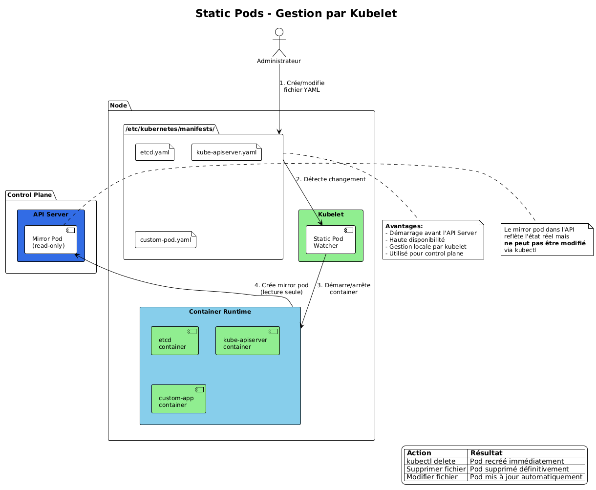

### 📝 EXERCICE ÉLÈVE
**Sur un WORKER:**
```bash
./02-deploy-static-pod.sh
```

**Sur le MASTER, vérifier:**
```bash
kubectl get pods -n kube-system | grep disk-monitor
kubectl logs -n kube-system disk-monitor-<nom-du-nœud>
```

---

## 2.3 - Static pods (suite)

### Démonstration recommandée

1. Le static pod apparaît dans kubectl avec **nom suffixé**
2. Tenter de supprimer via kubectl → **recréation immédiate**
3. Supprimer le manifest → **suppression effective**

### Point pédagogique important

**Les composants du control plane sont des static pods !**

```bash
sudo ls -la /etc/kubernetes/manifests/
```

---

## 2.4 - Test comportement

### 📝 EXERCICE ÉLÈVE
**Script sur le MASTER:**
```bash
./03-test-static-pod-behavior.sh
```

**Questions à poser:**
1. Que se passe-t-il si on supprime via kubectl ?
2. Comment supprimer définitivement ?
3. Avantage pour les composants control plane ?

**Validation:**
```bash
cd ../../validation
./validate-partie.sh 2
```

---

## Exercice bonus (si temps)

Demander aux étudiants de créer leur propre static pod personnalisé

**Répertoire:** `/etc/kubernetes/manifests/`

---

<!-- _class: lead -->

# Partie 4
## Taints et Tolerations (30 min)

---

## Partie 4 - Timeline suggérée

- Theorie Taints/Tolerations: **15 min**
- Exploration: **5 min**
- Ajout taints + observation: **10 min**

---

## Taints & Tolerations - C'est quoi ?

### Analogie simple : Le videur de boite de nuit

```
┌─────────────────────────────────────────────────────────┐
│                      NODE                               │
│                                                         │
│   TAINT = "Panneau a l'entree"                         │
│   ┌─────────────────────────────┐                      │
│   │  🚫 INTERDIT AUX PODS       │                      │
│   │     SANS TOLERATION         │                      │
│   └─────────────────────────────┘                      │
│                                                         │
│   TOLERATION = "Badge VIP du Pod"                      │
│   ┌─────────────────────────────┐                      │
│   │  ✅ J'ai le droit d'entrer  │                      │
│   └─────────────────────────────┘                      │
└─────────────────────────────────────────────────────────┘
```

**Taint** = Le node **repousse** les pods
**Toleration** = Le pod **tolere** le taint (peut entrer)

---

## Direction du controle - Concept cle

```
┌──────────────────────────────────────────────────────────┐
│                                                          │
│    nodeSelector / Affinity        Taints/Tolerations    │
│    ────────────────────────       ──────────────────    │
│                                                          │
│         POD ──────────> NODE      NODE ──────────> POD  │
│                                                          │
│    "Je VEUX aller sur             "Je REFUSE les pods   │
│     ce node"                       sans badge"          │
│                                                          │
│    Le Pod CHOISIT                 Le Node EXCLUT        │
│                                                          │
└──────────────────────────────────────────────────────────┘
```

**Combinaison recommandee:** Taint + nodeSelector pour controle complet

---

## Syntaxe d'un Taint

```bash
kubectl taint nodes <node-name> <key>=<value>:<effect>
```

### Exemples concrets :
```bash
# Marquer un node pour maintenance
kubectl taint nodes worker1 maintenance=true:NoSchedule

# Node dedie GPU
kubectl taint nodes gpu-node-1 gpu=nvidia:NoSchedule

# Node en panne (evacuation urgente)
kubectl taint nodes worker2 node.kubernetes.io/unreachable:NoExecute
```

### Retirer un taint (ajouter `-` a la fin) :
```bash
kubectl taint nodes worker1 maintenance=true:NoSchedule-
```

---

## Les 3 Effects - Vue d'ensemble

| Effect | Pods existants | Nouveaux pods |
|--------|----------------|---------------|
| `NoSchedule` | ✅ Restent | ❌ Bloques |
| `PreferNoSchedule` | ✅ Restent | ⚠️ Evites si possible |
| `NoExecute` | ❌ **Evacues** | ❌ Bloques |

---

## Les 3 Effects - Diagramme

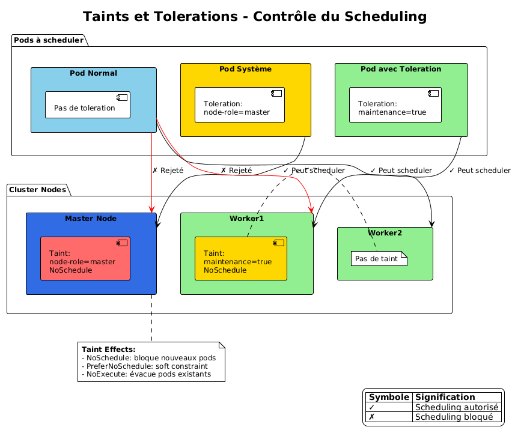

---

## Effect 1: NoSchedule (le plus courant)

<div style="display:flex;align-items:flex-start;gap:30px;margin-top:10px">
<div style="flex:1;border:2px solid #43a047;border-radius:8px;padding:12px;background:#e8f5e9">
<div style="font-weight:bold;color:#2e7d32;margin-bottom:8px">AVANT le taint — Worker1</div>
<div style="display:flex;gap:8px;margin-bottom:8px">
<div style="background:#a5d6a7;border:1px solid #43a047;border-radius:4px;padding:6px 12px;color:#1b5e20">Pod A</div>
<div style="background:#a5d6a7;border:1px solid #43a047;border-radius:4px;padding:6px 12px;color:#1b5e20">Pod B</div>
<div style="background:#a5d6a7;border:1px solid #43a047;border-radius:4px;padding:6px 12px;color:#1b5e20">Pod C</div>
<div style="background:#fff9c4;border:1px dashed #f9a825;border-radius:4px;padding:6px 12px;color:#e65100">Pod D (libre)</div>
</div>
</div>
<div style="font-size:32px;align-self:center">➜</div>
<div style="flex:1;border:2px solid #e53935;border-radius:8px;padding:12px;background:#ffebee">
<div style="font-weight:bold;color:#b71c1c;margin-bottom:4px">APRÈS — Worker1</div>
<div style="background:#ffcdd2;border-radius:4px;padding:4px 8px;margin-bottom:8px;color:#c62828;font-size:13px">🔴 Taint: NoSchedule</div>
<div style="display:flex;gap:8px;margin-bottom:8px">
<div style="background:#a5d6a7;border:1px solid #43a047;border-radius:4px;padding:6px 12px;color:#1b5e20">Pod A ✅</div>
<div style="background:#a5d6a7;border:1px solid #43a047;border-radius:4px;padding:6px 12px;color:#1b5e20">Pod B ✅</div>
<div style="background:#a5d6a7;border:1px solid #43a047;border-radius:4px;padding:6px 12px;color:#1b5e20">Pod C ✅</div>
</div>
<div style="background:#ffcdd2;border:1px dashed #e53935;border-radius:4px;padding:6px 12px;color:#b71c1c;display:inline-block">Pod D ❌ REFUSÉ</div>
</div>
</div>

📌 Cas d'usage : maintenance planifiée, réserver un nœud GPU

---

## Effect 2: PreferNoSchedule (soft)

<div style="text-align:center;margin-top:10px">
<div style="display:inline-block;background:#e3f2fd;border:2px solid #1565c0;border-radius:8px;padding:10px 30px;color:#0d47a1;font-weight:bold;margin-bottom:16px">⚙️ Scheduler — Où placer Pod X ?</div>
</div>
<div style="display:flex;gap:20px;margin-top:8px">
<div style="flex:1;border:2px solid #43a047;border-radius:8px;padding:14px;background:#e8f5e9;text-align:center">
<div style="font-weight:bold;color:#2e7d32;margin-bottom:8px">Worker1</div>
<div style="font-size:22px;margin-bottom:6px">✅</div>
<div style="background:#c8e6c9;border-radius:4px;padding:4px;color:#1b5e20;font-weight:bold">Score : 100</div>
<div style="color:#388e3c;font-size:13px;margin-top:6px">Prioritaire</div>
</div>
<div style="flex:1;border:2px solid #f9a825;border-radius:8px;padding:14px;background:#fff8e1;text-align:center">
<div style="font-weight:bold;color:#e65100;margin-bottom:4px">Worker2</div>
<div style="background:#ffe0b2;border-radius:4px;padding:4px;color:#bf360c;font-size:13px;margin-bottom:6px">⚠️ Taint: PreferNoSchedule</div>
<div style="background:#ffcc80;border-radius:4px;padding:4px;color:#e65100;font-weight:bold">Score : 50</div>
<div style="color:#e65100;font-size:13px;margin-top:6px">Évité si possible</div>
</div>
<div style="flex:1;border:2px solid #43a047;border-radius:8px;padding:14px;background:#e8f5e9;text-align:center">
<div style="font-weight:bold;color:#2e7d32;margin-bottom:8px">Worker3</div>
<div style="font-size:22px;margin-bottom:6px">✅</div>
<div style="background:#c8e6c9;border-radius:4px;padding:4px;color:#1b5e20;font-weight:bold">Score : 100</div>
<div style="color:#388e3c;font-size:13px;margin-top:6px">Prioritaire</div>
</div>
</div>

📌 Worker2 utilisé seulement si Worker1 et Worker3 sont saturés

---

## Effect 3: NoExecute (agressif!)

<div style="display:flex;align-items:flex-start;gap:20px;margin-top:10px">
<div style="flex:1;border:2px solid #43a047;border-radius:8px;padding:12px;background:#e8f5e9">
<div style="font-weight:bold;color:#2e7d32;margin-bottom:8px">AVANT — Worker1</div>
<div style="display:flex;gap:8px">
<div style="background:#a5d6a7;border:1px solid #43a047;border-radius:4px;padding:6px 12px;color:#1b5e20">Pod A</div>
<div style="background:#a5d6a7;border:1px solid #43a047;border-radius:4px;padding:6px 12px;color:#1b5e20">Pod B</div>
<div style="background:#a5d6a7;border:1px solid #43a047;border-radius:4px;padding:6px 12px;color:#1b5e20">Pod C</div>
</div>
</div>
<div style="text-align:center;align-self:center">
<div style="font-size:28px">➜</div>
<div style="color:#c62828;font-weight:bold;font-size:13px">ÉVACUATION<br>IMMÉDIATE</div>
</div>
<div style="flex:1;border:2px solid #e53935;border-radius:8px;padding:12px;background:#ffebee">
<div style="font-weight:bold;color:#b71c1c;margin-bottom:4px">APRÈS — Worker1</div>
<div style="background:#ffcdd2;border-radius:4px;padding:4px 8px;margin-bottom:8px;color:#c62828;font-size:13px">🔴 Taint: NoExecute</div>
<div style="color:#b71c1c;font-style:italic;text-align:center;padding:10px">(VIDE)</div>
</div>
<div style="font-size:28px;align-self:center">➜</div>
<div style="flex:1;border:2px solid #43a047;border-radius:8px;padding:12px;background:#e8f5e9">
<div style="font-weight:bold;color:#2e7d32;margin-bottom:8px">Worker2 — Reschedule</div>
<div style="display:flex;gap:8px">
<div style="background:#a5d6a7;border:1px solid #43a047;border-radius:4px;padding:6px 12px;color:#1b5e20">Pod A ✅</div>
<div style="background:#a5d6a7;border:1px solid #43a047;border-radius:4px;padding:6px 12px;color:#1b5e20">Pod B ✅</div>
<div style="background:#a5d6a7;border:1px solid #43a047;border-radius:4px;padding:6px 12px;color:#1b5e20">Pod C ✅</div>
</div>
</div>
</div>

⚠️ Peut causer des interruptions de service — à utiliser avec précaution

---

## Syntaxe d'une Toleration

```yaml
apiVersion: v1
kind: Pod
metadata:
  name: mon-pod
spec:
  tolerations:
  - key: "gpu"              # Cle du taint
    operator: "Equal"       # Equal ou Exists
    value: "nvidia"         # Valeur (si Equal)
    effect: "NoSchedule"    # Meme effect que le taint
  containers:
  - name: app
    image: nvidia/cuda:latest
```

---

## Toleration - Correspondance

**Les champs doivent correspondre exactement :**

| Taint sur Node | Toleration sur Pod | Match? |
|----------------|-------------------|--------|
| `gpu=nvidia:NoSchedule` | `key:gpu, value:nvidia, effect:NoSchedule` | ✅ OUI |
| `gpu=nvidia:NoSchedule` | `key:gpu, value:amd, effect:NoSchedule` | ❌ NON (value) |
| `gpu=nvidia:NoSchedule` | `key:gpu, effect:NoExecute` | ❌ NON (effect) |
| `gpu=nvidia:NoSchedule` | `key:cpu, value:nvidia, effect:NoSchedule` | ❌ NON (key) |

**Regle:** key + value + effect doivent tous correspondre

---

## Operator: Equal vs Exists

### **Equal** - Correspondance exacte
```yaml
tolerations:
- key: "gpu"
  operator: "Equal"      # value DOIT matcher
  value: "nvidia"
  effect: "NoSchedule"
```
→ Tolere UNIQUEMENT `gpu=nvidia:NoSchedule`

### **Exists** - Wildcard sur la valeur
```yaml
tolerations:
- key: "gpu"
  operator: "Exists"     # Pas de value!
  effect: "NoSchedule"
```
→ Tolere `gpu=nvidia`, `gpu=amd`, `gpu=intel`...

---

## Wildcard total - Tolerer TOUT

```yaml
tolerations:
- operator: "Exists"     # Pas de key!
```

**⚠️ Tolere TOUS les taints du cluster!**

### C'est ce qu'ont les pods systeme:
```bash
$ kubectl get pod kube-apiserver -n kube-system -o yaml | grep -A5 tolerations
tolerations:
- operator: Exists    # Tolere tout!
```

→ C'est pourquoi ils peuvent tourner sur le master malgre le taint

---

## tolerationSeconds - Delai avant eviction

```yaml
tolerations:
- key: "node.kubernetes.io/unreachable"
  operator: "Exists"
  effect: "NoExecute"
  tolerationSeconds: 300    # 5 minutes
```

```
  Node devient unreachable
           │
           ▼
  ┌─────────────────────────────────────────┐
  │  Pod reste sur le node pendant 300s    │
  │  (en esperant que le node revienne)    │
  └─────────────────────────────────────────┘
           │ 300 secondes passees...
           ▼
  ┌─────────────────────────────────────────┐
  │  Pod evacue vers un autre node         │
  └─────────────────────────────────────────┘
```

**Utile pour:** Tolerer les micro-coupures reseau

---

## Taints par defaut du Master

```bash
$ kubectl describe node master | grep Taints
Taints:  node-role.kubernetes.io/control-plane:NoSchedule
```

### Pourquoi les pods systeme tournent sur le master ?

Ils ont une toleration wildcard:
```yaml
tolerations:
- operator: "Exists"    # Tolere TOUT!
```

### Permettre les workloads sur le master (lab/dev) :
```bash
kubectl taint nodes master \
  node-role.kubernetes.io/control-plane:NoSchedule-
```

---

## 4.1 - Explorer les taints

### 📝 EXERCICE ELEVE
**Script sur le MASTER:**
```bash
cd scripts/partie3-taints-tolerations
./01-explore-default-taints.sh
```

**Questions a poser:**
1. Quelle taint est sur le master ?
2. Pourquoi les pods systeme tournent sur le master malgre le taint ?
3. Regardez la toleration de kube-apiserver

---

## 4.2 - Ajout de taints et observation

### 📝 EXERCICE ELEVE
**Script sur le MASTER:**
```bash
./02-add-custom-taints.sh
```

**Observer:**
- Pods existants avec NoSchedule
- Nouveaux pods refuses
- Evacuation avec NoExecute

---

## Demo live recommandee

```bash
# 1. Deployer une app
kubectl create deployment demo --image=nginx --replicas=5
kubectl get pods -o wide

# 2. Taint NoSchedule sur worker1
kubectl taint nodes worker1 test=true:NoSchedule

# 3. Scaler pour voir l'effet
kubectl scale deployment demo --replicas=8
kubectl get pods -o wide
# Nouveaux pods sur worker2 uniquement!

# 4. Taint NoExecute (attention!)
kubectl taint nodes worker1 test=true:NoExecute
kubectl get pods -o wide -w
# Pods evacues immediatement!

# 5. Cleanup
kubectl taint nodes worker1 test=true:NoExecute-
kubectl delete deployment demo
```

---

## Cas d'usage reels

| Scenario | Taint | Effect |
|----------|-------|--------|
| **Nodes GPU** | `gpu=nvidia` | `NoSchedule` |
| **Nodes SSD** | `storage=ssd` | `NoSchedule` |
| **Maintenance planifiee** | `maintenance=true` | `NoSchedule` |
| **Node en panne** | `unreachable` | `NoExecute` |
| **Multi-tenancy** | `team=alpha` | `NoSchedule` |
| **Nodes spot/preemptible** | `preemptible=true` | `NoSchedule` |

---

## Exemple complet: Nodes GPU dedies

```bash
# 1. Tainter les nodes GPU
kubectl taint nodes gpu-node-1 gpu=nvidia:NoSchedule
kubectl label nodes gpu-node-1 gpu=true
```

```yaml
# 2. Pod ML avec toleration + nodeSelector
apiVersion: v1
kind: Pod
metadata:
  name: ml-training
spec:
  tolerations:
  - key: "gpu"
    operator: "Equal"
    value: "nvidia"
    effect: "NoSchedule"
  nodeSelector:           # IMPORTANT: sinon le pod peut
    gpu: "true"           # aller sur n'importe quel node!
  containers:
  - name: training
    image: tensorflow/tensorflow:latest-gpu
```

---

## Questions frequentes - Taints

**Q: Pourquoi ne pas toujours utiliser NoExecute ?**
> R: NoExecute est **agressif** et cause des interruptions. NoSchedule suffit pour la maintenance planifiee.

**Q: Comment fonctionne l'operator 'Exists' ?**
> R: C'est un **wildcard**. Sans value = tolere toutes les valeurs. Sans key = tolere TOUT.

**Q: Taint seul vs Taint + nodeSelector ?**
> R: Taint **repousse** les autres pods. Mais le pod avec toleration peut aller **n'importe ou**. Ajoutez nodeSelector pour **forcer** le placement.

**Q: Comment voir les taints d'un node ?**
> R: `kubectl describe node <name> | grep Taints`

---

## Stratégies de Placement - Vue d'ensemble

| Mécanisme | Direction | Usage |
|-----------|-----------|-------|
| **nodeSelector** | Pod → Node | Simple, labels exacts |
| **Node Affinity** | Pod → Node | Avancé, expressions |
| **Taints/Tolerations** | Node → Pod | Exclusion de nodes |
| **Pod Affinity** | Pod → Pod | Co-localisation |
| **Pod Anti-Affinity** | Pod ↔ Pod | Séparation |
| **TopologySpread** | Pod → Zones | Distribution uniforme |

---

## Node Affinity - Concept

**Évolution de nodeSelector avec plus de flexibilité**

```yaml
apiVersion: v1
kind: Pod
spec:
  affinity:
    nodeAffinity:
      requiredDuringSchedulingIgnoredDuringExecution:  # Hard
        nodeSelectorTerms:
        - matchExpressions:
          - key: topology.kubernetes.io/zone
            operator: In
            values: ["eu-west-1a", "eu-west-1b"]
      preferredDuringSchedulingIgnoredDuringExecution:  # Soft
      - weight: 80
        preference:
          matchExpressions:
          - key: node-type
            operator: In
            values: ["high-memory"]
```

---

## Node Affinity - Opérateurs

| Opérateur | Description | Exemple |
|-----------|-------------|---------|
| `In` | Valeur dans liste | `zone In [a, b]` |
| `NotIn` | Valeur hors liste | `env NotIn [prod]` |
| `Exists` | Label existe | `gpu Exists` |
| `DoesNotExist` | Label absent | `spot DoesNotExist` |
| `Gt` | Supérieur à | `cpu-cores Gt 4` |
| `Lt` | Inférieur à | `memory Lt 32` |

---

## Pod Affinity - Co-localisation

**Scenario: Web App sur le meme node que Redis (latence minimale)**

```
┌─────────────────────────────────────────────────────┐
│                    Worker1                          │
│  ┌─────────────┐       ┌─────────────┐             │
│  │   Redis     │◄──────│   Web App   │             │
│  │ app: redis  │       │ affinity:   │             │
│  └─────────────┘       │  app=redis  │             │
│                        └─────────────┘             │
│                                                     │
│         Communication locale = latence ~0          │
└─────────────────────────────────────────────────────┘
```

```yaml
# Web App veut etre sur le meme node que Redis
apiVersion: v1
kind: Pod
metadata:
  name: web-app
spec:
  affinity:
    podAffinity:
      requiredDuringSchedulingIgnoredDuringExecution:
      - labelSelector:
          matchLabels:
            app: redis       # Cherche pods avec app=redis
        topologyKey: kubernetes.io/hostname  # Meme node
  containers:
  - name: web
    image: nginx
```

---

## Pod Anti-Affinity - Séparation

**Répartir les pods pour haute disponibilité**

```yaml
apiVersion: apps/v1
kind: Deployment
spec:
  replicas: 3
  template:
    spec:
      affinity:
        podAntiAffinity:
          requiredDuringSchedulingIgnoredDuringExecution:
          - labelSelector:
              matchLabels:
                app: web
            topologyKey: kubernetes.io/hostname
# Chaque replica sur un node différent
```

**Cas d'usage:** Zookeeper, etcd, bases de données répliquées

---

## TopologySpreadConstraints - Distribution

**Répartition uniforme sur zones/nodes (K8s 1.19+ GA)**

```yaml
apiVersion: v1
kind: Pod
spec:
  topologySpreadConstraints:
  - maxSkew: 1                    # Écart max entre zones
    topologyKey: topology.kubernetes.io/zone
    whenUnsatisfiable: DoNotSchedule  # ou ScheduleAnyway
    labelSelector:
      matchLabels:
        app: web
```

| Zone A | Zone B | Zone C | maxSkew=1 |
|--------|--------|--------|-----------|
| 3 pods | 2 pods | 2 pods | ✅ OK |
| 4 pods | 2 pods | 1 pod  | ❌ Violation |

---

## Stratégies de Placement - Récapitulatif

```
┌─────────────────────────────────────────────────────┐
│                    Scheduler                         │
├─────────────────────────────────────────────────────┤
│  1. Filtering (élimination)                         │
│     └─ Taints, Node Affinity (required)             │
│                                                      │
│  2. Scoring (préférence)                            │
│     └─ Node Affinity (preferred), weights           │
│                                                      │
│  3. Binding                                          │
│     └─ Pod assigné au node avec meilleur score     │
└─────────────────────────────────────────────────────┘
```

---

<!-- _class: lead -->

# Partie 5
## Migration CNI (25 min)

⚠️ **PARTIE LA PLUS CRITIQUE DU TD**

---

## Partie 4 - Timeline suggérée

- Backup: **3 min**
- Drain: **5 min**
- Suppression Flannel: **5 min**
- Installation Calico: **7 min**
- Validation: **5 min**

---

## Pourquoi migrer de Flannel vers Calico ?

| Feature | Flannel | Calico |
|---------|---------|--------|
| Complexité | Simple | Avancé |
| Network Policy | ❌ | ✅ |
| Routing | Overlay (VXLAN) | BGP + Overlay |
| Performance | Bonne | Excellente |
| Features | Basique | NetworkPolicy, encryption, etc. |

---

## Modèle OSI — où se situent IPIP et VXLAN

<div style="display:flex;flex-direction:column;gap:4px;font-size:0.82em;margin-top:6px">
  <div style="background:#f3e8ff;border-radius:6px;padding:7px 16px;border-left:5px solid #9333ea"><strong>L7 · Application</strong> &nbsp;·&nbsp; HTTP, gRPC, données du pod</div>
  <div style="background:#ede9fe;border-radius:6px;padding:7px 16px;border-left:5px solid #7c3aed;opacity:0.7"><strong>L6 · Présentation</strong> &nbsp;·&nbsp; <em>théorique — fondu dans L7 en TCP/IP (TLS, encodage)</em></div>
  <div style="background:#ede9fe;border-radius:6px;padding:7px 16px;border-left:5px solid #7c3aed;opacity:0.7"><strong>L5 · Session</strong> &nbsp;·&nbsp; <em>théorique — fondu dans L7 en TCP/IP (sessions HTTP, WebSocket)</em></div>
  <div style="text-align:center;color:#888;font-size:0.8em">▼</div>
  <div style="background:#bbf7d0;border-radius:6px;padding:7px 16px;border-left:5px solid #16a34a"><strong>L4 · Transport</strong> &nbsp;·&nbsp; TCP (proto 6) · UDP (proto 17) &nbsp;·&nbsp; <em>ports src / dst</em> &nbsp;← <strong>Security Groups filtrent ici</strong></div>
  <div style="text-align:center;color:#888;font-size:0.8em">▼</div>
  <div style="background:#fef08a;border-radius:6px;padding:7px 16px;border-left:5px solid #ca8a04"><strong>L3 · Réseau</strong> &nbsp;·&nbsp; IP · adresses src/dst · champ <strong>Protocol</strong> (1 octet) &nbsp;·&nbsp; <em>proto 4 = IPIP · proto 17 = UDP</em></div>
  <div style="text-align:center;color:#888;font-size:0.8em">▼</div>
  <div style="background:#e0f2fe;border-radius:6px;padding:7px 16px;border-left:5px solid #0284c7"><strong>L2 · Liaison</strong> &nbsp;·&nbsp; Ethernet · adresses MAC</div>
  <div style="text-align:center;color:#888;font-size:0.8em">▼</div>
  <div style="background:#f1f5f9;border-radius:6px;padding:7px 16px;border-left:5px solid #94a3b8"><strong>L1 · Physique</strong> &nbsp;·&nbsp; câble · fibre · switch virtuel</div>
</div>

> L5/L6 existent dans le modèle OSI théorique (1984) mais **n'ont pas d'équivalent en TCP/IP** — on parle uniquement de L3/L4/L7 en pratique. IPIP : L3→L3, pas de L4 → drop SG.

---

## IPIP — couches OSI du paquet encapsulé

<div style="font-size:0.82em">

<div style="background:#fee2e2;border-radius:6px;padding:8px 14px;margin:4px 0;border-left:4px solid #dc2626">
<strong>L3 outer</strong> · IP · src=<code>NodeA</code> dst=<code>NodeB</code> · <strong>Protocol = 4</strong> ← pas de L4, pas de port
</div>
<div style="background:#fecaca;border-radius:6px;padding:8px 14px;margin:4px 0 4px 30px;border-left:4px solid #ef4444">
<strong>L3 inner</strong> · IP · src=<code>10.244.0.5</code> (PodA) dst=<code>10.244.1.8</code> (PodB) · Protocol = 6
</div>
<div style="background:#fee2e2;border-radius:6px;padding:8px 14px;margin:4px 0 4px 60px;border-left:4px solid #f87171">
<strong>L4 inner</strong> · TCP · src=<code>54321</code> dst=<code>80</code>
</div>
<div style="background:#fef2f2;border-radius:6px;padding:8px 14px;margin:4px 0 4px 90px;border-left:4px solid #fca5a5">
<strong>L7 inner</strong> · HTTP GET /
</div>

</div>

<br/>

<div style="display:flex;align-items:center;gap:12px;font-size:0.85em;margin-top:8px">
  <div style="background:#fee2e2;border:2px solid #dc2626;border-radius:8px;padding:8px 14px;text-align:center"><strong>Paquet IPIP</strong><br/>proto=4</div>
  <div style="font-size:1.4em;color:#888">→</div>
  <div style="background:#fef9c3;border:2px solid #ca8a04;border-radius:8px;padding:8px 14px;text-align:center"><strong>Security Group</strong><br/>cherche L4…</div>
  <div style="font-size:1.4em;color:#888">→</div>
  <div style="background:#fee2e2;border:2px solid #dc2626;border-radius:8px;padding:8px 14px;text-align:center">pas de port ❌<br/><strong>DROP silencieux</strong><br/><small>au hyperviseur</small></div>
</div>

---

## VXLAN — couches OSI du paquet encapsulé

<div style="font-size:0.82em">

<div style="background:#dcfce7;border-radius:6px;padding:8px 14px;margin:4px 0;border-left:4px solid #16a34a">
<strong>L3 outer</strong> · IP · src=<code>NodeA</code> dst=<code>NodeB</code> · Protocol = 17 (UDP)
</div>
<div style="background:#bbf7d0;border-radius:6px;padding:8px 14px;margin:4px 0 4px 30px;border-left:4px solid #22c55e">
<strong>L4 outer</strong> · UDP · src=<code>ephémère</code> dst=<strong><code>4789</code></strong> ← filtrable par SG ✅
</div>
<div style="background:#f0fdf4;border-radius:6px;padding:8px 14px;margin:4px 0 4px 60px;border-left:4px solid #86efac">
<strong>VXLAN header</strong> · VNI (Virtual Network Identifier)
</div>
<div style="background:#dcfce7;border-radius:6px;padding:8px 14px;margin:4px 0 4px 90px;border-left:4px solid #4ade80">
<strong>L2 inner</strong> · Ethernet · MAC PodA → MAC PodB
</div>
<div style="background:#f0fdf4;border-radius:6px;padding:8px 14px;margin:4px 0 4px 90px;border-left:4px solid #86efac">
<strong>L3 inner</strong> · IP · <code>10.244.0.5</code> → <code>10.244.1.8</code> &nbsp;|&nbsp; <strong>L4</strong> · TCP :80 &nbsp;|&nbsp; <strong>L7</strong> · HTTP
</div>

</div>

<br/>

> Calico par défaut = IPIP (bare-metal). Sur Exoscale → `vxlanMode: Always` dans le manifest.

---

## 4.1 - Backup

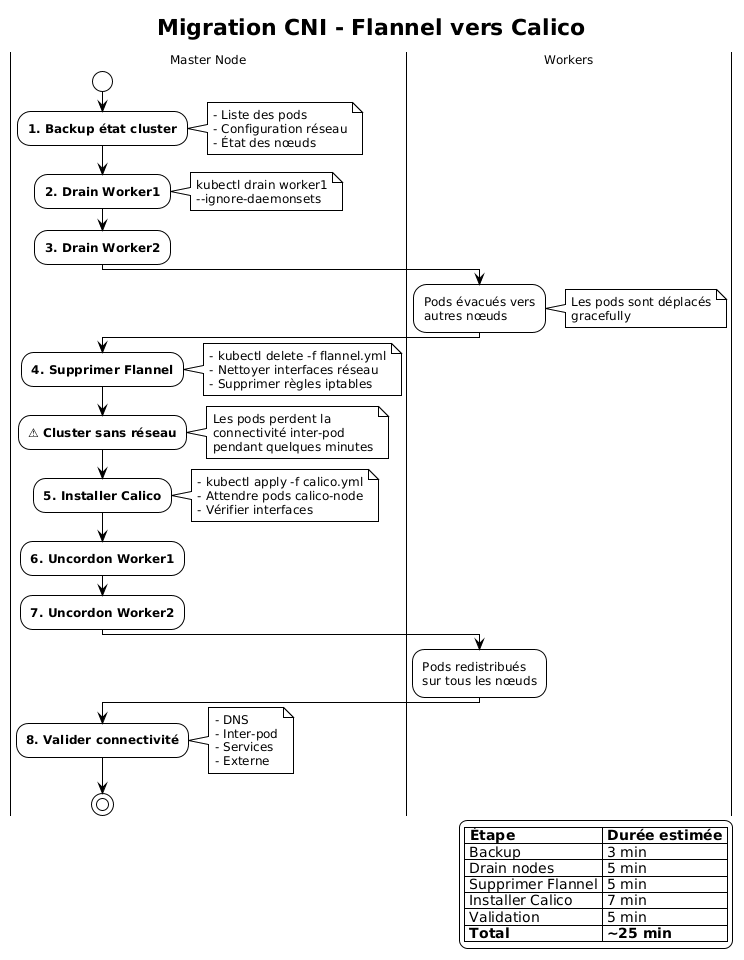

### 📝 EXERCICE ÉLÈVE
**Script sur le MASTER:**
```bash
cd scripts/partie4-migration-cni
./01-backup-state.sh
```

---

## 4.2 - Drain progressif

### 📝 EXERCICE ÉLÈVE
**Script sur le MASTER:**
```bash
./02-drain-nodes.sh
```

Observer l'évacuation progressive des pods

### Pourquoi drainer ?

✅ Évacuation propre des pods
✅ Évite les interruptions de connexion
✅ Respecte les PodDisruptionBudgets

### Problème potentiel
Drain bloqué par des pods sans controller

```bash
kubectl drain <node> --force --delete-emptydir-data
```

---

## 4.3 - Suppression de Flannel

### 📝 EXERCICE ÉLÈVE
**Script sur le MASTER:**
```bash
./03-remove-flannel.sh
```

### Points critiques

1. **Ne PAS redémarrer kubelet** entre suppression Flannel et installation Calico
   - Les pods perdront leur connectivité
   - Le nœud deviendra NotReady

2. **Nettoyage complet des interfaces**
   ```bash
   ip link show  # Vérifier flannel.1 supprimé
   ```

3. **Nettoyage iptables**

---

## 4.4 - Installation de Calico

### 📝 EXERCICE ÉLÈVE
**Script sur le MASTER:**
```bash
./04-install-calico.sh
```

⚠️ Le téléchargement peut prendre du temps

### Vérifications
```bash
kubectl get pods -n kube-system -l k8s-app=calico-node
```

---

## 4.5 - Validation post-migration

### 📝 EXERCICE ÉLÈVE
```bash
./05-validate-migration.sh
cd ../../validation && ./validate-partie.sh 4
```

### Tests obligatoires

- Connectivité inter-pods
- DNS fonctionnel
- Services fonctionnels

⚠️ **Si un test échoue, ne pas passer à la suite !**

---

<!-- _class: lead -->

# Partie 6
## Drain et Maintenance (20 min)

---

## Partie 5 - Timeline suggérée

- PodDisruptionBudget: **7 min**
- DaemonSets: **7 min**
- Simulation panne: **6 min**

---

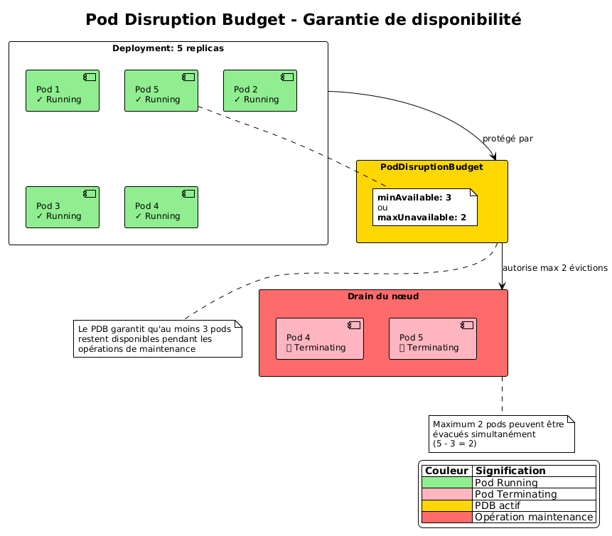

---

## PodDisruptionBudget - Concept

**Protection de la disponibilité pendant opérations volontaires**

| Opération | Volontaire ? | Respecte PDB ? |
|-----------|-------------|----------------|
| `kubectl drain` | Oui | ✅ Oui |
| `kubectl delete pod` | Oui | ✅ Oui |
| Node crash | Non | ❌ Non |
| OOM Kill | Non | ❌ Non |

---

## Drain + PDB — ce qui se passe étape par étape

<div style="font-size:0.78em">

<!-- État initial -->
<div style="display:flex;align-items:center;gap:8px;margin-bottom:6px">
  <div style="width:90px;font-weight:bold;color:#6b7280">① Initial</div>
  <div style="display:flex;gap:3px">
    <div style="background:#dcfce7;border:2px solid #16a34a;border-radius:5px;padding:3px 7px">A<br/><small>w1</small></div>
    <div style="background:#dcfce7;border:2px solid #16a34a;border-radius:5px;padding:3px 7px">B<br/><small>w1</small></div>
    <div style="background:#dcfce7;border:2px solid #16a34a;border-radius:5px;padding:3px 7px">C<br/><small>w1</small></div>
    <div style="background:#dcfce7;border:2px solid #16a34a;border-radius:5px;padding:3px 7px">D<br/><small>w2</small></div>
    <div style="background:#dcfce7;border:2px solid #16a34a;border-radius:5px;padding:3px 7px">E<br/><small>w2</small></div>
  </div>
  <div style="color:#16a34a;font-size:0.85em">PDB minAvailable=3 · 5/5 dispo · <strong>2 disruptions autorisées</strong></div>
</div>

<!-- kubectl drain -->
<div style="display:flex;align-items:center;gap:8px;margin-bottom:6px">
  <div style="width:90px;font-weight:bold;color:#6b7280">② drain<br/>worker1</div>
  <div style="background:#fef9c3;border:2px solid #ca8a04;border-radius:5px;padding:3px 8px;font-size:0.85em"><code>kubectl drain worker1</code><br/>cordon + éviction</div>
  <div style="font-size:1.2em">→</div>
  <div style="display:flex;gap:3px">
    <div style="background:#fee2e2;border:2px dashed #dc2626;border-radius:5px;padding:3px 7px;color:#dc2626">A<br/><small>évincé</small></div>
    <div style="background:#fee2e2;border:2px dashed #dc2626;border-radius:5px;padding:3px 7px;color:#dc2626">B<br/><small>évincé</small></div>
    <div style="background:#ffedd5;border:2px dashed #ea580c;border-radius:5px;padding:3px 7px;color:#ea580c">C<br/><small>bloqué ⏸</small></div>
    <div style="background:#dcfce7;border:2px solid #16a34a;border-radius:5px;padding:3px 7px">D<br/><small>w2</small></div>
    <div style="background:#dcfce7;border:2px solid #16a34a;border-radius:5px;padding:3px 7px">E<br/><small>w2</small></div>
  </div>
  <div style="color:#ca8a04;font-size:0.85em">A+B évincés (2 dispo) → 3ème éviction bloquée tant que A'/B' pas Ready</div>
</div>

<!-- reschedulé -->
<div style="display:flex;align-items:flex-start;gap:8px;margin-bottom:6px">
  <div style="width:90px;font-weight:bold;color:#6b7280;padding-top:4px">③ reschedule<br/>A' B' → Ready</div>
  <div style="display:flex;flex-direction:column;gap:4px">
    <div style="display:flex;gap:3px;align-items:center">
      <div style="background:#e0f2fe;border:2px solid #0284c7;border-radius:5px;padding:3px 7px">A'<br/><small>w2 ✅</small></div>
      <div style="background:#e0f2fe;border:2px solid #0284c7;border-radius:5px;padding:3px 7px">B'<br/><small>w2 ✅</small></div>
      <div style="background:#fee2e2;border:2px dashed #dc2626;border-radius:5px;padding:3px 7px;color:#dc2626">C<br/><small>évincé</small></div>
      <div style="background:#dcfce7;border:2px solid #16a34a;border-radius:5px;padding:3px 7px">D<br/><small>w2</small></div>
      <div style="background:#dcfce7;border:2px solid #16a34a;border-radius:5px;padding:3px 7px">E<br/><small>w2</small></div>
    </div>
    <div style="background:#f0f9ff;border-left:3px solid #0284c7;padding:4px 8px;border-radius:3px;color:#0369a1;font-size:0.82em">
      Le drain vide <strong>tous</strong> les pods de worker1 — C doit partir aussi car il est sur worker1 ·
      Le PDB contrôle le <strong>rythme</strong> : il attend que A' et B' soient <strong>Ready</strong> avant d'autoriser l'éviction de C ·
      Sans PDB, A, B et C auraient été évincés simultanément → risque de tomber sous minAvailable
    </div>
  </div>
</div>

<!-- final -->
<div style="display:flex;align-items:center;gap:8px">
  <div style="width:90px;font-weight:bold;color:#6b7280">④ Final</div>
  <div style="display:flex;gap:3px">
    <div style="background:#e0f2fe;border:2px solid #0284c7;border-radius:5px;padding:3px 7px">A'<br/><small>w2</small></div>
    <div style="background:#e0f2fe;border:2px solid #0284c7;border-radius:5px;padding:3px 7px">B'<br/><small>w2</small></div>
    <div style="background:#e0f2fe;border:2px solid #0284c7;border-radius:5px;padding:3px 7px">C'<br/><small>w2</small></div>
    <div style="background:#dcfce7;border:2px solid #16a34a;border-radius:5px;padding:3px 7px">D<br/><small>w2</small></div>
    <div style="background:#dcfce7;border:2px solid #16a34a;border-radius:5px;padding:3px 7px">E<br/><small>w2</small></div>
    <div style="background:#f1f5f9;border:2px dashed #94a3b8;border-radius:5px;padding:3px 7px;color:#94a3b8">w1<br/><small>cordonné</small></div>
  </div>
  <div style="color:#16a34a;font-size:0.85em">5/5 Running · worker1 vide · prêt pour maintenance</div>
</div>

</div>

---

## PodDisruptionBudget - Configuration

```yaml
apiVersion: policy/v1
kind: PodDisruptionBudget
metadata:
  name: app-pdb
spec:
  minAvailable: 2          # OU maxUnavailable: 1
  selector:
    matchLabels:
      app: my-app
---
# Équivalent avec pourcentage
apiVersion: policy/v1
kind: PodDisruptionBudget
spec:
  maxUnavailable: 25%      # Sur 4 replicas = 1 pod max
  selector:
    matchLabels:
      app: my-app
```

---

## PodDisruptionBudget - En pratique

### 📝 EXERCICE ÉLÈVE
**Script sur le MASTER:**
```bash
cd scripts/partie5-drain-maintenance
./01-test-pdb.sh
```

**Démonstration:**
1. Drain qui **respecte le PDB** (éviction séquentielle)
2. Drain qui **violerait le PDB** (bloqué, attente)

```bash
# Voir le status du PDB
kubectl get pdb app-pdb -o wide
# ALLOWED DISRUPTIONS montre combien de pods peuvent être évincés
```

---

## PodDisruptionBudget - Bonnes pratiques

| Situation | Recommandation |
|-----------|----------------|
| App stateless 3+ replicas | `maxUnavailable: 1` |
| App stateful (DB) | `minAvailable: 51%` (quorum) |
| Batch jobs | Pas de PDB nécessaire |
| Single replica | ⚠️ PDB bloquera tout drain! |

**Piège courant:** `minAvailable: 1` avec 1 replica = drain impossible

---

## 5.2 - DaemonSets

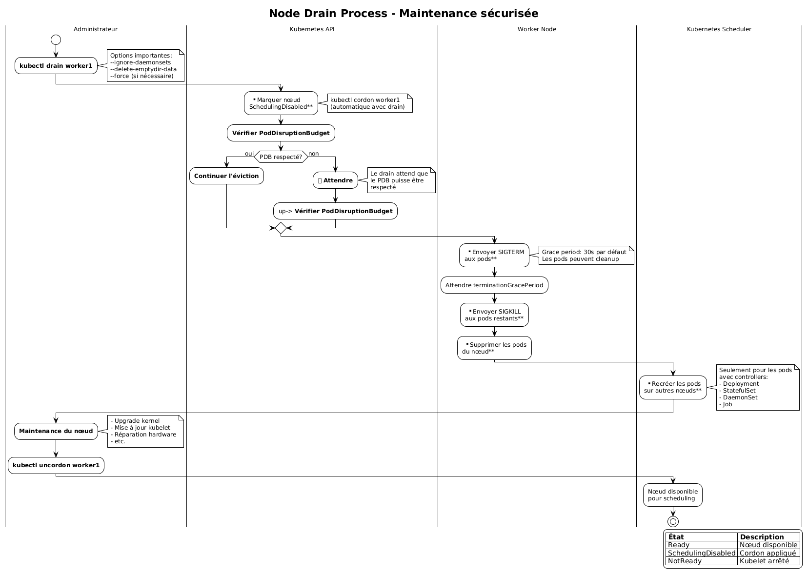

### 📝 EXERCICE ÉLÈVE
**Script sur le MASTER:**
```bash
./02-drain-daemonsets.sh
```

Observer l'erreur, puis avec `--ignore-daemonsets`

---

## 5.2 - DaemonSets (suite)

### Point pédagogique
Les DaemonSets sont spéciaux

### Pourquoi ?

**CNI** (Calico, Flannel) → Réseau node-level
**Monitoring** (node-exporter) → Métriques par nœud
**Logging** (fluentd) → Collecte locale des logs

**Démo:** Tentative de drain sans `--ignore-daemonsets`

Le drain échoue car les DaemonSets doivent rester sur le nœud

---

## Drain + DaemonSet — ce qui se passe

<div style="font-size:0.8em">

<!-- Initial -->
<div style="display:flex;align-items:center;gap:8px;margin-bottom:6px">
  <div style="width:100px;font-weight:bold;color:#6b7280">① Initial</div>
  <div style="display:flex;gap:6px;align-items:flex-end">
    <div style="display:flex;flex-direction:column;gap:3px;align-items:center">
      <div style="background:#dcfce7;border:2px solid #16a34a;border-radius:5px;padding:3px 8px">App A<br/><small>w1</small></div>
      <div style="background:#e0f2fe;border:2px solid #0284c7;border-radius:5px;padding:3px 8px">DS-w1<br/><small>DaemonSet</small></div>
    </div>
    <div style="display:flex;flex-direction:column;gap:3px;align-items:center">
      <div style="background:#dcfce7;border:2px solid #16a34a;border-radius:5px;padding:3px 8px">App B<br/><small>w2</small></div>
      <div style="background:#e0f2fe;border:2px solid #0284c7;border-radius:5px;padding:3px 8px">DS-w2<br/><small>DaemonSet</small></div>
    </div>
  </div>
  <div style="color:#6b7280;font-size:0.85em">1 pod DaemonSet par nœud — obligatoire</div>
</div>

<!-- Sans flag -->
<div style="display:flex;align-items:center;gap:8px;margin-bottom:6px">
  <div style="width:100px;font-weight:bold;color:#6b7280">② drain<br/><small>sans flag</small></div>
  <div style="background:#fee2e2;border:2px solid #dc2626;border-radius:5px;padding:4px 10px;font-size:0.85em">
    <code>kubectl drain worker1</code><br/>❌ <strong>ERREUR</strong> : cannot delete DaemonSet-managed Pods
  </div>
  <div style="background:#fef9c3;border-left:3px solid #ca8a04;padding:4px 8px;border-radius:3px;font-size:0.82em;color:#92400e">
    Le drain refuse de supprimer DS-w1 car le DaemonSet le recréerait immédiatement → boucle infinie
  </div>
</div>

<!-- Avec flag -->
<div style="display:flex;align-items:center;gap:8px;margin-bottom:6px">
  <div style="width:100px;font-weight:bold;color:#6b7280">③ drain<br/><small>--ignore-daemonsets</small></div>
  <div style="display:flex;gap:6px;align-items:flex-end">
    <div style="display:flex;flex-direction:column;gap:3px;align-items:center">
      <div style="background:#fee2e2;border:2px dashed #dc2626;border-radius:5px;padding:3px 8px;color:#dc2626">App A<br/><small>évincé</small></div>
      <div style="background:#e0f2fe;border:2px solid #0284c7;border-radius:5px;padding:3px 8px">DS-w1<br/><small>ignoré ✅</small></div>
    </div>
    <div style="display:flex;flex-direction:column;gap:3px;align-items:center">
      <div style="background:#dcfce7;border:2px solid #16a34a;border-radius:5px;padding:3px 8px">App B<br/><small>w2</small></div>
      <div style="background:#e0f2fe;border:2px solid #0284c7;border-radius:5px;padding:3px 8px">DS-w2<br/><small>DaemonSet</small></div>
    </div>
    <div style="background:#e0f2fe;border:2px solid #0284c7;border-radius:5px;padding:3px 8px">App A'<br/><small>w2</small></div>
  </div>
  <div style="color:#0284c7;font-size:0.85em">App A reschedulée · DS-w1 reste en place — il est node-level</div>
</div>

</div>

> Le pod DaemonSet **reste sur le nœud drainé** — c'est voulu : il fournit un service au niveau du nœud (réseau, logs, monitoring) qui ne peut pas migrer.

---

## 5.3 - Simulation de panne

### 📝 EXERCICE ÉLÈVE
```bash
./03-simulate-node-failure.sh
cd ../../validation && ./validate-partie.sh 5
```

⚠️ **Section interactive**

### Points d'observation

| Étape | Délai |
|-------|-------|
| Détection NotReady | ~40s |
| Pods Terminating | ~5 min |
| Recréation pods | Après éviction |

---

## Simulation de panne — timeline Kubernetes

<div style="font-size:0.8em">

<!-- Initial -->
<div style="display:flex;align-items:center;gap:8px;margin-bottom:6px">
  <div style="width:110px;font-weight:bold;color:#6b7280">① t=0<br/>Panne kubelet</div>
  <div style="display:flex;gap:4px">
    <div style="background:#dcfce7;border:2px solid #16a34a;border-radius:5px;padding:3px 8px">Pod 1<br/><small>w1</small></div>
    <div style="background:#dcfce7;border:2px solid #16a34a;border-radius:5px;padding:3px 8px">Pod 2<br/><small>w1</small></div>
    <div style="background:#dcfce7;border:2px solid #16a34a;border-radius:5px;padding:3px 8px">Pod 3<br/><small>w2</small></div>
  </div>
  <div style="background:#fee2e2;border:2px dashed #dc2626;border-radius:5px;padding:3px 10px;color:#dc2626">worker1<br/><small>kubelet arrêté</small></div>
  <div style="color:#6b7280;font-size:0.82em">Les pods semblent Running — l'API ne sait pas encore</div>
</div>

<!-- t=40s -->
<div style="display:flex;align-items:center;gap:8px;margin-bottom:6px">
  <div style="width:110px;font-weight:bold;color:#6b7280">② t≈40s<br/>NotReady</div>
  <div style="display:flex;gap:4px">
    <div style="background:#ffedd5;border:2px dashed #ea580c;border-radius:5px;padding:3px 8px;color:#ea580c">Pod 1<br/><small>Unknown</small></div>
    <div style="background:#ffedd5;border:2px dashed #ea580c;border-radius:5px;padding:3px 8px;color:#ea580c">Pod 2<br/><small>Unknown</small></div>
    <div style="background:#dcfce7;border:2px solid #16a34a;border-radius:5px;padding:3px 8px">Pod 3<br/><small>w2</small></div>
  </div>
  <div style="background:#fef9c3;border-left:3px solid #ca8a04;padding:4px 8px;border-radius:3px;font-size:0.82em;color:#92400e">
    <code>node-monitor-grace-period=40s</code> · node-controller marque worker1 <strong>NotReady</strong>
  </div>
</div>

<!-- t=5min -->
<div style="display:flex;align-items:center;gap:8px;margin-bottom:6px">
  <div style="width:110px;font-weight:bold;color:#6b7280">③ t≈5min<br/>Eviction</div>
  <div style="display:flex;gap:4px">
    <div style="background:#fee2e2;border:2px dashed #dc2626;border-radius:5px;padding:3px 8px;color:#dc2626">Pod 1<br/><small>Terminating</small></div>
    <div style="background:#fee2e2;border:2px dashed #dc2626;border-radius:5px;padding:3px 8px;color:#dc2626">Pod 2<br/><small>Terminating</small></div>
    <div style="background:#dcfce7;border:2px solid #16a34a;border-radius:5px;padding:3px 8px">Pod 3<br/><small>w2</small></div>
    <div style="background:#e0f2fe;border:2px solid #0284c7;border-radius:5px;padding:3px 8px">Pod 1'<br/><small>w2 🆕</small></div>
    <div style="background:#e0f2fe;border:2px solid #0284c7;border-radius:5px;padding:3px 8px">Pod 2'<br/><small>w2 🆕</small></div>
  </div>
  <div style="color:#dc2626;font-size:0.82em"><code>pod-eviction-timeout=5min</code> · pods recréés sur nœuds sains</div>
</div>

<!-- récupération -->
<div style="display:flex;align-items:center;gap:8px">
  <div style="width:110px;font-weight:bold;color:#6b7280">④ Récupération<br/>kubelet restart</div>
  <div style="display:flex;gap:4px">
    <div style="background:#dcfce7;border:2px solid #16a34a;border-radius:5px;padding:3px 8px">Pod 1'<br/><small>w2</small></div>
    <div style="background:#dcfce7;border:2px solid #16a34a;border-radius:5px;padding:3px 8px">Pod 2'<br/><small>w2</small></div>
    <div style="background:#dcfce7;border:2px solid #16a34a;border-radius:5px;padding:3px 8px">Pod 3<br/><small>w2</small></div>
    <div style="background:#f1f5f9;border:2px solid #94a3b8;border-radius:5px;padding:3px 8px;color:#6b7280">worker1<br/><small>Ready (vide)</small></div>
  </div>
  <div style="color:#16a34a;font-size:0.82em">worker1 revient Ready · anciens pods <strong>ne reviennent pas</strong> (déjà remplacés)</div>
</div>

</div>

---

## Question - Délai de détection

**Q: Comment réduire le délai de détection ?**
> R: Configurer `node-monitor-grace-period` et `pod-eviction-timeout` dans kube-controller-manager.
>
> ⚠️ Attention: trop court = false positives

---

<!-- _class: lead -->

# Partie 7
## Upgrade du Cluster (25 min)

---

## Partie 6 - Timeline suggérée

- Check versions: **3 min**
- Upgrade control plane: **7 min**
- Upgrade master kubelet: **5 min**
- Upgrade workers: **8 min** (4 min × 2)
- Validation: **2 min**

---

## Concepts de version Kubernetes

### Structure: `v1.28.3`

- **Major:** Changements majeurs (rare)
- **Minor:** Features, API changes (~4 mois)
- **Patch:** Bugfixes, security patches

### Politique de support
**N, N-1, N-2**

---

## 6.1 - Check versions

### 📝 EXERCICE ÉLÈVE
**Script sur le MASTER:**
```bash
cd scripts/partie6-upgrade-cluster
./01-check-versions.sh
```

---

## Ordre d'upgrade obligatoire

1. **etcd** (si externe)
2. **Control plane**
3. **Workers**
4. **Addons** (CNI, etc.)

⚠️ Ordre crucial pour la compatibilité !

---

## 6.2 - Upgrade control plane

### 📝 EXERCICE ÉLÈVE
**Script sur le MASTER:**
```bash
./02-upgrade-control-plane.sh
```

### Point critique
`kubeadm upgrade plan`

**Insistez pour que les étudiants lisent attentivement le plan !**

### Informations dans le plan

- Versions actuelles
- Versions disponibles
- Composants à upgrader
- Commande exacte à exécuter

---

## 6.3 - Upgrade kubelet master

### 📝 EXERCICE ÉLÈVE
**Script sur le MASTER:**
```bash
./03-upgrade-master-kubelet.sh
```

### Point pédagogique
**Pourquoi kubelet séparément ?**

- Kubelet tourne sur **chaque nœud**
- Nécessite un **redémarrage local**
- **Drain requis** pour éviter les interruptions

---

## 6.4 - Upgrade workers

### 📝 EXERCICE ÉLÈVE
**Script sur chaque WORKER:**
```bash
./04-upgrade-worker.sh
```

### Procédure par worker
**Drain → Upgrade → Uncordon**

### Ordre recommandé

- Un worker à la fois
- Valider entre chaque worker

**Si temps limité:** Upgrader un seul worker en démo

---

## 6.5 - Validation post-upgrade

### 📝 EXERCICE ÉLÈVE
```bash
./05-verify-upgrade.sh
cd ../../validation && ./validate-partie.sh 6
```

### Checklist

- Nœuds Ready + Versions cohérentes
- Pods système Running
- Nouveau déploiement OK
- DNS + Services fonctionnels

---

<!-- _class: lead -->

# etcd & etcdctl
## La source de vérité du cluster

---

## etcd — rôle dans Kubernetes

### L'unique source de vérité

```
┌─────────────────────────────────────────────────────────────┐
│                      CONTROL PLANE                          │
│                                                             │
│  kubectl → API Server → etcd  ← tout l'état du cluster     │
│                ↑                                            │
│  scheduler, controller-manager lisent/écrivent via API      │
└─────────────────────────────────────────────────────────────┘
```

**Ce qu'etcd stocke :**
- Tous les objets Kubernetes (Pods, Services, ConfigMaps…)
- L'état désiré ET l'état observé
- Les secrets (chiffrés at rest depuis K8s 1.13+)

> Perte d'etcd = perte du cluster. C'est le seul composant **stateful**.

---

## etcd dans kubeadm — stacked vs external

### Stacked (défaut kubeadm)

```
┌─────────── Master node ───────────┐
│  API Server                       │
│  scheduler / controller-manager   │
│  etcd  ← tourne sur le même nœud  │
└───────────────────────────────────┘
```

### External (production multi-master)

```
Master nodes          etcd cluster
┌──────────┐         ┌─────┐ ┌─────┐ ┌─────┐
│ API Srvr │────────►│etcd │ │etcd │ │etcd │
└──────────┘         └─────┘ └─────┘ └─────┘
                      3 ou 5 membres (quorum)
```

| | Stacked | External |
|---|---|---|
| Simplicité | ✓ | Plus complexe |
| HA réelle | Partielle | ✓ |
| Ce TD | **✓ stacked** | — |

---

## etcdctl — setup et authentification

### Variables d'environnement obligatoires

```bash
# API v3 obligatoire (v2 = legacy)
export ETCDCTL_API=3

# Certificats TLS (kubeadm stacked)
export ETCDCTL_CACERT=/etc/kubernetes/pki/etcd/ca.crt
export ETCDCTL_CERT=/etc/kubernetes/pki/etcd/server.crt
export ETCDCTL_KEY=/etc/kubernetes/pki/etcd/server.key

# Endpoint local
export ETCDCTL_ENDPOINTS=https://127.0.0.1:2379
```

### Vérifier que tout fonctionne

```bash
etcdctl endpoint health
# 127.0.0.1:2379 is healthy: committed revision: 42156
```

⚠️ Sans `ETCDCTL_API=3` → erreurs cryptiques ou réponses vides

---

## etcdctl — commandes essentielles

### Santé du cluster

```bash
etcdctl endpoint status --write-out=table
# ENDPOINT             ID    VERSION  DB SIZE  IS LEADER
# 127.0.0.1:2379  abc123  3.5.12   8.2 MB   true

etcdctl member list --write-out=table
# ID     STATUS   NAME     PEER ADDRS             IS LEARNER
# abc123 started  master   https://10.0.0.1:2380  false
```

### Inspection des données

```bash
# Lister toutes les clés (namespace Kubernetes)
etcdctl get / --prefix --keys-only | head -20

# Lire un objet spécifique
etcdctl get /registry/pods/default/mon-pod
```

> L'API Server est une façade : tout ce que kubectl retourne vient d'etcd

---

## Backup etcd — snapshot avant upgrade

### Procédure obligatoire avant tout upgrade

```bash
# 1. Créer le répertoire de backup
sudo mkdir -p /var/backup/etcd

# 2. Snapshot
sudo ETCDCTL_API=3 etcdctl snapshot save /var/backup/etcd/snapshot-$(date +%Y%m%d-%H%M).db \
  --cacert=/etc/kubernetes/pki/etcd/ca.crt \
  --cert=/etc/kubernetes/pki/etcd/server.crt \
  --key=/etc/kubernetes/pki/etcd/server.key \
  --endpoints=https://127.0.0.1:2379

# 3. Vérifier le snapshot
sudo ETCDCTL_API=3 etcdctl snapshot status /var/backup/etcd/snapshot-*.db \
  --write-out=table
```

**Output attendu :**
```
HASH       REVISION  TOTAL KEYS  TOTAL SIZE
a1b2c3d4   42156     1247        8.2 MB
```

---

## Restauration depuis un snapshot

### Scénario : cluster cassé, etcd corrompu

```bash
# 1. Arrêter l'API server (pod statique → déplacer le manifest)
sudo mv /etc/kubernetes/manifests/etcd.yaml /tmp/

# 2. Restaurer le snapshot
sudo ETCDCTL_API=3 etcdctl snapshot restore /var/backup/etcd/snapshot.db \
  --data-dir=/var/lib/etcd-restored \
  --name=master \
  --initial-cluster=master=https://127.0.0.1:2380 \
  --initial-advertise-peer-urls=https://127.0.0.1:2380

# 3. Pointer etcd vers le nouveau data-dir
# Modifier /tmp/etcd.yaml : --data-dir=/var/lib/etcd-restored

# 4. Remettre le manifest → etcd redémarre
sudo mv /tmp/etcd.yaml /etc/kubernetes/manifests/
```

⚠️ La restauration **revert l'état complet** — tous les objets créés après le snapshot sont perdus

---

## etcdctl — points instructeur

### Pièges fréquents

| Piège | Symptôme | Fix |
|-------|----------|-----|
| `ETCDCTL_API` non défini | `Error: unknown command` | `export ETCDCTL_API=3` |
| Mauvais certificat | `x509: certificate signed by unknown authority` | Vérifier les 3 chemins PKI |
| etcd pod stacked | `connection refused` pendant restore | Déplacer le manifest d'abord |
| data-dir existant | `member already exists` | Supprimer `/var/lib/etcd` avant restore |

### Quand utiliser etcdctl en TD ?

- **Avant l'upgrade** (Partie 7) → snapshot obligatoire
- **Curiosité pédagogique** → `get / --prefix --keys-only` pour voir l'état brut
- **Scénario de panne** → restauration (optionnel si temps)

---

<!-- _class: lead -->

# Partie 8
## RuntimeClass & gVisor (25 min)

---

## Partie 8 - Timeline suggérée

- Install gVisor sur les nœuds: **7 min**
- Création RuntimeClass: **3 min**
- Test d'isolation: **5 min**
- Déploiement avec RuntimeClass: **5 min**
- Comparaison de performance: **5 min**

---

## Le problème — isolation des containers

- `runc` partage le **kernel hôte** avec tous les containers
- CVE kernel = **tous les containers exposés**
- Attaque kernel: escalade de privilèges possible

<svg width="760" height="185" viewBox="0 0 760 185" xmlns="http://www.w3.org/2000/svg" role="img" aria-hidden="true">
<defs>
<marker id="p8a1" markerWidth="8" markerHeight="6" refX="7" refY="3" orient="auto"><polygon points="0 0,8 3,0 6" fill="#6b7280"/></marker>
<marker id="p8a2" markerWidth="8" markerHeight="6" refX="7" refY="3" orient="auto"><polygon points="0 0,8 3,0 6" fill="#ef4444"/></marker>
<marker id="p8a3" markerWidth="8" markerHeight="6" refX="7" refY="3" orient="auto"><polygon points="0 0,8 3,0 6" fill="#16a34a"/></marker>
</defs>
<style>text{font-family:sans-serif;font-size:13px}</style>
<text x="150" y="16" text-anchor="middle" font-size="14" font-weight="bold" fill="#dc2626">runc (défaut)</text>
<rect x="15" y="24" width="120" height="40" rx="5" fill="#dbeafe" stroke="#3b82f6" stroke-width="1.5"/>
<text x="75" y="49" text-anchor="middle" fill="#1d4ed8" font-weight="bold">Container A</text>
<rect x="155" y="24" width="120" height="40" rx="5" fill="#fee2e2" stroke="#ef4444" stroke-width="1.5"/>
<text x="215" y="42" text-anchor="middle" fill="#b91c1c" font-weight="bold">Container B</text>
<text x="215" y="57" text-anchor="middle" fill="#b91c1c" font-size="11">⚠ compromis</text>
<line x1="75" y1="64" x2="75" y2="100" stroke="#6b7280" stroke-width="1.5" marker-end="url(#p8a1)"/>
<line x1="215" y1="64" x2="215" y2="100" stroke="#ef4444" stroke-width="2" marker-end="url(#p8a2)"/>
<rect x="15" y="103" width="260" height="38" rx="5" fill="#fef3c7" stroke="#f59e0b" stroke-width="2"/>
<text x="145" y="120" text-anchor="middle" fill="#78350f" font-weight="bold">Kernel Linux hôte</text>
<text x="145" y="135" text-anchor="middle" fill="#78350f" font-size="11">partagé par tous les containers</text>
<text x="145" y="158" text-anchor="middle" font-size="12" fill="#dc2626">⚡ CVE kernel → tous les containers exposés</text>
<line x1="310" y1="10" x2="310" y2="175" stroke="#d1d5db" stroke-width="1" stroke-dasharray="5,3"/>
<text x="450" y="16" text-anchor="middle" font-size="14" font-weight="bold" fill="#16a34a">gVisor</text>
<rect x="325" y="24" width="110" height="35" rx="5" fill="#dbeafe" stroke="#3b82f6" stroke-width="1.5"/>
<text x="380" y="46" text-anchor="middle" fill="#1d4ed8" font-weight="bold">Container A</text>
<rect x="455" y="24" width="110" height="35" rx="5" fill="#fee2e2" stroke="#ef4444" stroke-width="1.5"/>
<text x="510" y="40" text-anchor="middle" fill="#b91c1c" font-weight="bold">Container B</text>
<text x="510" y="53" text-anchor="middle" fill="#b91c1c" font-size="11">⚠ compromis</text>
<line x1="380" y1="59" x2="380" y2="76" stroke="#6b7280" stroke-width="1.5" marker-end="url(#p8a1)"/>
<line x1="510" y1="59" x2="510" y2="76" stroke="#ef4444" stroke-width="1.5" marker-end="url(#p8a2)"/>
<rect x="325" y="78" width="110" height="30" rx="5" fill="#dcfce7" stroke="#16a34a" stroke-width="1.5"/>
<text x="380" y="98" text-anchor="middle" fill="#166534">🛡 Sentry A</text>
<rect x="455" y="78" width="110" height="30" rx="5" fill="#dcfce7" stroke="#16a34a" stroke-width="1.5"/>
<text x="510" y="98" text-anchor="middle" fill="#166534">🛡 Sentry B</text>
<line x1="380" y1="108" x2="380" y2="127" stroke="#16a34a" stroke-width="1.5" marker-end="url(#p8a3)"/>
<line x1="510" y1="108" x2="510" y2="127" stroke="#16a34a" stroke-width="1.5" marker-end="url(#p8a3)"/>
<rect x="325" y="129" width="240" height="33" rx="5" fill="#fef3c7" stroke="#f59e0b" stroke-width="1.5"/>
<text x="445" y="147" text-anchor="middle" fill="#78350f" font-weight="bold">Kernel hôte</text>
<text x="445" y="158" text-anchor="middle" fill="#78350f" font-size="11">syscalls filtrés (limités)</text>
<text x="445" y="180" text-anchor="middle" font-size="12" fill="#16a34a">✓ B compromis reste isolé dans son Sentry</text>
</svg>

**Solution: interposer un kernel par container**

---

## gVisor — kernel en espace utilisateur

- Intercepte les **syscalls** avant le kernel hôte
- ~70% des syscalls Linux implémentés
- Composant clé: **Sentry** (kernel en Go/userspace)

<svg width="740" height="80" viewBox="0 0 740 80" xmlns="http://www.w3.org/2000/svg" role="img" aria-hidden="true">
<defs><marker id="p8a4" markerWidth="8" markerHeight="6" refX="7" refY="3" orient="auto"><polygon points="0 0,8 3,0 6" fill="#6b7280"/></marker></defs>
<style>text{font-family:sans-serif;font-size:13px}</style>
<rect x="5" y="20" width="80" height="38" rx="5" fill="#dbeafe" stroke="#3b82f6" stroke-width="1.5"/>
<text x="45" y="44" text-anchor="middle" fill="#1d4ed8" font-weight="bold">App</text>
<line x1="85" y1="39" x2="148" y2="39" stroke="#6b7280" stroke-width="1.5" marker-end="url(#p8a4)"/>
<text x="117" y="32" text-anchor="middle" fill="#6b7280" font-size="11">syscall</text>
<text x="117" y="55" text-anchor="middle" fill="#6b7280" font-size="11">(tous)</text>
<rect x="151" y="10" width="175" height="58" rx="5" fill="#dcfce7" stroke="#16a34a" stroke-width="2"/>
<text x="238" y="36" text-anchor="middle" fill="#166534" font-weight="bold">gVisor Sentry</text>
<text x="238" y="53" text-anchor="middle" fill="#166534" font-size="11">kernel userspace (Go)</text>
<line x1="326" y1="39" x2="395" y2="39" stroke="#6b7280" stroke-width="1.5" marker-end="url(#p8a4)"/>
<text x="361" y="32" text-anchor="middle" fill="#6b7280" font-size="11">syscalls</text>
<text x="361" y="55" text-anchor="middle" fill="#6b7280" font-size="11">filtrés</text>
<rect x="398" y="20" width="155" height="38" rx="5" fill="#fef3c7" stroke="#f59e0b" stroke-width="1.5"/>
<text x="475" y="44" text-anchor="middle" fill="#78350f" font-weight="bold">Kernel hôte</text>
<text x="45" y="74" text-anchor="middle" fill="#9ca3af" font-size="10">userspace</text>
<text x="238" y="74" text-anchor="middle" fill="#9ca3af" font-size="10">userspace (intercept)</text>
<text x="475" y="74" text-anchor="middle" fill="#9ca3af" font-size="10">kernelspace</text>
<text x="590" y="35" fill="#6b7280" font-size="12">~70% syscalls</text>
<text x="590" y="52" fill="#6b7280" font-size="12">implémentés</text>
</svg>

- Isolation forte: même si le Sentry est compromis, surface réduite
- Surcoût: ~2-3× (I/O, fork/exec)

---

## Installation de gVisor

Deux binaires requis sur chaque nœud:
- `runsc` — le runtime gVisor
- `containerd-shim-runsc-v1` — shim containerd

Config containerd via drop-in (ne pas modifier `config.toml`):
```toml
# /etc/containerd/conf.d/gvisor.toml
[plugins.'io.containerd.cri.v1.runtime']
  [plugins.'io.containerd.cri.v1.runtime'.containerd.runtimes.runsc]
    runtime_type = 'io.containerd.runsc.v1'
    [plugins.'io.containerd.cri.v1.runtime'.containerd.runtimes.runsc.options]
      TypeUrl = 'io.containerd.runsc.v1.options'
```

⚠️ Plugin v2: `io.containerd.cri.v1.runtime` (pas `grpc.v1.cri`)

---

## containerd 2.x — le plugin CRI a changé de nom

### containerd 1.x vs 2.x : deux chemins incompatibles

```toml
# containerd 1.x  (< 2.0)
[plugins."io.containerd.grpc.v1.cri".containerd.runtimes.runsc]
  runtime_type = "io.containerd.runsc.v1"

# containerd 2.x  (ce TD)
[plugins.'io.containerd.cri.v1.runtime'.containerd.runtimes.runsc]
  runtime_type = 'io.containerd.runsc.v1'
```

### Pourquoi ce renommage ?

- En 1.x, le CRI était un **plugin gRPC parmi d'autres** → `grpc.v1.cri`
- En 2.x, le CRI est **natif** dans containerd → `cri.v1.runtime`
- Le préfixe `grpc` disparaît : CRI n'est plus un greffon, c'est le cœur

### Piège fréquent

Copier une config gVisor/kata depuis internet → souvent écrite pour 1.x
→ containerd 2.x **ignore silencieusement** la section mal nommée
→ le runtime n'apparaît pas, sans message d'erreur explicite

---

## Exercice 8.1 — Install gVisor

### 📝 EXERCICE ÉLÈVE — Sur TOUS les nœuds

```bash
cd scripts/partie7-runtimeclass
./01-install-gvisor.sh
```

### Points d'attention instructeur

- KVM disponible sur Exoscale: `platform = 'kvm'` dans `/etc/containerd/runsc.toml`
- Sans KVM: `platform = 'systrap'` (ptrace-based, plus lent)
- Vérifier: `sudo runsc --version`
- Vérifier containerd restart OK: `systemctl status containerd`

---

## RuntimeClass — Le lien K8s ↔ containerd

<svg width="740" height="68" viewBox="0 0 740 68" xmlns="http://www.w3.org/2000/svg" role="img" aria-hidden="true">
<defs><marker id="p8a5" markerWidth="8" markerHeight="6" refX="7" refY="3" orient="auto"><polygon points="0 0,8 3,0 6" fill="#6b7280"/></marker></defs>
<style>text{font-family:sans-serif;font-size:12px}</style>
<rect x="5" y="13" width="155" height="42" rx="5" fill="#ede9fe" stroke="#7c3aed" stroke-width="1.5"/>
<text x="82" y="31" text-anchor="middle" fill="#5b21b6" font-weight="bold">Pod spec</text>
<text x="82" y="47" text-anchor="middle" fill="#5b21b6" font-size="11">runtimeClassName: gvisor</text>
<line x1="160" y1="34" x2="200" y2="34" stroke="#6b7280" stroke-width="1.5" marker-end="url(#p8a5)"/>
<rect x="203" y="10" width="165" height="48" rx="5" fill="#dcfce7" stroke="#16a34a" stroke-width="1.5"/>
<text x="285" y="30" text-anchor="middle" fill="#166534" font-weight="bold">RuntimeClass</text>
<text x="285" y="47" text-anchor="middle" fill="#166534" font-size="11">gvisor → handler: runsc</text>
<line x1="368" y1="34" x2="408" y2="34" stroke="#6b7280" stroke-width="1.5" marker-end="url(#p8a5)"/>
<rect x="411" y="13" width="120" height="42" rx="5" fill="#f3f4f6" stroke="#6b7280" stroke-width="1.5"/>
<text x="471" y="39" text-anchor="middle" fill="#374151" font-weight="bold">containerd</text>
<line x1="531" y1="34" x2="571" y2="34" stroke="#6b7280" stroke-width="1.5" marker-end="url(#p8a5)"/>
<rect x="574" y="13" width="155" height="42" rx="5" fill="#dcfce7" stroke="#16a34a" stroke-width="2"/>
<text x="651" y="31" text-anchor="middle" fill="#166534" font-weight="bold">runsc</text>
<text x="651" y="47" text-anchor="middle" fill="#166534" font-size="11">gVisor runtime</text>
<text x="285" y="64" text-anchor="middle" fill="#9ca3af" font-size="10">objet Kubernetes</text>
</svg>

```yaml
apiVersion: node.k8s.io/v1
kind: RuntimeClass
metadata:
  name: gvisor
handler: runsc
scheduling:
  nodeClassification:
    tolerations:
    - effect: NoSchedule
      key: sandbox
      operator: Equal
      value: gvisor
```

Le `handler` doit correspondre au nom dans la config containerd.

---

## Exercice 8.2 — Création RuntimeClass

### 📝 EXERCICE ÉLÈVE — Sur le MASTER

```bash
./02-create-runtimeclass.sh
```

### Vérification

```bash
kubectl get runtimeclass
kubectl describe runtimeclass gvisor
```

---

## Démonstration de l'isolation

Comparaison `runc` vs `gVisor` depuis un container:

| Commande | runc | gVisor |
|----------|------|--------|
| `uname -r` | Kernel hôte (ex: 5.14.x) | 4.4.0 (Sentry) |
| `dmesg` | Logs kernel hôte | Logs Sentry isolés |
| `/proc/version` | Linux hôte | gVisor version |

**Point pédagogique:** le kernel "4.4.0" est celui du Sentry gVisor — pas le kernel hôte. L'app voit un kernel virtuel.

---

## Exercice 8.3 — Test isolation

### 📝 EXERCICE ÉLÈVE

```bash
./03-test-isolation.sh
```

### Points pédagogiques

- Comparer `uname -r` dans un pod runc vs pod gVisor
- Le kernel "4.4.0" = Sentry gVisor (pas une vraie version)
- `dmesg` dans le pod gVisor: logs isolés, pas ceux de l'hôte
- Essayer d'écrire dans `/proc` → permission refusée

---

## Utilisation dans un Deployment

Ajouter `runtimeClassName` dans le podSpec:

```yaml
apiVersion: apps/v1
kind: Deployment
metadata:
  name: app-securisee
  namespace: sandbox
spec:
  template:
    spec:
      runtimeClassName: gvisor
      containers:
      - name: app
        image: nginx:alpine
```

**Bonne pratique:** namespace dédié pour workloads sensibles (CI/CD, multi-tenant)

---

## Exercices 8.4 & 8.5

### 📝 EXERCICE ÉLÈVE

**8.4 — Déploiement avec RuntimeClass:**
```bash
./04-deploy-with-runtimeclass.sh
```

**8.5 — Comparaison de performance:**
```bash
./05-performance-comparison.sh
```

**Résultats attendus:** overhead visible sur I/O et fork/exec, transparent pour workloads CPU.

---

## Performance — Overhead gVisor

| Workload | runc | gVisor | Overhead |
|----------|------|--------|----------|
| I/O séquentiel | 1× | ~3× | +200% |
| fork/exec | 1× | ~2.5× | +150% |
| Requêtes DNS | 1× | ~1.3× | +30% |

**Règle:** gVisor pour l'isolation, pas pour les I/O intensifs.

---

## Quand utiliser gVisor

### Cas d'usage adaptés
- Pipelines CI/CD (code utilisateur non fiable)
- Plateformes multi-tenant (isolation entre clients)
- Workloads traitant des données sensibles
- Preview/sandbox d'applications

### Quand éviter
- Workloads I/O-intensifs (bases de données, logs)
- Applications temps-réel (latence critique)
- Workloads nécessitant des syscalls non supportés

---

<!-- _class: lead -->

# Partie 9
## Réseau public vs privé (10 min)

---

## Partie 9 - Timeline suggérée

- Architecture sans réseau privé — risques: **4 min**
- Architecture avec réseau privé — isolation: **4 min**
- Quand choisir: **2 min**

---

## Architecture sans réseau privé — les risques

<svg width="1100" height="318" viewBox="0 0 760 220" xmlns="http://www.w3.org/2000/svg" role="img" aria-hidden="true">
<defs>
  <marker id="ra" markerWidth="8" markerHeight="6" refX="7" refY="3" orient="auto"><polygon points="0 0,8 3,0 6" fill="#dc2626"/></marker>
  <marker id="ga" markerWidth="8" markerHeight="6" refX="7" refY="3" orient="auto"><polygon points="0 0,8 3,0 6" fill="#16a34a"/></marker>
</defs>
<style>text{font-family:sans-serif}</style>

<!-- Master -->
<rect x="20" y="20" width="190" height="130" rx="8" fill="#dbeafe" stroke="#3b82f6" stroke-width="2"/>
<text x="115" y="42" text-anchor="middle" fill="#1e40af" font-weight="bold" font-size="14">Master</text>
<text x="115" y="57" text-anchor="middle" fill="#6b7280" font-size="11">185.42.17.3 (IP publique)</text>
<rect x="35" y="65" width="160" height="28" rx="4" fill="#bfdbfe" stroke="#3b82f6" stroke-width="1.5"/>
<text x="115" y="84" text-anchor="middle" fill="#1e40af" font-size="12" font-weight="bold">API Server :6443</text>
<rect x="35" y="105" width="160" height="28" rx="4" fill="#bfdbfe" stroke="#3b82f6" stroke-width="1.5"/>
<text x="115" y="124" text-anchor="middle" fill="#1e40af" font-size="12" font-weight="bold">etcd :2379</text>
<line x1="115" y1="93" x2="115" y2="105" stroke="#16a34a" stroke-width="2" marker-end="url(#ga)"/>
<text x="200" y="102" fill="#15803d" font-size="10">loopback ✓</text>

<!-- Worker 1 -->
<rect x="280" y="30" width="170" height="100" rx="8" fill="#dbeafe" stroke="#3b82f6" stroke-width="1.5"/>
<text x="365" y="55" text-anchor="middle" fill="#1e40af" font-weight="bold" font-size="14">Worker 1</text>
<text x="365" y="73" text-anchor="middle" fill="#6b7280" font-size="11">kubelet</text>
<text x="365" y="90" text-anchor="middle" fill="#dc2626" font-size="11">185.42.17.8 (pub)</text>
<text x="365" y="107" text-anchor="middle" fill="#6b7280" font-size="11">pods / CNI</text>

<!-- Worker 2 -->
<rect x="520" y="30" width="170" height="100" rx="8" fill="#dbeafe" stroke="#3b82f6" stroke-width="1.5"/>
<text x="605" y="55" text-anchor="middle" fill="#1e40af" font-weight="bold" font-size="14">Worker 2</text>
<text x="605" y="73" text-anchor="middle" fill="#6b7280" font-size="11">kubelet</text>
<text x="605" y="90" text-anchor="middle" fill="#dc2626" font-size="11">185.42.17.15 (pub)</text>
<text x="605" y="107" text-anchor="middle" fill="#6b7280" font-size="11">pods / CNI</text>

<!-- Bus IP publique rouge -->
<rect x="20" y="155" width="720" height="34" rx="6" fill="#fee2e2" stroke="#ef4444" stroke-width="2"/>
<text x="380" y="169" text-anchor="middle" fill="#dc2626" font-weight="bold" font-size="12">⚠ Bus IP publique — kubelet→API  et  CNI pod-to-pod</text>
<text x="380" y="183" text-anchor="middle" fill="#b91c1c" font-size="11">trafic inter-nœuds exposé sur internet · ports 6443 et 10250 accessibles</text>

<!-- Connexions nœuds → bus -->
<line x1="115" y1="150" x2="115" y2="155" stroke="#ef4444" stroke-width="2"/>
<line x1="365" y1="130" x2="365" y2="155" stroke="#ef4444" stroke-width="2"/>
<line x1="605" y1="130" x2="605" y2="155" stroke="#ef4444" stroke-width="2"/>

<!-- Legend -->
<line x1="20" y1="210" x2="50" y2="210" stroke="#16a34a" stroke-width="2" marker-end="url(#ga)"/>
<text x="56" y="214" fill="#15803d" font-size="10">loopback (local au master)</text>
<rect x="270" y="202" width="50" height="14" rx="3" fill="#fee2e2" stroke="#ef4444" stroke-width="1.5"/>
<text x="330" y="213" fill="#dc2626" font-size="10">trafic sur IP publique</text>
</svg>

- **etcd ↔ API server** : loopback `127.0.0.1` — reste local sur le master ✓
- **kubelet → API server** : IP publique du master ⚠
- **CNI pod-to-pod** : IP publique des workers ⚠

---

## Architecture avec réseau privé — isolation

<svg width="1100" height="318" viewBox="0 0 760 220" xmlns="http://www.w3.org/2000/svg" role="img" aria-hidden="true">
<defs>
  <marker id="ga2" markerWidth="8" markerHeight="6" refX="7" refY="3" orient="auto"><polygon points="0 0,8 3,0 6" fill="#16a34a"/></marker>
</defs>
<style>text{font-family:sans-serif}</style>

<!-- Master -->
<rect x="20" y="20" width="190" height="130" rx="8" fill="#dbeafe" stroke="#3b82f6" stroke-width="2"/>
<text x="115" y="42" text-anchor="middle" fill="#1e40af" font-weight="bold" font-size="14">Master</text>
<text x="115" y="57" text-anchor="middle" fill="#6b7280" font-size="11">pub: 185.42.17.3 · priv: 10.0.0.1</text>
<rect x="35" y="65" width="160" height="28" rx="4" fill="#bfdbfe" stroke="#3b82f6" stroke-width="1.5"/>
<text x="115" y="84" text-anchor="middle" fill="#1e40af" font-size="12" font-weight="bold">API Server :6443</text>
<rect x="35" y="105" width="160" height="28" rx="4" fill="#bfdbfe" stroke="#3b82f6" stroke-width="1.5"/>
<text x="115" y="124" text-anchor="middle" fill="#1e40af" font-size="12" font-weight="bold">etcd :2379</text>
<line x1="115" y1="93" x2="115" y2="105" stroke="#16a34a" stroke-width="2" marker-end="url(#ga2)"/>
<text x="200" y="102" fill="#15803d" font-size="10">loopback ✓</text>

<!-- Worker 1 -->
<rect x="280" y="30" width="170" height="100" rx="8" fill="#dbeafe" stroke="#3b82f6" stroke-width="1.5"/>
<text x="365" y="55" text-anchor="middle" fill="#1e40af" font-weight="bold" font-size="14">Worker 1</text>
<text x="365" y="73" text-anchor="middle" fill="#6b7280" font-size="11">kubelet</text>
<text x="365" y="90" text-anchor="middle" fill="#15803d" font-size="11">priv: 10.0.0.2</text>
<text x="365" y="107" text-anchor="middle" fill="#6b7280" font-size="11">pods / CNI</text>

<!-- Worker 2 -->
<rect x="520" y="30" width="170" height="100" rx="8" fill="#dbeafe" stroke="#3b82f6" stroke-width="1.5"/>
<text x="605" y="55" text-anchor="middle" fill="#1e40af" font-weight="bold" font-size="14">Worker 2</text>
<text x="605" y="73" text-anchor="middle" fill="#6b7280" font-size="11">kubelet</text>
<text x="605" y="90" text-anchor="middle" fill="#15803d" font-size="11">priv: 10.0.0.3</text>
<text x="605" y="107" text-anchor="middle" fill="#6b7280" font-size="11">pods / CNI</text>

<!-- Bus réseau privé vert -->
<rect x="20" y="155" width="720" height="34" rx="6" fill="#dcfce7" stroke="#16a34a" stroke-width="2"/>
<text x="380" y="169" text-anchor="middle" fill="#15803d" font-weight="bold" font-size="12">✓ Bus réseau privé 10.0.0.0/24 — kubelet→API  et  CNI pod-to-pod</text>
<text x="380" y="183" text-anchor="middle" fill="#166534" font-size="11">non routable depuis internet · IP publique = SSH uniquement</text>

<!-- Connexions nœuds → bus -->
<line x1="115" y1="150" x2="115" y2="155" stroke="#16a34a" stroke-width="2"/>
<line x1="365" y1="130" x2="365" y2="155" stroke="#16a34a" stroke-width="2"/>
<line x1="605" y1="130" x2="605" y2="155" stroke="#16a34a" stroke-width="2"/>

<!-- Legend -->
<line x1="20" y1="210" x2="50" y2="210" stroke="#16a34a" stroke-width="2" marker-end="url(#ga2)"/>
<text x="56" y="214" fill="#15803d" font-size="10">loopback (local au master)</text>
<rect x="270" y="202" width="50" height="14" rx="3" fill="#dcfce7" stroke="#16a34a" stroke-width="1.5"/>
<text x="330" y="213" fill="#15803d" font-size="10">trafic sur réseau privé</text>
</svg>

- **etcd ↔ API server** : loopback — inchangé ✓
- **kubelet → API server** : IP privée `10.0.0.x` — non accessible depuis internet ✓
- **CNI pod-to-pod** : IP privée — non routable depuis internet ✓

---

## Quand choisir quelle architecture réseau

### Réseau public seul
- Acceptable pour: labs éphémères, démos isolées
- Mitigation: security group strict, firewalld

### Réseau privé + public
- Recommandé pour: tout environnement de formation réel
- Configurer `PRIVATE_NETWORK` dans `infra-exo/.env`

---

## Dream architecture — security groups dédiés

<svg width="1100" height="405" viewBox="0 0 760 280" xmlns="http://www.w3.org/2000/svg" role="img" aria-hidden="true">
<defs>
  <marker id="dga" markerWidth="8" markerHeight="6" refX="7" refY="3" orient="auto"><polygon points="0 0,8 3,0 6" fill="#16a34a"/></marker>
  <marker id="doa" markerWidth="8" markerHeight="6" refX="7" refY="3" orient="auto"><polygon points="0 0,8 3,0 6" fill="#d97706"/></marker>
  <marker id="dga-up" markerWidth="8" markerHeight="6" refX="7" refY="3" orient="auto"><polygon points="0 0,8 3,0 6" fill="#16a34a"/></marker>
</defs>
<style>text{font-family:sans-serif}</style>

<!-- Internet / kubectl -->
<rect x="290" y="5" width="180" height="30" rx="6" fill="#f1f5f9" stroke="#94a3b8" stroke-width="1.5"/>
<text x="380" y="25" text-anchor="middle" fill="#475569" font-size="11" font-weight="bold">Internet — kubectl / admin</text>

<!-- Flèche Internet → NLB -->
<line x1="380" y1="35" x2="380" y2="52" stroke="#d97706" stroke-width="2" marker-end="url(#doa)"/>
<text x="420" y="48" fill="#92400e" font-size="9">HTTPS :6443</text>

<!-- Exoscale NLB -->
<rect x="270" y="52" width="220" height="40" rx="6" fill="#fef3c7" stroke="#d97706" stroke-width="2"/>
<text x="380" y="69" text-anchor="middle" fill="#92400e" font-weight="bold" font-size="12">Exoscale NLB</text>
<text x="380" y="84" text-anchor="middle" fill="#d97706" font-size="10">185.42.17.100  (seule IP publique)</text>

<!-- Flèche NLB → sg-masters -->
<line x1="380" y1="92" x2="380" y2="112" stroke="#d97706" stroke-width="2" marker-end="url(#doa)"/>
<text x="420" y="108" fill="#92400e" font-size="9">forward :6443</text>

<!-- SG Masters -->
<rect x="80" y="112" width="600" height="75" rx="8" fill="#faf5ff" stroke="#7c3aed" stroke-width="2" stroke-dasharray="5,3"/>
<text x="190" y="128" text-anchor="middle" fill="#7c3aed" font-size="10" font-weight="bold">sg-masters</text>
<text x="190" y="141" text-anchor="middle" fill="#7c3aed" font-size="9">IN :6443 ← NLB + sg-workers</text>
<text x="190" y="153" text-anchor="middle" fill="#7c3aed" font-size="9">IN :2379-2380 ← sg-masters</text>

<!-- Master 1 -->
<rect x="95" y="122" width="130" height="55" rx="5" fill="#dbeafe" stroke="#3b82f6" stroke-width="1.5"/>
<text x="160" y="141" text-anchor="middle" fill="#1e40af" font-weight="bold" font-size="11">Master 1 · 10.0.0.1</text>
<rect x="105" y="147" width="55" height="16" rx="3" fill="#bfdbfe" stroke="#3b82f6" stroke-width="1"/>
<text x="132" y="159" text-anchor="middle" fill="#1e40af" font-size="9">API Server</text>
<rect x="165" y="147" width="50" height="16" rx="3" fill="#bfdbfe" stroke="#3b82f6" stroke-width="1"/>
<text x="190" y="159" text-anchor="middle" fill="#1e40af" font-size="9">etcd</text>

<!-- Master 2 -->
<rect x="245" y="122" width="130" height="55" rx="5" fill="#dbeafe" stroke="#3b82f6" stroke-width="1.5"/>
<text x="310" y="141" text-anchor="middle" fill="#1e40af" font-weight="bold" font-size="11">Master 2 · 10.0.0.2</text>
<rect x="255" y="147" width="55" height="16" rx="3" fill="#bfdbfe" stroke="#3b82f6" stroke-width="1"/>
<text x="282" y="159" text-anchor="middle" fill="#1e40af" font-size="9">API Server</text>
<rect x="315" y="147" width="50" height="16" rx="3" fill="#bfdbfe" stroke="#3b82f6" stroke-width="1"/>
<text x="340" y="159" text-anchor="middle" fill="#1e40af" font-size="9">etcd</text>

<!-- etcd inter-masters -->
<line x1="225" y1="155" x2="245" y2="155" stroke="#7c3aed" stroke-width="1.5" stroke-dasharray="3,2" marker-end="url(#dga)"/>

<!-- Flèche sg-masters → sg-workers (kubelet) -->
<line x1="380" y1="187" x2="380" y2="202" stroke="#16a34a" stroke-width="2" marker-end="url(#dga)"/>
<text x="420" y="198" fill="#166534" font-size="9">kubelet :10250</text>

<!-- SG Workers -->
<rect x="80" y="202" width="600" height="70" rx="8" fill="#f0fdf4" stroke="#16a34a" stroke-width="2" stroke-dasharray="5,3"/>
<text x="190" y="218" text-anchor="middle" fill="#166534" font-size="10" font-weight="bold">sg-workers</text>
<text x="190" y="231" text-anchor="middle" fill="#166534" font-size="9">IN :10250 ← sg-masters</text>
<text x="190" y="243" text-anchor="middle" fill="#166534" font-size="9">CNI ← sg-workers</text>

<!-- Worker 1 -->
<rect x="95" y="210" width="130" height="52" rx="5" fill="#dbeafe" stroke="#3b82f6" stroke-width="1.5"/>
<text x="160" y="228" text-anchor="middle" fill="#1e40af" font-weight="bold" font-size="11">Worker 1 · 10.0.1.1</text>
<text x="160" y="244" text-anchor="middle" fill="#6b7280" font-size="9">kubelet / pods / CNI</text>
<text x="160" y="256" text-anchor="middle" fill="#15803d" font-size="8">pas d'IP publique</text>

<!-- Worker 2 -->
<rect x="245" y="210" width="130" height="52" rx="5" fill="#dbeafe" stroke="#3b82f6" stroke-width="1.5"/>
<text x="310" y="228" text-anchor="middle" fill="#1e40af" font-weight="bold" font-size="11">Worker 2 · 10.0.1.2</text>
<text x="310" y="244" text-anchor="middle" fill="#6b7280" font-size="9">kubelet / pods / CNI</text>
<text x="310" y="256" text-anchor="middle" fill="#15803d" font-size="8">pas d'IP publique</text>

<!-- CNI inter-workers -->
<line x1="225" y1="240" x2="245" y2="240" stroke="#16a34a" stroke-width="1.5" stroke-dasharray="3,2" marker-end="url(#dga)"/>

<!-- Legend -->
<rect x="80" y="278" width="600" height="0" rx="0" fill="none"/>
<rect x="80" y="272" width="12" height="8" rx="2" fill="#faf5ff" stroke="#7c3aed" stroke-width="1.5" stroke-dasharray="3,1"/>
<text x="97" y="279" fill="#7c3aed" font-size="9">sg-masters</text>
<rect x="185" y="272" width="12" height="8" rx="2" fill="#f0fdf4" stroke="#16a34a" stroke-width="1.5" stroke-dasharray="3,1"/>
<text x="202" y="279" fill="#166534" font-size="9">sg-workers</text>
<rect x="295" y="272" width="12" height="8" rx="2" fill="#fef3c7" stroke="#d97706" stroke-width="1.5"/>
<text x="312" y="279" fill="#92400e" font-size="9">Exoscale NLB (managé, IP pub)</text>
<text x="510" y="279" fill="#6b7280" font-size="9">flux verticaux = pas de croisement</text>
</svg>

- **Exoscale NLB** : service managé L4, seul composant exposé — pas un HAProxy custom
- `sg-masters` : ports etcd/API ouverts uniquement entre pairs ou depuis NLB
- `sg-workers` : aucune IP publique, kubelet joignable uniquement par `sg-masters`

---

## NLB Exoscale — filtrage IP (defense in depth)

<svg width="1100" height="376" viewBox="0 0 760 260" xmlns="http://www.w3.org/2000/svg" role="img" aria-hidden="true">
<defs>
  <marker id="fa" markerWidth="8" markerHeight="6" refX="7" refY="3" orient="auto"><polygon points="0 0,8 3,0 6" fill="#16a34a"/></marker>
  <marker id="ra" markerWidth="8" markerHeight="6" refX="7" refY="3" orient="auto"><polygon points="0 0,8 3,0 6" fill="#dc2626"/></marker>
  <marker id="oa" markerWidth="8" markerHeight="6" refX="7" refY="3" orient="auto"><polygon points="0 0,8 3,0 6" fill="#d97706"/></marker>
</defs>
<style>text{font-family:sans-serif}</style>

<!-- Source autorisée (VPN) -->
<rect x="30" y="8" width="155" height="38" rx="6" fill="#dcfce7" stroke="#16a34a" stroke-width="1.5"/>
<text x="107" y="24" text-anchor="middle" fill="#166534" font-weight="bold" font-size="10">✓ VPN bureau</text>
<text x="107" y="38" text-anchor="middle" fill="#166534" font-size="9">203.0.113.0/24</text>

<!-- Source bloquée (internet random) -->
<rect x="210" y="8" width="155" height="38" rx="6" fill="#fee2e2" stroke="#dc2626" stroke-width="1.5"/>
<text x="287" y="24" text-anchor="middle" fill="#991b1b" font-weight="bold" font-size="10">✗ Internet inconnu</text>
<text x="287" y="38" text-anchor="middle" fill="#991b1b" font-size="9">45.x.x.x / bots / scanners</text>

<!-- Source bloquée 2 (CI) -->
<rect x="390" y="8" width="155" height="38" rx="6" fill="#dcfce7" stroke="#16a34a" stroke-width="1.5"/>
<text x="467" y="24" text-anchor="middle" fill="#166534" font-weight="bold" font-size="10">✓ CI/CD runner</text>
<text x="467" y="38" text-anchor="middle" fill="#166534" font-size="9">198.51.100.12/32</text>

<!-- Flèches vers NLB -->
<line x1="107" y1="46" x2="200" y2="68" stroke="#16a34a" stroke-width="1.5" marker-end="url(#fa)"/>
<line x1="287" y1="46" x2="270" y2="68" stroke="#dc2626" stroke-width="1.5" stroke-dasharray="4,2" marker-end="url(#ra)"/>
<line x1="467" y1="46" x2="340" y2="68" stroke="#16a34a" stroke-width="1.5" marker-end="url(#fa)"/>

<!-- NLB + ACL CIDR — couche 1 -->
<rect x="130" y="68" width="370" height="48" rx="8" fill="#fef3c7" stroke="#d97706" stroke-width="2"/>
<text x="315" y="86" text-anchor="middle" fill="#92400e" font-weight="bold" font-size="12">Exoscale NLB  ·  185.42.17.100</text>
<text x="315" y="101" text-anchor="middle" fill="#d97706" font-size="10">ACL CIDR : allowed_sources = [203.0.113.0/24, 198.51.100.12/32]</text>

<!-- Croix de blocage sur le trait rouge -->
<text x="271" y="63" text-anchor="middle" fill="#dc2626" font-size="12" font-weight="bold">✗</text>

<!-- Badge couche -->
<rect x="505" y="74" width="90" height="18" rx="4" fill="#d97706"/>
<text x="550" y="87" text-anchor="middle" fill="white" font-size="9" font-weight="bold">Couche 1 : NLB</text>

<!-- Flèche NLB → SG masters -->
<line x1="315" y1="116" x2="315" y2="136" stroke="#d97706" stroke-width="2" marker-end="url(#oa)"/>
<text x="395" y="130" fill="#92400e" font-size="9">185.42.17.100 → masters</text>

<!-- SG masters — couche 2 -->
<rect x="130" y="136" width="370" height="48" rx="8" fill="#faf5ff" stroke="#7c3aed" stroke-width="2" stroke-dasharray="5,3"/>
<text x="315" y="154" text-anchor="middle" fill="#7c3aed" font-weight="bold" font-size="12">sg-masters</text>
<text x="315" y="170" text-anchor="middle" fill="#7c3aed" font-size="10">IN :6443 source = 185.42.17.100/32 (IP NLB uniquement)</text>

<!-- Badge couche -->
<rect x="505" y="142" width="100" height="18" rx="4" fill="#7c3aed"/>
<text x="555" y="155" text-anchor="middle" fill="white" font-size="9" font-weight="bold">Couche 2 : SG</text>

<!-- Flèche SG → API Server -->
<line x1="315" y1="184" x2="315" y2="200" stroke="#16a34a" stroke-width="2" marker-end="url(#fa)"/>

<!-- API Server -->
<rect x="215" y="200" width="200" height="32" rx="6" fill="#dbeafe" stroke="#3b82f6" stroke-width="2"/>
<text x="315" y="221" text-anchor="middle" fill="#1e40af" font-weight="bold" font-size="12">API Server (masters)</text>

<!-- Note defense in depth -->
<rect x="30" y="240" width="700" height="16" rx="4" fill="#f8fafc" stroke="#e2e8f0" stroke-width="1"/>
<text x="380" y="252" text-anchor="middle" fill="#64748b" font-size="9">Defense in depth : NLB bloque par IP source · SG bloque si paquet arriverait autrement (ex: réseau interne compromis)</text>
</svg>

```bash
# Configurer les ACL CIDR sur le service NLB (exo CLI)
exo compute load-balancer service update my-nlb my-svc \
  --healthcheck-mode tcp \
  --allowed-ips 203.0.113.0/24,198.51.100.12/32
```

---

<!-- _class: lead -->

# Partie 10
## SKS Exoscale — Kubernetes managé (15 min)

---

## Partie 10 - Timeline suggérée

- Présentation SKS vs kubeadm: **4 min**
- Démo live SKS: **7 min**
- Cluster hybride SKS + on-prem: **4 min**

---

## SKS Exoscale — Kubernetes managé

Exoscale **SKS** (Scalable Kubernetes Service): control plane géré, nœuds Exoscale.

| Composant | kubeadm (TD) | SKS Exoscale |
|-----------|-------------|--------------|
| etcd | Vous le gérez | Managé |
| API Server | Vous le gérez | Managé |
| Upgrade CP | Manuel | Un clic / API |
| Nœuds | VMs complètes | Node pools |
| Réseau privé | Optionnel `.env` | Intégré |

**Création en une commande:**
```bash
exo compute sks create tp-k8s \
  --zone de-fra-1 --version 1.30 \
  --node-pools workers,2
```

---

## Démo SKS — Instructeur

### Étapes démo live (7 min)

```bash
# 1. Créer le cluster SKS
exo compute sks create tp-k8s --zone de-fra-1 \
  --version 1.30 --node-pools workers,2

# 2. Récupérer le kubeconfig
exo compute sks kubeconfig tp-k8s admin \
  --zone de-fra-1 > ~/.kube/config-sks

# 3. Vérifier
KUBECONFIG=~/.kube/config-sks kubectl get nodes
```

### Ce que les étudiants observent
- Cluster prêt en ~3 min (vs ~30 min avec kubeadm)
- Control plane invisible — abstrait
- `kubectl get nodes` ne montre que les workers

---

## SKS vs kubeadm — Comparaison pédagogique

| Critère | kubeadm (TD) | SKS (managé) |
|---------|-------------|--------------|
| Compréhension interne | ✓ Totale | ✗ Boîte noire |
| Temps de setup | ~30 min | ~3 min |
| Accès etcd | Oui | Non |
| Static pods CP | Visible | Caché |
| Coût opérationnel | Élevé | Faible |
| Cas d'usage prod | Petites équipes | Équipes DevOps |

**Point pédagogique:** le TD kubeadm vous donne la compréhension interne nécessaire pour opérer SKS intelligemment.

---

## Cluster hybride SKS + kubeadm on-prem ?

### Non — pas nativement possible

SKS ne permet pas de joindre des nœuds extérieurs à son control plane :

| Obstacle | Raison |
|----------|--------|
| Tokens kubeadm join | Non exposés par SKS |
| CA privée du control plane | Gérée par Exoscale, inaccessible |
| Node pools SKS | Exclusivement des instances Exoscale |
| API server | Non configuré pour accepter des kubelets externes |

### Alternatives pour du vrai hybride

- **Liqo** — peering de clusters, partage de capacité entre K8s distincts
- **Submariner** — connectivité réseau cross-cluster (pod CIDR routable entre clusters)
- **Skupper** — service mesh multi-cluster via proxy, sans VPN

> L'hybride en production = **deux clusters séparés** reliés par un outil multi-cluster,
> pas un seul cluster avec des nœuds sur deux infrastructures

---

<!-- _class: lead -->

# Questions de Synthèse
## Réponses attendues

---

## Q1: Architecture du Control Plane

### Réponse attendue

- **API Server:** Point d'entrée unique, validation, authentification
- **Scheduler:** Placement des pods sur les nœuds
- **Controller Manager:** Boucles de contrôle (ReplicaSet, Node, etc.)
- **etcd:** Base de données distribuée, état du cluster

**Point bonus:** Communication via API server uniquement

---

## Q2: CNI Overlay vs Avancé

### Réponse attendue

- **Overlay (Flannel):**
  - Encapsulation VXLAN
  - Simple
  - Léger surcoût performance

- **BGP (Calico):**
  - Routage natif
  - Meilleures performances
  - Plus complexe

---

## Q3: Static Pods pour Control Plane

### Réponse attendue

- **Bootstrap problem:** kubelet démarre avant l'API server
- **Haute disponibilité:** si API server crashe, kubelet le redémarre
- **Simplicité:** pas de dépendance à un orchestrateur externe

---

## Q4: Taints pour nœuds GPU

### Réponse attendue

```bash
# Tainter les nœuds GPU
kubectl taint nodes gpu-node-1 gpu=true:NoSchedule

# Pods GPU avec toleration
tolerations:
- key: gpu
  operator: Equal
  value: "true"
  effect: NoSchedule

# + nodeSelector ou nodeAffinity
```

---

## Q5: Drain vs Cordon

### Réponse attendue

- **Cordon:** Empêche nouveaux pods, garde les existants
- **Drain:** Cordon + évacuation des pods existants

### Cas d'usage

- **Cordon:** Tests, observation
- **Drain:** Maintenance, upgrade

---

## Q6: Ordre Upgrade

### Réponse attendue

- **Rétrocompatibilité:** kubelet N peut parler à API server N+1
- **Mais:** API server N+1 peut utiliser features incompatibles avec kubelet N-2
- **Donc:** Control plane first

---

## Q7: HA du Master

### Limitations actuelles

- Single point of failure
- Pas de maintenance sans downtime
- Pas de scaling

### Solutions

- Multiple masters (3 ou 5)
- LoadBalancer devant API servers
- etcd cluster (3 ou 5 membres)
- HA proxy pour kubeconfig

---

## Q8: RuntimeClass — Quand choisir quel runtime

### Réponse attendue

| Critère | runc | gVisor |
|---------|------|--------|
| Isolation | Kernel hôte partagé | Kernel virtuel par pod |
| Performance I/O | Natif | ~2-3× overhead |
| Code non fiable | Risqué | Recommandé |
| Bases de données | OK | Déconseillé |

- **runc** par défaut pour la majorité des workloads
- **gVisor** quand l'isolation prime sur la performance

---

## Q9: Réseau privé & SKS — Architecture cible

### Réponse attendue

| Scenario | Architecture recommandée |
|----------|------------------------|
| Lab éphémère (cours) | VMs public + security group |
| Formation persistante | VMs + réseau privé Exoscale |
| Prod petite équipe | SKS + réseau privé intégré |
| Apprentissage K8s | kubeadm (visibilité totale) |

- **Réseau privé** isole etcd/kubelet de l'exposition internet
- **SKS** sacrifie la visibilité interne pour la simplicité opérationnelle
- En prod: les deux ne sont pas exclusifs (SKS avec private network)

---

<!-- _class: lead -->

# Troubleshooting
## Commandes utiles

---

## Debugging général

```bash
# Événements récents
kubectl get events --all-namespaces \
  --sort-by='.lastTimestamp'

# État d'un nœud
kubectl describe node <node-name>

# Métriques (nécessite metrics-server)
kubectl top nodes
```

---

## Logs

```bash
# Logs kubelet
sudo journalctl -u kubelet -f

# Logs d'un pod (container précédent)
kubectl logs -n kube-system <pod> --previous
```

---

## Réseau

```bash
# Pods avec IPs
kubectl get pods -o wide --all-namespaces

# Debug depuis un pod
kubectl exec <pod> -- ip addr
kubectl exec <pod> -- ip route
```

---

## Certificats

```bash
# Vérifier expiration
kubeadm certs check-expiration

# Détails d'un certificat
openssl x509 -in /etc/kubernetes/pki/apiserver.crt \
  -text -noout
```

---

<!-- _class: lead -->

# Variantes du TD
## Adaptations possibles

---

## Si les étudiants vont vite

1. **NetworkPolicy:** Ajouter des règles Calico
2. **Ingress:** Installer nginx-ingress
3. **Monitoring:** Installer Prometheus via Helm
4. **Multi-master:** Ajouter un second control plane

---

## Si les étudiants sont lents

1. **Combiner parties 5 et 6** (drain déjà pratiqué)
2. **Skiper la migration CNI** (rester sur Flannel)
3. **Simplifier l'upgrade** (seulement control plane)

---

## Pour un TD plus long (4h)

1. **Persistent Storage** (Local PV, NFS)
2. **Helm** et déploiement d'apps complexes
3. **Backup/Restore** complet (Velero)
4. **RBAC** et sécurité avancée

---

<!-- _class: lead -->

# Checklist finale
## Pendant et après le TD

---

## Pendant le TD

- Surveiller la progression générale
- Identifier les étudiants en difficulté
- Valider chaque partie avant de continuer
- Encourager les questions
- Partager l'écran pour les démonstrations

---

## Après le TD

- Collecter les feedbacks
- Noter les problèmes rencontrés
- Mettre à jour les scripts si nécessaire
- Préparer les corrections des questions

---

<!-- _class: lead -->

# Ressources
## Documentation et outils

---

## Documentation de référence

- [kubeadm Documentation](https://kubernetes.io/docs/reference/setup-tools/kubeadm/)
- [kubelet Configuration](https://kubernetes.io/docs/reference/config-api/kubelet-config.v1beta1/)
- [Calico Documentation](https://docs.tigera.io/calico/latest/about/)
- [CKA Exam Curriculum](https://github.com/cncf/curriculum)

---

## Outils recommandés

```bash
# k9s - Interface terminal interactive
brew install k9s

# kubectx/kubens - Switch contexte
brew install kubectx

# stern - Logs multi-pods
brew install stern
```

---

<!-- _class: lead -->

# Questions ?

**Bon TD et n'hésitez pas à adapter selon votre contexte !**

---

<!-- _class: lead -->

# Annexe
## Quick Reference

---

## Commandes essentielles

```bash
# État du cluster
kubectl get nodes
kubectl get pods --all-namespaces

# Debugging
kubectl describe <resource> <name>
kubectl logs <pod>
kubectl exec -it <pod> -- /bin/bash

# Maintenance
kubectl drain <node> --ignore-daemonsets
kubectl uncordon <node>
kubectl cordon <node>
```

---

## Fichiers importants

```
/etc/kubernetes/manifests/       # Static pods
/var/lib/kubelet/config.yaml     # Config kubelet
/etc/cni/net.d/                  # Config CNI
/etc/kubernetes/pki/             # Certificats
```

---

## Ports importants

| Port | Service |
|------|---------|
| 6443 | API Server |
| 2379-2380 | etcd |
| 10250 | kubelet API |
| 10251 | kube-scheduler |
| 10252 | kube-controller-manager |

---

<!-- _class: lead -->

**Contact et ressources dans le README**

---

<!-- _class: lead -->

# Partie 1
## Nouveautés Kubernetes (45 min)
### Versions 1.30 à 1.35

---

<!-- _class: toc -->

## Partie 1 - Plan

| Version | Fonctionnalités clés | Slide |
|---------|---------------------|-------|
| [K8s 1.30](#12) | Swap, ValidatingAdmissionPolicy, User Namespaces | [→](#12) |
| [Sidecars](#17) | Native Sidecar Containers | [→](#17) |
| [K8s 1.31](#25) | AppArmor GA, OCI Volumes, NFTables | [→](#25) |
| [K8s 1.32](#36) | DRA, Memory Manager, Volume Group Snapshots | [→](#36) |
| [K8s 1.33](#47) | In-Place Pod Resize, Sidecars GA, Job Success Policy | [→](#47) |
| [K8s 1.34](#58) | DRA Stable, Traffic Distribution, Container Restart Rules | [→](#58) |
| [K8s 1.35](#68) | In-Place Resize GA, DRA GA, PDB améliorations, ClusterTrustBundle | [→](#68) |

[← Retour menu principal](#8)

---

## Vue d'ensemble des versions récentes

### Timeline des versions

- **Kubernetes 1.30** - Avril 2024 - "Uwubernetes"
- **Kubernetes 1.31** - Août 2024 - "Elli"
- **Kubernetes 1.32** - Décembre 2024 - "Penelope"
- **Kubernetes 1.33** - Avril 2025 - "Octarine"
- **Kubernetes 1.34** - Août 2025 - "Of Wind & Will"
- **Kubernetes 1.35** - Décembre 2025 - "Timbernetes"

**Cycle de release:** ~4 mois entre chaque version
**Support:** 14 mois pour chaque version

---

## Kubernetes 1.30 - Avril 2024

### Fonctionnalités majeures

#### 1. Support du Swap (Beta)
- **KEP-2400:** Support du swap memory en mode beta
- Permet l'utilisation de swap sur les nœuds
- Contrôle fin via `memorySwap` dans kubelet config

```yaml
# Configuration kubelet
apiVersion: kubelet.config.k8s.io/v1beta1
kind: KubeletConfiguration
memorySwap:
  swapBehavior: LimitedSwap  # ou NoSwap, UnlimitedSwap
```

---

## Kubernetes 1.30 - Swap (suite)

### Modes de swap disponibles

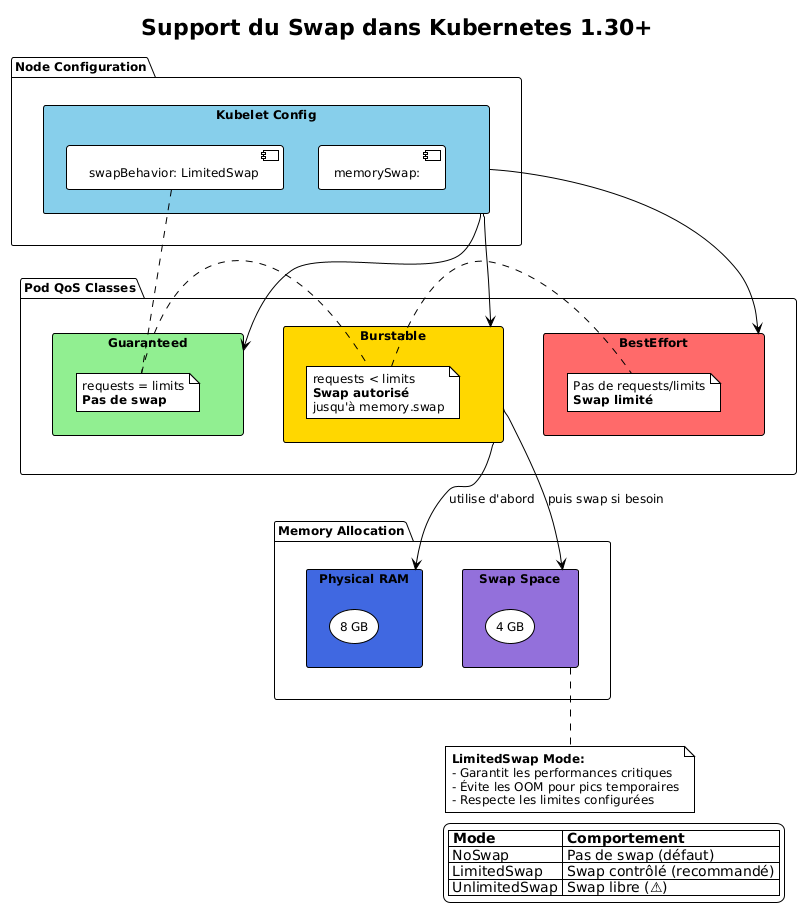

**1. NoSwap (défaut)**
```yaml
swapBehavior: NoSwap
```
Comportement classique: pas de swap

**2. LimitedSwap (recommandé)**
```yaml
swapBehavior: LimitedSwap
```
Swap limité aux pods avec QoS "Burstable"
Respecte les limites mémoire des containers

---

## Kubernetes 1.30 - Swap (suite)

**3. UnlimitedSwap (attention)**
```yaml
swapBehavior: UnlimitedSwap
```
Tous les pods peuvent utiliser le swap
Risque de dégradation des performances

### Configuration au niveau Pod

```yaml
apiVersion: v1
kind: Pod
metadata:
  name: swap-demo
spec:
  containers:
  - name: app
    resources:
      limits:
        memory: "200Mi"
        memory.swap: "100Mi"  # Limite de swap
```

---

## K8s 1.30 - ValidatingAdmissionPolicy (GA)

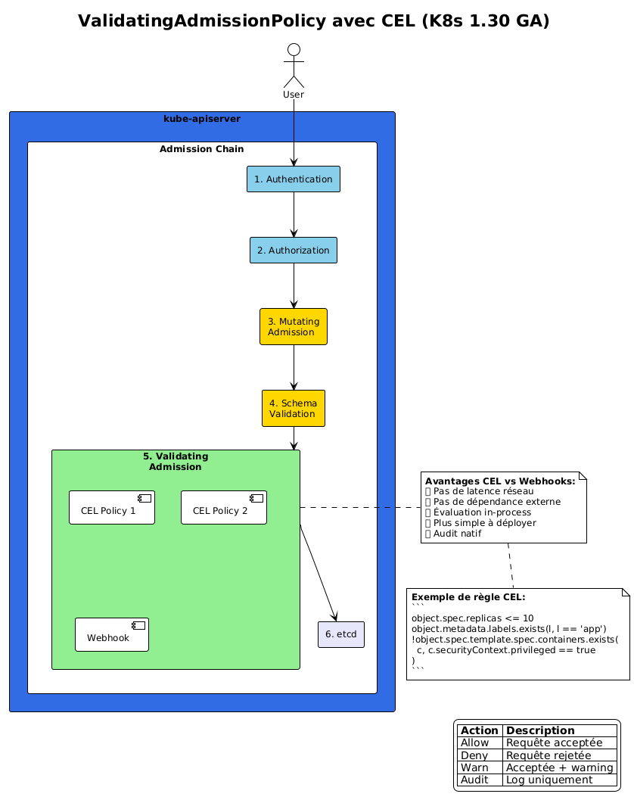

**Remplace les webhooks par des règles CEL natives**

```yaml
apiVersion: admissionregistration.k8s.io/v1
kind: ValidatingAdmissionPolicy
metadata:
  name: max-replicas
spec:
  matchConstraints:
    resourceRules:
    - apiGroups: ["apps"]
      resources: ["deployments"]
  validations:
  - expression: "object.spec.replicas <= 10"
    message: "Max 10 replicas autorisés"
```

---

## K8s 1.30 - User Namespaces (Beta)

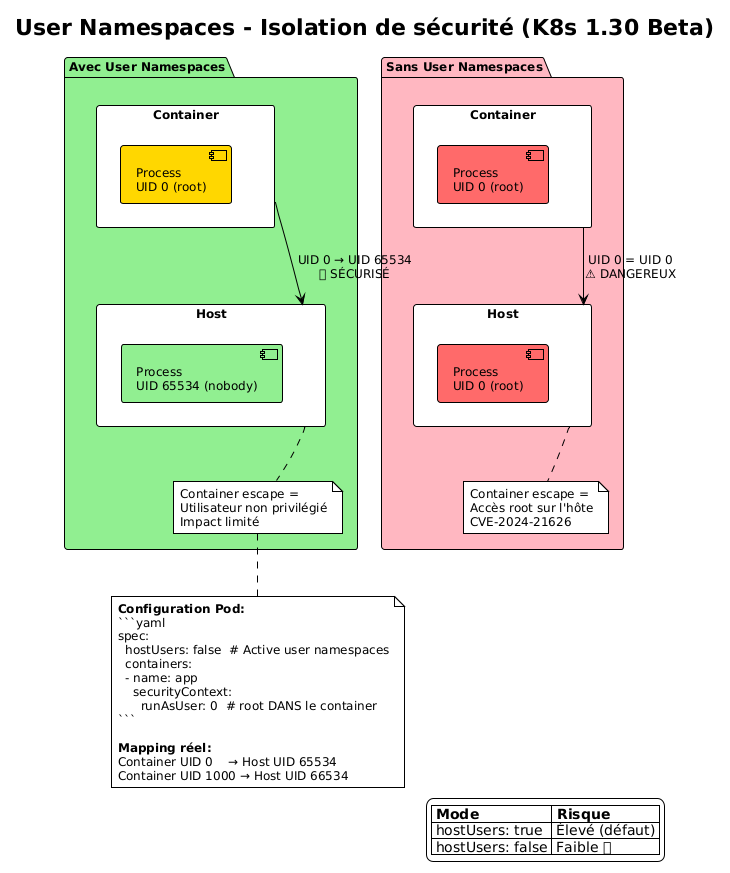

**Protection contre les CVE critiques (CVE-2024-21626)**

```yaml
apiVersion: v1
kind: Pod
metadata:
  name: secure-app
spec:
  hostUsers: false  # Active user namespaces
  containers:
  - name: app
    image: nginx
    securityContext:
      runAsUser: 0  # root DANS le container
      # Mais mappé à UID 65534 sur l'hôte !
```

---

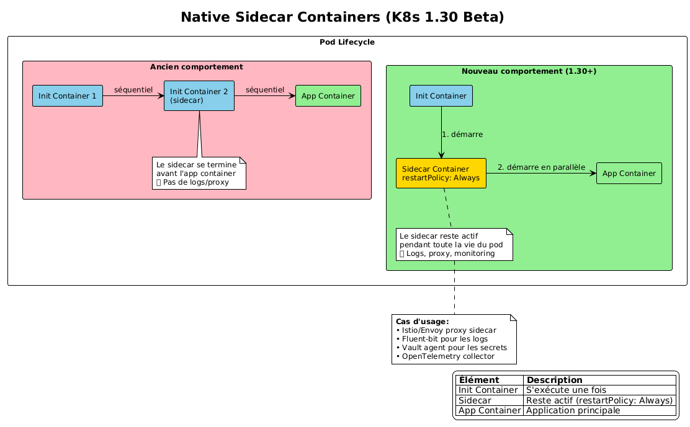

---

## Native Sidecars - Le problème résolu

**Avant K8s 1.28**, les sidecars étaient des containers réguliers :

- Aucune garantie d'ordre de démarrage
- Une seule `restartPolicy` pour tous les containers
- Le sidecar pouvait démarrer **après** l'application
- Contournements complexes nécessaires (sleep, scripts)

**Solution K8s 1.28+ (GA en 1.29)** : Init containers avec `restartPolicy: Always`

---

## Native Sidecars - Configuration

```yaml
apiVersion: v1
kind: Pod
spec:
  initContainers:
  - name: istio-proxy
    image: istio/proxyv2
    restartPolicy: Always  # Clé: transforme en sidecar!
    readinessProbe:        # Probes supportées
      tcpSocket:
        port: 15021
      periodSeconds: 5
  containers:
  - name: app
    image: myapp:v1
    # L'app démarre APRÈS que le proxy soit ready
```

---

## Native Sidecars - Caractéristiques

| Aspect | Init Container | Native Sidecar | Container Régulier |
|--------|---------------|----------------|-------------------|
| Ordre de démarrage | Séquentiel strict | Respecté | Aucun |
| Bloque le suivant | Oui | **Non** | Non |
| `restartPolicy` | Once | **Always** | - |
| Probes | Non | **Oui** | Oui |
| Durée de vie | Courte | **Pod entier** | Pod entier |
| Arrêt | Avant app | **Après app** | Avec app |

---

## Native Sidecars - Cycle de vie

1. **Init containers classiques** s'exécutent séquentiellement
2. **Sidecar démarre** mais **ne bloque pas** la suite
3. **Containers réguliers** démarrent en parallèle
4. **Sidecar reste actif** pendant toute la vie du Pod
5. **À l'arrêt** : containers réguliers d'abord, sidecars ensuite

**Cas d'usage :** Istio/Envoy proxy, Fluent-bit, Vault Agent, OpenTelemetry

---

## K8s 1.30 - Sleep PreStop Hook

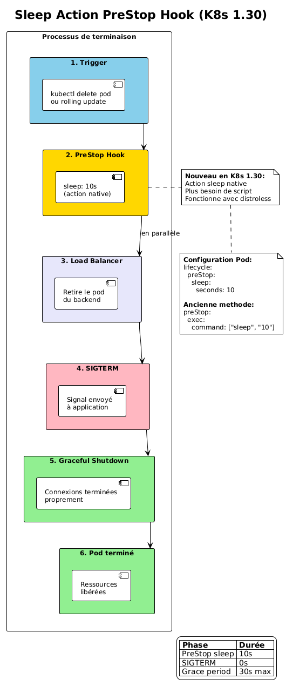

**Action native pour graceful shutdown**

```yaml
apiVersion: v1
kind: Pod
spec:
  containers:
  - name: app
    lifecycle:
      preStop:
        sleep:
          seconds: 10  # Natif, pas de script!
```

**Avantage:** Fonctionne avec images distroless

---

## K8s 1.30 - HPA Container Metrics (GA)

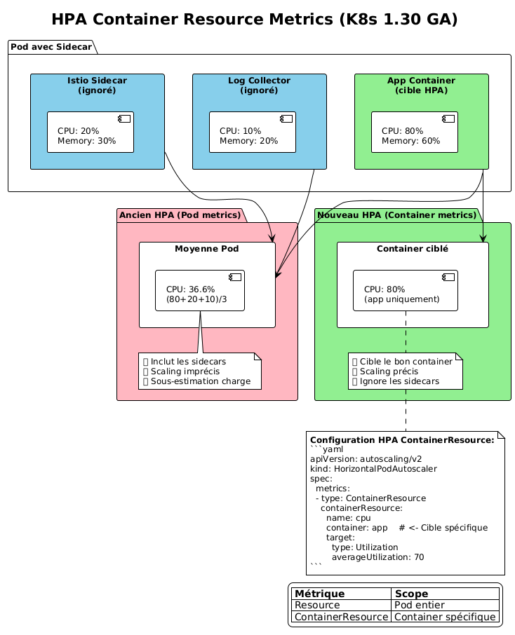

**Scaling basé sur un container spécifique**

```yaml
apiVersion: autoscaling/v2
kind: HorizontalPodAutoscaler
spec:
  scaleTargetRef:
    name: my-deployment
  metrics:
  - type: ContainerResource
    containerResource:
      name: cpu
      container: app  # Ignore les sidecars!
      target:
        type: Utilization
        averageUtilization: 70
```

---

## K8s 1.30 - Pod Scheduling Readiness (GA)

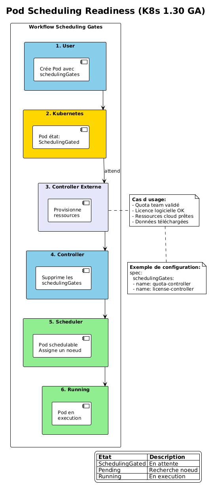

**Contrôle fin du moment de scheduling**

```yaml
apiVersion: v1
kind: Pod
metadata:
  name: batch-job
spec:
  schedulingGates:
  - name: quota-controller/approved
  - name: data-loader/ready
  containers:
  - name: training
    image: ml-training:v1
```

**Cas d'usage:** Quota validation, licence check, data prep

---

## Kubernetes 1.31 - Août 2024 "Elli"

### 45 améliorations dont 11 GA, 22 Beta, 12 Alpha

**Thèmes majeurs:**
- **AppArmor GA** - Sécurité renforcée
- Transition vers **cloud-neutral**
- **NFTables** remplace iptables
- **Multi-Service CIDRs** pour grands clusters
- OCI Volumes pour **AI/ML workloads**

**10 ans de Kubernetes!** 🎂

---

## K8s 1.31 - AppArmor Support (GA)

**Sécurité Linux intégrée nativement**

```yaml
apiVersion: v1
kind: Pod
metadata:
  name: secure-app
spec:
  securityContext:
    appArmorProfile:
      type: RuntimeDefault  # ou Localhost, Unconfined
  containers:
  - name: app
    image: nginx
    securityContext:
      appArmorProfile:
        type: Localhost
        localhostProfile: k8s-nginx  # Profil custom
```

**Migration:** Annotations → champs `securityContext`

---

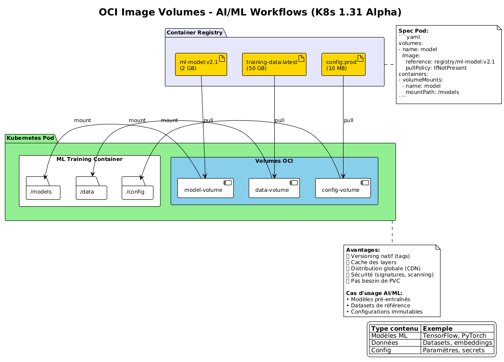

---

## OCI Image Volumes - Configuration

**Monter des images OCI comme volumes read-only**

```yaml
apiVersion: v1
kind: Pod
spec:
  volumes:
  - name: ml-model
    image:
      reference: registry.io/models/bert:v2
      pullPolicy: IfNotPresent
  containers:
  - name: inference
    image: ml-serving:v1  # Image légère sans modèle
    volumeMounts:
    - name: ml-model
      mountPath: /models
      readOnly: true
```

---

## OCI Image Volumes - Avantages

**Pourquoi séparer modèles et code ?**

| Aspect | Image monolithique | OCI Volume |
|--------|-------------------|------------|
| Taille image | 10+ GB avec modèle | ~500 MB sans modèle |
| Temps de pull | Minutes | Secondes |
| Cache | Invalide si modèle change | Réutilisable |
| Versioning | Couplé au code | Indépendant |

**Cas d'usage AI/ML:**
- Modèles LLM (Llama, GPT)
- Datasets de référence
- Configurations partagées

---

## K8s 1.31 - VolumeAttributesClass (Beta)

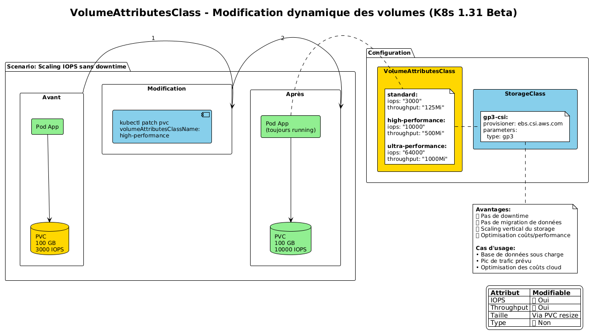

**Modifier IOPS/throughput sans downtime**

```yaml
apiVersion: storage.k8s.io/v1beta1
kind: VolumeAttributesClass
metadata:
  name: high-performance
driverName: ebs.csi.aws.com
parameters:
  iops: "10000"
  throughput: "500"
---
# Modifier un PVC existant
kubectl patch pvc my-data \
  -p '{"spec":{"volumeAttributesClassName":"high-performance"}}'
```

---

## K8s 1.31 - NFTables Backend (Beta)

**Successeur moderne d'iptables pour kube-proxy**

| Aspect | iptables | NFTables |
|--------|----------|----------|
| Performance | O(n) rules | O(1) lookup |
| Scalabilité | ~5000 services | **~50000 services** |
| Atomicité | Non | **Oui** |
| Kernel requis | 2.4+ | **5.13+** |

---

## NFTables - Migration

**Prérequis:**
- Linux Kernel **5.13+**
- Feature gate `NFTablesProxyMode` (activé par défaut en 1.31)

```bash
# Vérifier le kernel
uname -r  # >= 5.13

# Modifier kube-proxy ConfigMap
kubectl -n kube-system edit cm kube-proxy
# mode: nftables

# Redémarrer kube-proxy
kubectl -n kube-system rollout restart ds kube-proxy
```

**Note:** Les règles iptables existantes ne sont PAS migrées

---

## K8s 1.31 - Multi-Service CIDRs (Beta)

**Résout l'épuisement d'IPs de services**

```yaml
apiVersion: networking.k8s.io/v1beta1
kind: ServiceCIDR
metadata:
  name: secondary-cidr
spec:
  cidrs:
  - 10.200.0.0/16  # Nouveau range!
```

**Avantages:**
- Extension sans downtime
- Pas de migration nécessaire
- Clusters très larges supportés

---

## K8s 1.31 - Deprecations majeures

### Cloud Provider Externalization

**Retiré du core Kubernetes:**
- Code spécifique AWS/GCP/Azure
- In-tree cloud providers

**Nouveau modèle:**
```
Cloud Controller Manager (externe)
     ↓
CSI Drivers (stockage)
     ↓
Out-of-tree plugins
```

---

## Kubernetes 1.32 - Décembre 2024 "Penelope"

### 44 améliorations dont 13 GA, 12 Beta, 19 Alpha

**Thème:** Hommage aux racines grecques (Kubernetes = pilote)

**Highlights:**
- **100% Conformance Test Coverage** - première fois!
- **Memory Manager GA** - allocation NUMA
- **Custom Resource Field Selectors GA** - filtrage efficace
- **DRA Structured Parameters Beta** - GPU/TPU sans driver
- **Volume Group Snapshots Beta** - backups cohérents

---

## K8s 1.32 - Nouvelles fonctionnalités GA

| Feature | Description |
|---------|-------------|
| **Memory Manager** | Allocation mémoire NUMA-aware |
| **Custom Resource Field Selectors** | `kubectl get --field-selector` pour CRs |
| **Bound SA Token + Node** | Token inclut le nom du node |
| **Structured Authorization** | Multi-authorizers + CEL |
| **StatefulSet PVC Auto-Delete** | Nettoyage automatique PVCs |

**13 features GA au total !**

---

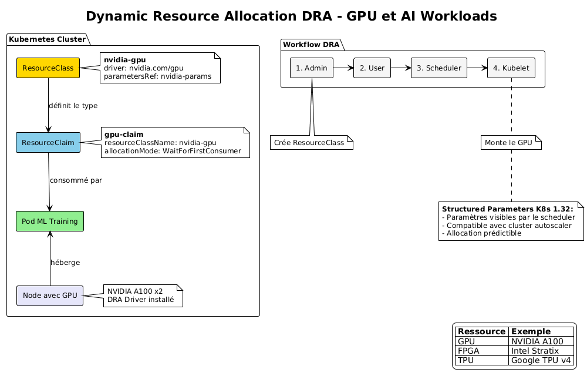

---

## DRA - Pourquoi pas device plugins ?

| Aspect | Device Plugins | DRA |
|--------|---------------|-----|
| Allocation | Compteur simple | **Sélection avancée** |
| Partage | Non | **Oui** (time-slicing) |
| Scheduler | Aveugle | **Aware** |
| Configuration | Statique | **Dynamique** |
| Cluster Autoscaler | Limité | **Intégré** |

---

## DRA - Configuration complète

```yaml
apiVersion: resource.k8s.io/v1beta1
kind: ResourceClaim
metadata:
  name: gpu-claim
spec:
  devices:
    requests:
    - name: gpu
      deviceClassName: nvidia-gpu
      selectors:
      - cel:
          expression: device.attributes["memory"].quantity >= "16Gi"
---
apiVersion: v1
kind: Pod
spec:
  resourceClaims:
  - name: training-gpu
    resourceClaimName: gpu-claim
  containers:
  - name: training
    resources:
      claims:
      - name: training-gpu
```

---

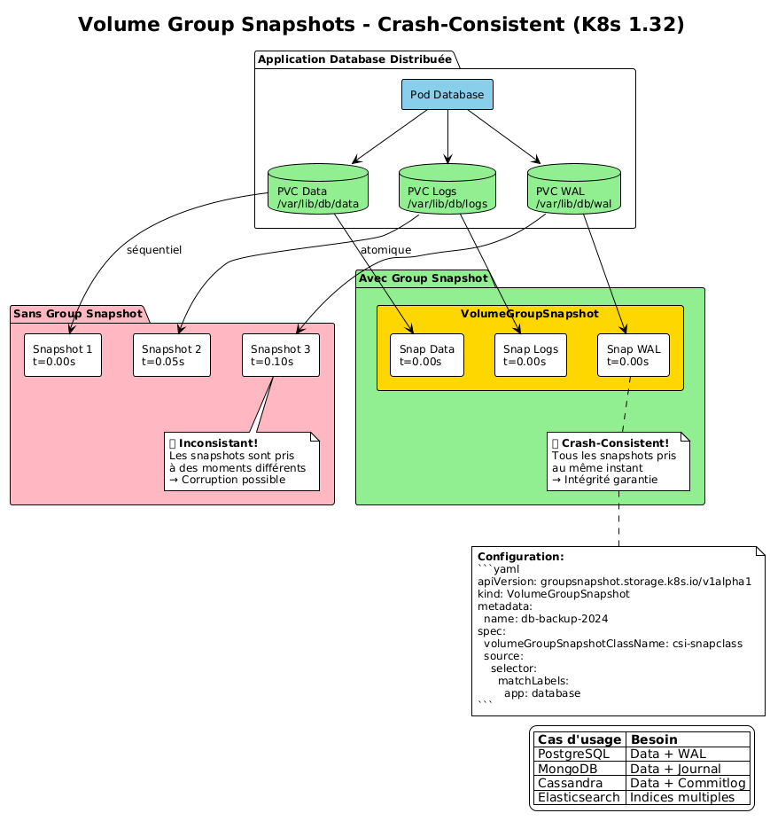

---

## Volume Group Snapshots - Le problème

**Avant:** Snapshots individuels = incohérences possibles

```
t=0: Snapshot volume données  ✓
t=1: Write transaction...
t=2: Snapshot volume WAL      ✓  ← Désynchronisé!
```

**Après:** Snapshots groupés = cohérence garantie

```
t=0: Snapshot [données + WAL + logs] atomique ✓
```

---

## Volume Group Snapshots - Configuration

```yaml
apiVersion: groupsnapshot.storage.k8s.io/v1beta1
kind: VolumeGroupSnapshot
metadata:
  name: postgres-backup-daily
spec:
  volumeGroupSnapshotClassName: csi-aws-snapclass
  source:
    selector:
      matchLabels:
        app: postgresql
        tier: database
# Capture tous les PVCs avec ces labels ensemble
```

**Cas d'usage:** PostgreSQL, MongoDB replica sets, Kafka

---

## K8s 1.32 - Memory Manager (GA)

**Allocation mémoire NUMA-aware pour workloads critiques**

**Pourquoi NUMA importe ?**
- Accès mémoire locale : ~100ns
- Accès mémoire distante : ~300ns (3x plus lent!)

---

## Memory Manager - Configuration

```yaml
# /var/lib/kubelet/config.yaml
topologyManagerPolicy: single-numa-node  # ou best-effort
memoryManagerPolicy: Static
reservedMemory:
- numaNode: 0
  limits:
    memory: 1Gi  # Réservé système
```

```yaml
apiVersion: v1
kind: Pod
spec:
  containers:
  - name: latency-critical
    resources:
      requests:
        memory: "8Gi"
        cpu: "4"
      limits:
        memory: "8Gi"  # Guaranteed QoS requis!
        cpu: "4"
```

**Cas d'usage:** HFT, telecom 5G, gaming temps réel

---

## K8s 1.32 - Custom Resource Field Selectors (GA)

**Filtrage efficace côté serveur pour vos CRDs**

```yaml
apiVersion: apiextensions.k8s.io/v1
kind: CustomResourceDefinition
spec:
  names:
    kind: MyApp
  selectableFields:
  - jsonPath: .spec.environment  # Champ filtrable
  - jsonPath: .status.phase
```

```bash
# Avant: Filtre client (lent, coûteux)
kubectl get myapps -o json | jq '.items[] | select(.spec.environment=="prod")'

# Après: Filtre serveur (rapide, efficace)
kubectl get myapps --field-selector spec.environment=prod
```

---

## K8s 1.32 - Bound SA Token + Node (GA)

**Tokens de service account liés au node**

```yaml
# Le token JWT inclut maintenant:
{
  "kubernetes.io/serviceaccount/node-name": "worker-01",
  "kubernetes.io/serviceaccount/node-uid": "abc-123"
}
```

**Sécurité renforcée:**
- Node compromis → token invalide sur autres nodes
- Empêche escalade de privilèges inter-nodes
- Autorisations basées sur le node source

---

## K8s 1.32 - Nouveaux endpoints de diagnostic

**Endpoints /statusz et /flagz**

```bash
# Santé des composants
curl -k https://localhost:10259/statusz
# Scheduler status: OK
# Last schedule: 2024-12-08T10:30:00Z

# Configuration active
curl -k https://localhost:10259/flagz
# --leader-elect=true
# --v=2
# --bind-address=0.0.0.0
```

**Disponible pour:** kube-scheduler, kube-controller-manager

---

## K8s 1.32 - Windows Graceful Shutdown

**Support shutdown propre sur Windows**

```yaml
# kubelet config Windows
shutdownGracePeriod: 30s
shutdownGracePeriodCriticalPods: 10s
```

**Comportement:**
1. Windows envoie signal shutdown
2. Kubelet évacue les pods gracefully
3. Critical pods en dernier
4. Pas de corruption de données

---

## K8s 1.32 - CPU Manager Strict Reservation

**Réservation CPU exclusive (Alpha)**

```yaml
# kubelet config
cpuManagerPolicy: static
cpuManagerPolicyOptions:
  strict-cpu-reservation: "true"
reservedSystemCPUs: "0-1"  # CPUs réservés système
```

**Avantages:**
- Latence ultra-faible
- Pas de context switch
- Performances prédictibles

---

## Deprecations et removals - Timeline

| Version | Supprimé | Deprecated |
|---------|----------|------------|
| 1.30 | FlowSchema v1beta1 | CSR anciennes APIs |
| 1.31 | ValidatingAdmissionPolicy v1beta1 | Annotations AppArmor |
| 1.32 | FlowSchema v1beta2 | Resource Claims v1alpha |

**Action requise:**
```bash
# Vérifier les APIs deprecated dans votre cluster
kubectl get --raw /apis | jq -r '.groups[].versions[].groupVersion' \
  | grep -E "v1alpha|v1beta"

# Convertir les manifests
kubectl convert -f old-manifest.yaml --output-version apps/v1
```

---

## Kubernetes 1.33 - Avril 2025 "Octarine"

### 64 améliorations dont 18 GA, 20 Beta, 24 Alpha

**Thème:** "The Color of Magic" - référence à Terry Pratchett

**Highlights:**
- **In-Place Pod Vertical Scaling (Beta)** - resize sans redémarrage
- **Native Sidecar Containers (GA)** - support stable
- **User Namespaces activés par défaut**
- **Job Success Policy (GA)** - conditions de succès personnalisées
- **DRA ResourceClaim Device Status (Beta)**

---

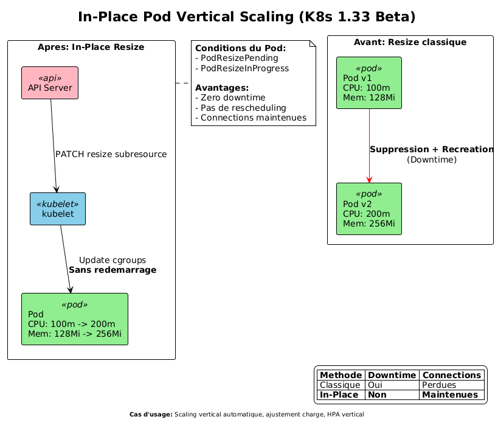

---

## K8s 1.33 - In-Place Pod Resize (Beta)

**Scaling vertical sans redémarrage ni rescheduling**

```yaml
apiVersion: v1
kind: Pod
metadata:
  name: resizable-app
spec:
  containers:
  - name: app
    image: nginx
    resources:
      requests:
        cpu: "100m"
        memory: "128Mi"
      limits:
        cpu: "200m"
        memory: "256Mi"
```

```bash
# Resize en live !
kubectl patch pod resizable-app --subresource=resize \
  -p '{"spec":{"containers":[{"name":"app","resources":{"requests":{"cpu":"200m"}}}]}}'
```

---

## In-Place Resize - Conditions et monitoring

**Nouvelles conditions du Pod:**

| Condition | Description |
|-----------|-------------|
| `PodResizePending` | Resize demandé, en attente de ressources |
| `PodResizeInProgress` | Resize en cours d'application |

```bash
# Vérifier le status du resize
kubectl get pod resizable-app -o jsonpath='{.status.conditions}' | jq

# Voir les resources actuelles vs demandées
kubectl get pod resizable-app -o jsonpath='{.status.containerStatuses[*].resources}'
```

**Cas d'usage:** VPA sans downtime, scaling automatique, charge variable

---

## K8s 1.33 - Native Sidecars (GA)

**Support stable des sidecars avec `restartPolicy: Always`**

```yaml
apiVersion: v1
kind: Pod
spec:
  initContainers:
  - name: istio-proxy
    image: istio/proxyv2:1.22
    restartPolicy: Always  # Devient sidecar natif
    securityContext:
      runAsUser: 1337
  containers:
  - name: app
    image: myapp:v2
```

**Garanties GA:** Démarrage avant, arrêt après containers principaux

---

## K8s 1.33 - User Namespaces (Défaut)

**Activé par défaut - plus besoin de feature gate**

```yaml
apiVersion: v1
kind: Pod
metadata:
  name: isolated-pod
spec:
  hostUsers: false  # User namespaces activés
  containers:
  - name: app
    image: nginx
    securityContext:
      runAsUser: 0  # root DANS le container
      # Mappé à UID 65534+ sur l'hôte
```

**Impact sécurité:**
- Protection contre CVE-2024-21626 et similaires
- Escalade de privilèges impossible vers l'hôte
- Compatible avec les images rootless

---

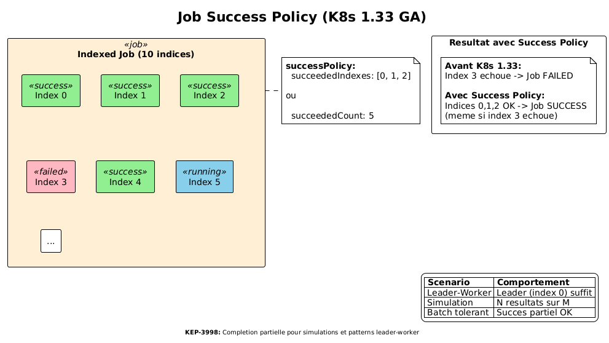

---

## K8s 1.33 - Job Success Policy (GA)

**Définir quand un Job indexé est considéré réussi**

```yaml
apiVersion: batch/v1
kind: Job
metadata:
  name: ml-training
spec:
  completionMode: Indexed
  completions: 10
  parallelism: 5
  successPolicy:
    rules:
    - succeededIndexes: "0"  # Leader doit réussir
      succeededCount: 1
    - succeededIndexes: "1-9"  # 7 workers sur 9 suffisent
      succeededCount: 7
  template:
    spec:
      containers:
      - name: trainer
        image: ml-trainer:v1
```

**Cas d'usage:** ML distribué, MapReduce, batch tolérant aux pannes

---

## K8s 1.33 - Per-Index Backoff Limits (GA)

**Limites de retry indépendantes par index**

```yaml
apiVersion: batch/v1
kind: Job
metadata:
  name: data-processing
spec:
  completionMode: Indexed
  completions: 100
  backoffLimitPerIndex: 3  # Chaque index peut retry 3 fois
  maxFailedIndexes: 10     # Max 10 indexes en échec total
  template:
    spec:
      containers:
      - name: processor
        image: processor:v1
```

**Avantage:** Un index défaillant n'épuise pas le backoffLimit global

---

## K8s 1.33 - DRA Device Status (Beta)

**Les drivers peuvent reporter le status des devices**

```yaml
apiVersion: resource.k8s.io/v1beta1
kind: ResourceClaim
metadata:
  name: network-device
status:
  devices:
  - name: nic
    conditions:
    - type: Ready
      status: "True"
    networkData:
      interfaceName: "eth1"
      macAddress: "00:1A:2B:3C:4D:5E"
```

**Utilité:** Debug réseau, configuration automatique, observabilité

---

## K8s 1.33 - Ordered Namespace Deletion

**Suppression structurée respectant les dépendances**

```
Ordre de suppression (nouveau):
1. Pods
2. Services
3. NetworkPolicies  ← Avant: pouvait être supprimé en premier!
4. ConfigMaps/Secrets
5. RBAC resources
6. Finalizers
```

**Problème résolu:**
- Avant: NetworkPolicy supprimée → pods exposés temporairement
- Après: Pods supprimés d'abord → pas de fenêtre de vulnérabilité

---

## K8s 1.33 - Deprecation Endpoints API

**Migration vers EndpointSlices obligatoire**

```yaml
# NOUVEAU - Utiliser EndpointSlices
apiVersion: discovery.k8s.io/v1
kind: EndpointSlice
metadata:
  name: my-service-abc
  labels:
    kubernetes.io/service-name: my-service
addressType: IPv4
endpoints:
- addresses: ["10.0.0.1"]
  conditions:
    ready: true
```

**Avantages:** Dual-stack, meilleur scaling, moins de charge API

---

## Kubernetes 1.34 - Août 2025 "Of Wind & Will"

### 58 améliorations dont 13 nouvelles Alpha

**Particularité:** Zéro deprecation, zéro breaking change !

**Highlights:**
- **Dynamic Resource Allocation (GA)** - API stable pour GPU/TPU
- **Traffic Distribution étendu** - PreferSameNode, PreferSameZone
- **Container Restart Rules** - restart granulaire par exit code
- **Asynchronous Scheduling** - performances améliorées
- **KYAML** - format YAML sans ambiguïtés

---

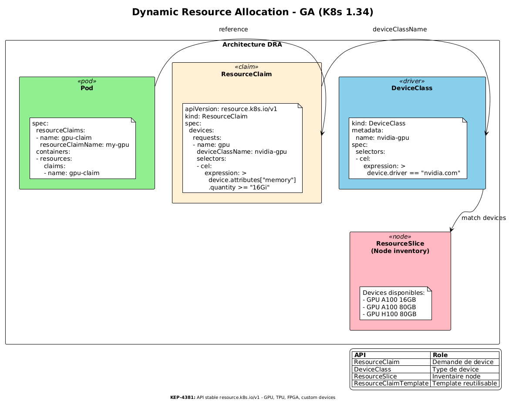

---

## K8s 1.34 - DRA Stable (GA)

**API `resource.k8s.io/v1` pour hardware spécialisé**

```yaml
apiVersion: resource.k8s.io/v1
kind: ResourceClaim
metadata:
  name: gpu-training
spec:
  devices:
    requests:
    - name: gpu
      deviceClassName: nvidia-gpu
      selectors:
      - cel:
          expression: device.attributes["memory"].quantity >= "24Gi"
```

**Nouveau en GA:** API stable, structured parameters, Cluster Autoscaler intégré

---

## DRA 1.34 - DeviceClass et ResourceSlice

```yaml
apiVersion: resource.k8s.io/v1
kind: DeviceClass
metadata:
  name: nvidia-gpu
spec:
  selectors:
  - cel:
      expression: device.driver == "nvidia.com"
  config:
  - opaque:
      driver: nvidia.com
      parameters:
        sharing: time-slicing
---
apiVersion: resource.k8s.io/v1
kind: ResourceSlice
metadata:
  name: node-01-gpus
spec:
  nodeName: node-01
  driver: nvidia.com
  devices:
  - name: gpu-0
    basic:
      attributes:
        memory: {quantity: "80Gi"}
        model: {string: "H100"}
```

---

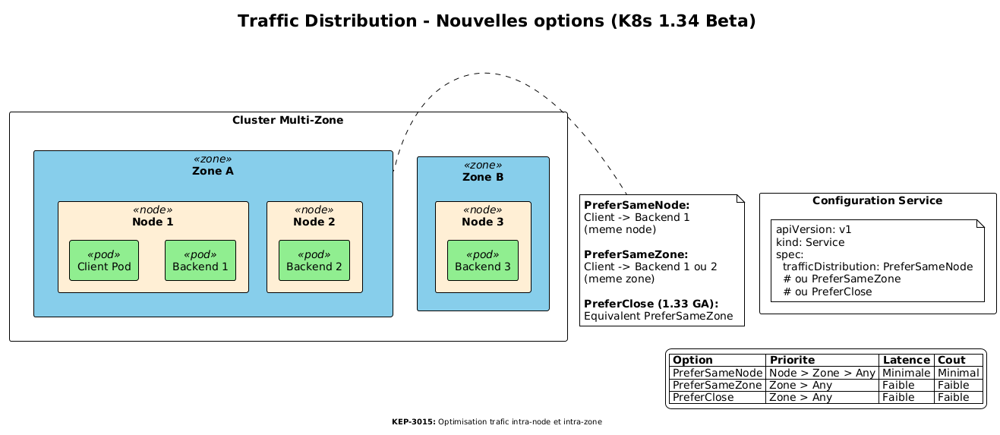

---

## K8s 1.34 - Traffic Distribution étendu

**Nouveaux modes pour optimiser la latence**

```yaml
apiVersion: v1
kind: Service
metadata:
  name: my-api
spec:
  selector:
    app: api
  ports:
  - port: 80
  trafficDistribution: PreferSameNode  # Nouveau!
```

| Mode | Comportement |
|------|-------------|
| `PreferClose` | Zone la plus proche (existant) |
| `PreferSameZone` | Même zone en priorité |
| `PreferSameNode` | **Même node en priorité** |

**Cas d'usage:** Sidecars, caches locaux, latence critique

---

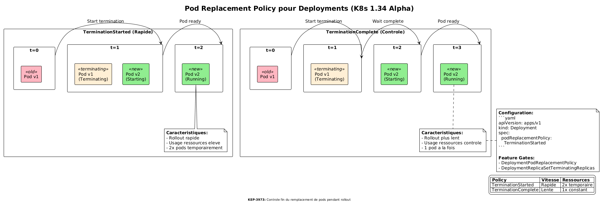

---

## K8s 1.34 - Container Restart Rules (Alpha)

**Restart granulaire basé sur le code de sortie**

```yaml
apiVersion: v1
kind: Pod
metadata:
  name: batch-job
spec:
  restartPolicy: Never  # Pod level
  containers:
  - name: processor
    image: batch:v1
    restartPolicyRules:  # Container level - Nouveau!
    - exitCodeRanges:
      - start: 1
        end: 10    # Erreurs récupérables
      action: Restart
    - exitCodeRanges:
      - start: 11
        end: 255   # Erreurs fatales
      action: Terminate
```

**Avantage:** Récupération des erreurs transitoires sans rescheduler le Pod

---

## K8s 1.34 - Resource Health Tracking (Alpha)

**Status de santé des devices dans le Pod**

```yaml
status:
  containerStatuses:
  - name: ml-trainer
    resourceHealth:
      devices:
      - deviceID: "gpu-0"
        health: Healthy
      - deviceID: "gpu-1"
        health: Unhealthy  # GPU défaillant!
        message: "Temperature exceeded threshold"
```

**Utilité:**
- Distinguer erreur app vs hardware défaillant
- Alerting proactif
- Décision de rescheduling informée

---

## K8s 1.34 - Asynchronous Scheduling

**Queue asynchrone pour les appels API du scheduler**

```
Avant (synchrone):
  Pod pending → API call → BLOCK → Response → Continue

Après (asynchrone):
  Pod pending → API Queue → Continue scheduling
                    ↓
              Background processing
              (merge, cancel, batch)
```

**Améliorations:**
- Scheduling non bloquant
- Fusion d'opérations redondantes
- Re-queue plus rapide des pods unschedulable

---

## K8s 1.34 - KYAML Format

**Dialect YAML sans ambiguïtés (le "Norway problem")**

```yaml
# YAML standard - Problème!
country: NO        # Interprété comme boolean false!
version: 1.20      # Interprété comme float 1.2!

# KYAML - Résolu
country: "NO"      # String garantie
version: "1.20"    # String garantie
```

**Caractéristiques:**
- Strings toujours quotées
- Pas de conversion implicite
- Commentaires préservés
- Compatible JSON

---

## K8s 1.34 - Native Pod Certificates (Alpha)

**Pods peuvent demander des certificats X.509 directement**

```yaml
apiVersion: v1
kind: Pod
spec:
  containers:
  - name: app
    volumeMounts:
    - name: cert
      mountPath: /etc/certs
  volumes:
  - name: cert
    projected:
      sources:
      - clusterTrustBundle:
          signerName: kubernetes.io/kube-apiserver-client
        path: ca.crt
      - certificateRequest:
          signerName: kubernetes.io/kube-apiserver-client
          usages: ["client auth"]
        path: tls.crt
```

**Avantage:** mTLS sans dépendre de Cert-Manager ou SPIFFE

---

## K8s 1.34 - Custom Pod Hostnames (Alpha)

**Pods peuvent avoir des FQDNs personnalisés**

```yaml
apiVersion: v1
kind: Pod
metadata:
  name: legacy-app
spec:
  hostnameOverride: "legacy.internal.company.com"  # Nouveau!
  containers:
  - name: app
    image: legacy:v1
```

**Cas d'usage:**
- Applications legacy avec hostname hardcodé
- Migration depuis VMs
- Certificats avec CN spécifique

---

## Deprecations et removals - Timeline complète

| Version | Supprimé | Deprecated |
|---------|----------|------------|
| 1.30 | FlowSchema v1beta1 | CSR anciennes APIs |
| 1.31 | ValidatingAdmissionPolicy v1beta1 | Annotations AppArmor |
| 1.32 | FlowSchema v1beta2 | Resource Claims v1alpha |
| 1.33 | kubeProxyVersion field | Endpoints API |
| 1.34 | - | - (aucune!) |
| 1.35 | Resource Claims v1alpha2 | Device Plugins (remplacés par DRA) |

**K8s 1.34:** Release exceptionnelle sans breaking changes
**K8s 1.35:** "Timbernetes" — stabilisation de la gestion des ressources avancées

---

## Kubernetes 1.35 — "Timbernetes" (Décembre 2025)

| Feature | État |
|---------|------|
| In-Place Pod Vertical Scaling | **GA** ✓ |
| Dynamic Resource Allocation (DRA) | **GA** ✓ |
| PDB `unhealthyPodEvictionPolicy` | **GA** ✓ |
| VolumeAttributesClass | **GA** (depuis 1.34) |
| ClusterTrustBundle | **Beta** (v1beta1) |

**Thème 1.35 :** stabilisation de la gestion avancée des ressources (GPU, mémoire, volumes)

---

## K8s 1.35 - In-Place Pod Vertical Scaling (GA)

**Avant :** modifier CPU/RAM d'un pod → suppression + recréation (downtime)
**Maintenant :** resize à chaud via `--subresource resize`

```yaml
spec:
  containers:
  - name: app
    resizePolicy:
    - resourceName: cpu
      restartPolicy: NotRequired      # CPU: hot-resize sans interruption
    - resourceName: memory
      restartPolicy: RestartContainer # RAM: restart du container uniquement
    resources:
      requests: { cpu: "500m", memory: "256Mi" }
      limits:   { cpu: "500m", memory: "256Mi" }
```

---

## K8s 1.35 - In-Place Resize — Utilisation

```bash
# Augmenter le CPU sans restart
kubectl patch pod mon-pod --subresource resize \
  --patch '{"spec":{"containers":[{
    "name":"app",
    "resources":{"requests":{"cpu":"800m"},
                 "limits":{"cpu":"800m"}}
  }]}}'

# Surveiller l'état du resize
kubectl get pod mon-pod \
  -o jsonpath='{.status.resize}'
# Valeurs: "InProgress" | "Infeasible" | (absent = succès)
```

**Cas d'usage :** apps stateful (BDD, caches), jobs longs — scaling vertical sans downtime

---

## K8s 1.35 - DRA (Dynamic Resource Allocation) GA

<svg width="1100" height="270" viewBox="0 0 1100 270" xmlns="http://www.w3.org/2000/svg" role="img" aria-hidden="true">
<defs>
<marker id="dra1" markerWidth="9" markerHeight="6" refX="8" refY="3" orient="auto"><polygon points="0 0,9 3,0 6" fill="#6b7280"/></marker>
<marker id="dra2" markerWidth="9" markerHeight="6" refX="8" refY="3" orient="auto"><polygon points="0 0,9 3,0 6" fill="#7c3aed"/></marker>
</defs>
<style>text{font-family:sans-serif;font-size:13px}</style>
<text x="550" y="20" text-anchor="middle" font-size="15" font-weight="bold" fill="#111827">DRA — Flux d'allocation de ressources (GPU, FPGA…)</text>
<rect x="10" y="40" width="180" height="80" rx="8" fill="#ede9fe" stroke="#7c3aed" stroke-width="2"/>
<text x="100" y="68" text-anchor="middle" fill="#5b21b6" font-weight="bold">Pod spec</text>
<text x="100" y="86" text-anchor="middle" fill="#5b21b6" font-size="11">resourceClaims:</text>
<text x="100" y="101" text-anchor="middle" fill="#5b21b6" font-size="11">- gpu-claim-tpl</text>
<line x1="190" y1="80" x2="240" y2="80" stroke="#6b7280" stroke-width="2" marker-end="url(#dra1)"/>
<rect x="243" y="40" width="200" height="80" rx="8" fill="#dcfce7" stroke="#16a34a" stroke-width="2"/>
<text x="343" y="65" text-anchor="middle" fill="#166534" font-weight="bold">ResourceClaim</text>
<text x="343" y="82" text-anchor="middle" fill="#166534" font-size="11">auto-créé par le scheduler</text>
<text x="343" y="97" text-anchor="middle" fill="#166534" font-size="11">durée de vie = durée du Pod</text>
<line x1="443" y1="80" x2="493" y2="80" stroke="#6b7280" stroke-width="2" marker-end="url(#dra1)"/>
<rect x="496" y="40" width="200" height="80" rx="8" fill="#fef3c7" stroke="#f59e0b" stroke-width="2"/>
<text x="596" y="65" text-anchor="middle" fill="#78350f" font-weight="bold">DeviceClass</text>
<text x="596" y="82" text-anchor="middle" fill="#78350f" font-size="11">nvidia-gpu</text>
<text x="596" y="97" text-anchor="middle" fill="#78350f" font-size="11">filtre CEL: memory ≥ 16Gi</text>
<line x1="696" y1="80" x2="746" y2="80" stroke="#6b7280" stroke-width="2" marker-end="url(#dra1)"/>
<rect x="749" y="40" width="180" height="80" rx="8" fill="#dbeafe" stroke="#3b82f6" stroke-width="2"/>
<text x="839" y="68" text-anchor="middle" fill="#1d4ed8" font-weight="bold">GPU Hardware</text>
<text x="839" y="86" text-anchor="middle" fill="#1d4ed8" font-size="11">alloué exclusivement</text>
<text x="839" y="101" text-anchor="middle" fill="#1d4ed8" font-size="11">au Pod</text>
<rect x="380" y="155" width="240" height="55" rx="8" fill="#f3f4f6" stroke="#6b7280" stroke-width="1.5"/>
<text x="500" y="178" text-anchor="middle" fill="#374151" font-weight="bold">DRA Driver (DaemonSet)</text>
<text x="500" y="196" text-anchor="middle" fill="#374151" font-size="11">surveille et alloue les devices</text>
<line x1="500" y1="155" x2="596" y2="121" stroke="#7c3aed" stroke-width="1.5" stroke-dasharray="5,3" marker-end="url(#dra2)"/>
<rect x="10" y="195" width="350" height="65" rx="6" fill="#fef2f2" stroke="#fca5a5" stroke-width="1.5"/>
<text x="185" y="215" text-anchor="middle" fill="#dc2626" font-weight="bold" font-size="12">Device Plugins (ancienne méthode)</text>
<text x="185" y="232" text-anchor="middle" fill="#dc2626" font-size="11">allocation statique par container</text>
<text x="185" y="248" text-anchor="middle" fill="#dc2626" font-size="11">pas de partage, pas de filtrage CEL</text>
<text x="25" y="268" fill="#dc2626" font-size="10">↗ remplacé progressivement par DRA</text>
<rect x="749" y="155" width="340" height="65" rx="6" fill="#f0fdf4" stroke="#86efac" stroke-width="1.5"/>
<text x="919" y="178" text-anchor="middle" fill="#15803d" font-weight="bold" font-size="12">Avantages DRA vs Device Plugins</text>
<text x="919" y="196" text-anchor="middle" fill="#15803d" font-size="11">✓ Filtrage CEL (capacité, type, modèle)</text>
<text x="919" y="212" text-anchor="middle" fill="#15803d" font-size="11">✓ Partage de device entre Pods possible</text>
</svg>

---

## K8s 1.35 - DRA — Exemple ResourceClaimTemplate GPU

```yaml
apiVersion: resource.k8s.io/v1
kind: ResourceClaimTemplate
metadata:
  name: gpu-claim-tpl
spec:
  spec:
    devices:
      requests:
      - name: gpu
        exactly:
          deviceClassName: nvidia-gpu
          selectors:
          - cel:
              expression: >
                device.capacity["driver.nvidia.com"].memory
                >= quantity("16Gi")
---
# Job utilisant le template DRA
spec:
  template:
    spec:
      resourceClaims:
      - name: gpu-claim
        resourceClaimTemplateName: gpu-claim-tpl
      containers:
      - name: training
        resources:
          claims:
          - name: gpu-claim
```

---

## K8s 1.35 - PDB unhealthyPodEvictionPolicy (GA)

**Problème :** un pod unhealthy bloquait les drains → cluster upgrade impossible

| Policy | Comportement |
|--------|-------------|
| `IfHealthyBudget` *(défaut)* | Pod unhealthy évincé seulement si budget respecté |
| `AlwaysAllow` | Pod unhealthy toujours évincé, budget ignoré |

```yaml
apiVersion: policy/v1
kind: PodDisruptionBudget
metadata:
  name: myapp-pdb
spec:
  minAvailable: 2
  selector:
    matchLabels: { app: myapp }
  unhealthyPodEvictionPolicy: AlwaysAllow
```

**Usage :** `AlwaysAllow` lors des upgrades — évite le blocage sur pods crashés

---

## K8s 1.35 - ClusterTrustBundle (Beta)

**Problème :** distribuer des CA certificates → ConfigMap par namespace, maintenance lourde

<svg width="1100" height="200" viewBox="0 0 1100 200" xmlns="http://www.w3.org/2000/svg" role="img" aria-hidden="true">
<defs><marker id="ctb1" markerWidth="9" markerHeight="6" refX="8" refY="3" orient="auto"><polygon points="0 0,9 3,0 6" fill="#6b7280"/></marker></defs>
<style>text{font-family:sans-serif;font-size:12px}</style>
<rect x="10" y="30" width="200" height="60" rx="8" fill="#ede9fe" stroke="#7c3aed" stroke-width="2"/>
<text x="110" y="56" text-anchor="middle" fill="#5b21b6" font-weight="bold">Admin K8s</text>
<text x="110" y="74" text-anchor="middle" fill="#5b21b6" font-size="11">crée ClusterTrustBundle</text>
<line x1="210" y1="60" x2="280" y2="60" stroke="#6b7280" stroke-width="2" marker-end="url(#ctb1)"/>
<rect x="283" y="20" width="230" height="80" rx="8" fill="#fef3c7" stroke="#f59e0b" stroke-width="2"/>
<text x="398" y="50" text-anchor="middle" fill="#78350f" font-weight="bold">ClusterTrustBundle</text>
<text x="398" y="67" text-anchor="middle" fill="#78350f" font-size="11">resource cluster-scoped</text>
<text x="398" y="82" text-anchor="middle" fill="#78350f" font-size="11">contient PEM du CA root</text>
<line x1="513" y1="60" x2="583" y2="60" stroke="#6b7280" stroke-width="2" marker-end="url(#ctb1)"/>
<rect x="586" y="20" width="230" height="80" rx="8" fill="#dcfce7" stroke="#16a34a" stroke-width="2"/>
<text x="701" y="47" text-anchor="middle" fill="#166534" font-weight="bold">Projected Volume</text>
<text x="701" y="64" text-anchor="middle" fill="#166534" font-size="11">monté dans chaque Pod</text>
<text x="701" y="81" text-anchor="middle" fill="#166534" font-size="11">→ /run/ca-certs/ca.crt</text>
<line x1="816" y1="60" x2="886" y2="60" stroke="#6b7280" stroke-width="2" marker-end="url(#ctb1)"/>
<rect x="889" y="30" width="195" height="60" rx="8" fill="#dbeafe" stroke="#3b82f6" stroke-width="2"/>
<text x="986" y="56" text-anchor="middle" fill="#1d4ed8" font-weight="bold">App → vérifie TLS</text>
<text x="986" y="73" text-anchor="middle" fill="#1d4ed8" font-size="11">avec CA distribué</text>
<text x="550" y="155" text-anchor="middle" fill="#374151" font-size="13">Un seul objet cluster-scoped → tous les namespaces l'utilisent automatiquement</text>
<text x="550" y="178" text-anchor="middle" fill="#6b7280" font-size="11">Remplace: ConfigMap ca-bundle par namespace + montage manuel</text>
</svg>

```yaml
volumes:
- name: ca-certs
  projected:
    sources:
    - clusterTrustBundle:
        name: mon-ca-bundle
        path: ca.crt
```

---

## Améliorations du swap - Focus technique

### Pourquoi le swap est important ?

**Avantages:**
- Réduction des coûts (moins de RAM nécessaire)
- Évite les OOMKills pour pics temporaires
- Meilleure utilisation des ressources

**Inconvénients:**
- Impact sur les performances
- Latence accrue pour certaines workloads

---

## Swap - Cas d'usage recommandés

### ✅ Bon cas d'usage

```yaml
apiVersion: v1
kind: Pod
metadata:
  name: batch-job
spec:
  containers:
  - name: processor
    resources:
      requests:
        memory: "1Gi"
      limits:
        memory: "2Gi"
        memory.swap: "1Gi"  # Permet bursts
  # QoS: Burstable
```

- Jobs batch non critiques
- Workloads avec pics prévisibles
- Environnements dev/test

---

## Swap - Configuration des nœuds

### Activation du swap sur CentOS 10

```bash
# 1. Créer un fichier swap (dd plus fiable que fallocate sur certains FS)
sudo dd if=/dev/zero of=/swapfile bs=1M count=4096
sudo chmod 600 /swapfile
sudo mkswap /swapfile
sudo swapon /swapfile

# 2. Persister dans /etc/fstab
echo '/swapfile none swap sw 0 0' | sudo tee -a /etc/fstab

# 3. Configurer kubelet
cat <<EOF | sudo tee /var/lib/kubelet/config.yaml
apiVersion: kubelet.config.k8s.io/v1beta1
kind: KubeletConfiguration
memorySwap:
  swapBehavior: LimitedSwap
failSwapOn: false
EOF
```

---

## Swap - Monitoring

### Commandes de monitoring

```bash
# Vérifier l'utilisation du swap sur le nœud
free -h
swapon --show

# Voir les pods utilisant le swap
kubectl top pods --containers

# Métriques kubelet
curl http://localhost:10255/stats/summary | jq '.node.memory'
```

### Métriques importantes
- `container_memory_swap` - Swap utilisé par container
- `node_memory_SwapTotal` - Total swap disponible
- `node_memory_SwapFree` - Swap libre

---

## Améliorations de sécurité

### User Namespaces (1.32 - Beta)

```yaml
apiVersion: v1
kind: Pod
metadata:
  name: secure-pod
spec:
  hostUsers: false  # Active user namespaces
  containers:
  - name: app
    securityContext:
      runAsUser: 1000
      runAsGroup: 3000
```

**Avantages:**
- Root dans le container ≠ root sur l'hôte
- Isolation renforcée
- Protection contre les escalations

---

## Améliorations de sécurité - AppArmor

### AppArmor (1.30 - GA)

Configuration native AppArmor dans Kubernetes:

```yaml
apiVersion: v1
kind: Pod
metadata:
  name: apparmor-pod
spec:
  containers:
  - name: app
    securityContext:
      appArmorProfile:
        type: Localhost
        localhostProfile: k8s-custom-profile
```

**Types disponibles:** `RuntimeDefault`, `Localhost`, `Unconfined`

---

## Améliorations de sécurité - Service Account Tokens

### Bounded Service Account Tokens (1.32 - GA)

Tokens avec expiration et audience spécifique:

```yaml
apiVersion: v1
kind: Pod
spec:
  serviceAccountName: my-sa
  volumes:
  - name: token
    projected:
      sources:
      - serviceAccountToken:
          expirationSeconds: 3600  # 1 heure
          audience: api
```

---

## Améliorations de performance

### 1.31 - Informer Watchlist
- Réduction de 50% de la charge API server
- Startup plus rapide des controllers
- Moins de bande passante réseau

### 1.31 - Traffic Distribution
```yaml
apiVersion: v1
kind: Service
spec:
  trafficDistribution: PreferClose
```
- Latence réduite
- Trafic local privilégié
- Économie de coûts cloud

---

## Améliorations de la gestion de resources

### VolumeAttributesClass (1.32 - Beta)

**Cas d'usage:** Modifier les IOPS d'un volume sans downtime

```yaml
# Avant
apiVersion: v1
kind: PersistentVolumeClaim
spec:
  storageClassName: standard

# Après - modification dynamique
apiVersion: v1
kind: PersistentVolumeClaim
spec:
  storageClassName: standard
  volumeAttributesClassName: high-performance
```

---

## Conseils de migration

### Préparation

1. **Lire les release notes complètes**
   - Deprecations et removals
   - Breaking changes
   - New features

2. **Tester dans un environnement de dev**
   - Valider la compatibilité
   - Tester les nouvelles fonctionnalités

3. **Planifier le rollback**
   - Backup etcd
   - Procédure de downgrade

---

## Conseils de migration - Control Plane

### Étape 1: Upgrade du Control Plane

**Règle d'or:** 1 version mineure à la fois

```bash
# Vérifier les versions disponibles
kubeadm upgrade plan

# Appliquer la mise à jour
kubeadm upgrade apply v1.34.0
```

⚠️ Toujours upgrade le control plane AVANT les workers

---

## Conseils de migration - Kubelet & Workers

### Étape 2: Kubelet sur le master

```bash
sudo dnf versionlock delete kubelet kubectl 2>/dev/null || true
sudo dnf install -y kubelet-1.34.0 kubectl-1.34.0
sudo dnf versionlock add kubelet kubectl
sudo systemctl daemon-reload && sudo systemctl restart kubelet
```

### Étape 3: Workers (un par un)

```bash
kubectl drain <node> --ignore-daemonsets
# Upgrade kubelet sur le worker
kubectl uncordon <node>
```

---

## Feature gates importantes

### Activation des features alpha/beta

```yaml
# /var/lib/kubelet/config.yaml
apiVersion: kubelet.config.k8s.io/v1beta1
kind: KubeletConfiguration
featureGates:
  InPlacePodVerticalScaling: true  # 1.33 Beta (défaut on)
  ContainerRestartRules: true      # 1.34 Alpha
  ImageVolume: true                # 1.31 Alpha
```

```yaml
# kube-apiserver
apiVersion: v1
kind: Pod
spec:
  containers:
  - command:
    - kube-apiserver
    - --feature-gates=ContainerRestartRules=true,NativePodCertificates=true
```

---

## Ressources et documentation

### Documentation officielle
- Release notes: https://kubernetes.io/docs/setup/release/notes/
- Change log: https://github.com/kubernetes/kubernetes/blob/master/CHANGELOG/
- KEPs: https://github.com/kubernetes/enhancements

### Outils utiles
- **kubectl version:** Vérifier la version
- **kubeadm upgrade plan:** Voir les upgrades disponibles
- **kubectl api-resources:** Lister les APIs disponibles

---

## Points clés à retenir

### Scaling & Ressources
- **In-Place Pod Resize (1.33 Beta)** - scaling vertical sans downtime
- **DRA GA (1.34)** - gestion GPU/TPU production ready
- Memory Manager GA (1.32) - NUMA-aware allocation

### Sécurité
- **User Namespaces (1.33 défaut)** - activé automatiquement
- AppArmor GA (1.30) - production ready
- Ordered Namespace Deletion (1.33) - pas de fenêtre vulnérabilité

---

## Points clés à retenir (suite)

### Performance
- **Traffic Distribution étendu (1.34)** - PreferSameNode
- Async Scheduling (1.34) - scheduler non bloquant
- Informer Watchlist (1.31) - moins de charge API

### Containers & Jobs
- **Native Sidecars GA (1.33)** - support stable
- Job Success Policy GA (1.33) - critères personnalisés
- Container Restart Rules (1.34 Alpha) - retry granulaire

### Production readiness
- K8s 1.34: Zéro breaking changes!
- Suivre les deprecations (Endpoints → EndpointSlices)
- Planifier les upgrades régulièrement

---

## Questions fréquentes

**Q: Dois-je activer le swap en production ?**
R: Dépend du workload. OK pour batch jobs non critiques avec `LimitedSwap`. Attention pour les services à faible latence.

**Q: À quelle fréquence upgrader ?**
R: Au minimum tous les 12 mois pour rester dans la fenêtre de support (14 mois). Idéalement suivre N-1 ou N-2.

**Q: Comment tester les features alpha ?**
R: Environnement de dev isolé, feature gates activées, ne JAMAIS en production.

---

<!-- _class: lead -->

# Merci !


---